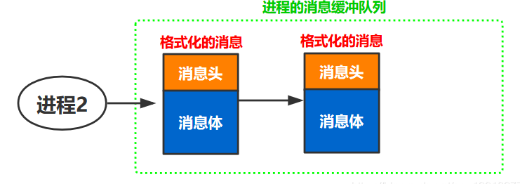
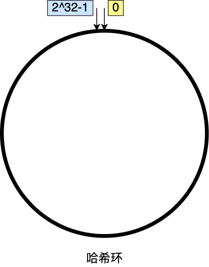

#   操作系统

## 一、硬件结构

### 1. 冯诺依曼机型
最重要的是定义计算机基本结构为 5 个部分，分别是运算器、控制器、存储器、输入设备、输出设备，这 5 个部分也被称为冯诺依曼模型。


- 内存：我们的程序和数据都是存储在内存，存储的区域是线性的。数据存储的单位是一个二进制位（bit），即 0 或 1。最小的存储单位是字节（byte），1 字节等于 8 位。
- CPU：32位和64位的CPU的主要区别是在于一次性能计算多少字节的数据。
	- 32位一次计算4字节，64位一次计算8字节；这里的32位和64位叫做CPU的位宽。
	- CPU 内部还有一些组件，常见的有寄存器、控制单元和逻辑运算单元等。其中，控制单元负责控制 CPU 工作，逻辑运算单元负责计算，而寄存器可以分为多种类，每种寄存器的功能又不尽相同。
	- 常用的寄存器种类：
	- 1. 通用寄存器，用来存放需要进行运算的数据。
	- 2. 程序计数器，用来存储CPU要执行的下一条指令所在的内存地址。
	- 3. 指令寄存器，用来存放程序计数器指向的指令，也就是指令本身。
	- 4. 栈指针，用于管理函数参数栈，局部变量和返回地址。
- 总线：总线用于CPU和内存以及其他设备之间的通信，总线可分为3种
	- 地址总线，用于指定CPU将要操作的内存地址；
	- 数据总线，用于读取内存数据
	- 控制总线，用于发送和接受信号
- 输入输出设备

### 2. 程序执行的基本过程

简单来说就是取址执行，一个程序执行的时候，CPU 会根据程序计数器里的内存地址，从内存里面把需要执行的指令读取到指令寄存器里面执行，然后根据指令长度自增，开始顺序读取下一条指令。CPU 从程序计数器读取指令、到执行、再到下一条指令，这个过程会不断循环，直到程序执行结束，这个不断循环的过程被称为 CPU 的指令周期。

### 3. 存储器的层次结构

- CPU里面的有寄存器，CPU Cache包括L1,L2,L3 Cache。
- CPU之外的有内存和硬盘。
#### （1）寄存器
最靠近 CPU 的控制单元和逻辑计算单元的存储器，最快，每个寄存器存储一定字节，32位机4字节，寄存器的访问速度非常快，一般要求在半个 CPU 时钟周期内完成读写。
#### （2）CPU Cache
CPU Cache，采用SRAM（静态随机存储器），有电就可以保存数据。

- L1 高速缓存：L1高速缓存的访问速度几乎和寄存器有一块,在2-4个时钟周期，大小到几十KB到几百KB不等。每个CPU核心有属于自己的L1告诉缓存，指令和数据在L1是分开存放的，所以L1高速缓存分为指令缓存和数据缓存。
- L2 高速缓存：L2高速缓存也是每个CPU核心都有，但是它距离CPU核心越远，大小比L1缓存更大，约在几百KB，访问速度更慢，在10-20个时钟周期。
- L3 高速缓存：L3 高速缓存通常是多个 CPU 核心共用的，位置比 L2 高速缓存距离 CPU 核心 更远，大小也会更大些，通常大小在几 MB 到几十 MB 不等，访问速度在 20~60个时钟周期。

#### （3）内存

内存用的芯片和 CPU Cache 有所不同，它使用的是一种叫作 DRAM （Dynamic Random Access Memory，动态随机存取存储器） 的芯片，所以访问的速度会更慢，内存速度大概在 200~300 个 时钟周期之间。

#### （4）硬盘
SSD/HDD 断电后数据还在。

#### （5）如何写出跑的更快的代码？
利用程序的时间局部性和空间局部性，提升缓存的命中率。

CPU cache的数据是从内存读过来的，一小块一小块的读取数据，称为Cache Line（缓存块），L1 Cache 的大小是64字节，CPU读取数据的时候，无论数据是否加载在缓存里面，先访问Cache，找不到再访问内存，并把内存的数据读入Cache，CPU再从Cache读取。

内存地址映射到 CPU Cache 地址里的策略有很多种，其中比较简单是直接映射 Cache，它巧妙的把内存地址拆分成「索引 + 组标记 + 偏移量」的方式，使得我们可以将很大的内存地址，映射到很小的 CPU Cache 地址里。其中组标记用来标记不同的内存块。


- 如何提升数据缓存的命中率？

```C++
array[N][N] = 0;

// 1
for(int i=0;i<N;++i){
	for(int j=0;j<N;++j){
	array[i][j] = 0;
	}
}

// 2
for(int i=0;i<N;i+=l){
	for(int j=0;j<N;j+=l){
	array[j][i] = 0;
	}
}
```
形式1比形式2快好几倍，因为数据所占的内存是连续的，形式1用`array[i][j]`访问数组元素，与内存里面数组存放的顺序一致，当当 CPU 访问`array[0][0]` 时，由于该数据不在 Cache 中，于是会顺序把跟随其后的 3 个元素从内存中加载到 CPU Cache，这样当 CPU 访问后面的 3 个数组元素时，就能在 CPU Cache 中成功地找到数据，这意味着缓存命中率很高，缓存命中的数据不需要访问内存，这便大大提高了代码的性能。

形式2访问时跳跃式的，如果N的数值很大，那么访问`array[j][i]` 是无法把`array[j+1][i]`载入CPU Cache的，那么就要从内存读取，性能不高。

因此，遇到这种遍历数组的情况时，按照内存布局顺序访问，将可以有效的利用 CPU Cache 带来的好处，这样我们代码的性能就会得到很大的提升。


- 如何提升指令缓存的命中率

```C++
int array[N];
for(int i=0;i<N;++i){
	array[i] = rand()%100;
}

// 1
for(int i=0;i<N;++i){
	if(array[0]<50){
		array[i] = 0;
	}
}

// 2
sort(array,array+N);
```
先排序再遍历还是先遍历再排序速度快呢？

在回答这个问题之前，我们先了解 CPU 的**分支预测器**。对于 if 条件语句，意味着此时至少可以选择跳转到两段不同的指令执行，也就是 if 还是 else 中的指令。那么，如果分支预测可以预测到接下来要执行 if 里的指令，还是 else 指令的话，就可以「提前」把这些指令放在指令缓存中，这样 CPU 可以直接从 Cache 读取到指令，于是执行速度就会很快。

当数组中的元素是随机的，分支预测就无法有效工作，而当数组元素都是是顺序的，分支预测器会动态地根据历史命中数据对未来进行预测，这样命中率就会很高。

因此，先排序再遍历速度会更快，这是因为排序之后，数字是从小到大的，那么前几次循环命中 if < 50 的次数会比较多，于是分支预测就会缓存 if 里的 array[i] = 0 指令到 Cache 中，后续 CPU 执行该指令就只需要从 Cache 读取就好了。

```C++
在if语句里使用likely显示打开分支预测器
```
### 4. 操作系统概述

是一种软件，是应用连接硬件的桥梁，提供一些接口（系统调用），为应用程序提供标准库，管理系统资源。


内核的作用：
- 管理进程、线程，决定哪个进程、线程使用 CPU，也就是进程调度的能力；
- 管理内存，决定内存的分配和回收，也就是内存管理的能力；
- 管理硬件设备，为进程与硬件设备之间提供通信能力，也就是硬件通信能力；
- 提供系统调用，如果应用程序要运行更高权限运行的服务，那么就需要有系统调用，它是用户程序与操作系统之间的接口。

内核怎样工作：由于内核具有很高权限，可以控制CPU，内存等设备，大多数操作系统把内存分为两个区域
- 内核空间，这个内存空间只有内核程序可以访问；
- 用户空间，这个内存空间专门给应用程序使用；

用户空间的代码只能访问一个局部的内存空间，而内核空间的代码可以访问所有内存空间。因此，当程序使用用户空间时，我们常说该程序在用户态执行，而当程序使内核空间时，程序则在内核态执行。应用程序通过系统调用进入内核空间：

内核程序执行在内核态，用户程序执行在用户态。当应用程序使用系统调用时，会产生一个中断。发生中断后,CPU中断当前的用户程序，跳转到中断处理程序，执行内核程序。内核处理完，主动出发中断，把CPU的执行权限交回给用户，会到用户态继续工作。

- 宏内核：Linux就是宏内核，意味着Linux的内核就是一个完整的可执行程序，且拥有最高权限，其特点时系统内核的所有模块比如进程调度，内存管理，文件系统，设备驱动等等都运行在内核态。
- 微内核：只保留最基本的能力，如进程调度，虚拟内存等等，把一些应用放到了用户空间，比如驱动程序和文件系统。这样服务与服务之间是隔离的，单个服务出现故障或者完全攻击，也不会导致整个操作系统挂掉，提高了操作系统的稳定性和可靠性。

## 二、进程线程相关（CPU虚拟化）


### 1. 进程
- 进程的定义：进程就是运行中的程序。操作系统通过虚拟化CPU，让一个进程只允许一个时间片，然后切换到其他进程，提供了多个虚拟CPU的假象。
- 并发：指一段时间内能同时运行多个程序，这些事件宏观上是同时发生的， 但微观上是交替发生的。并行指同一时刻能运行多个指令。操作系统通过引入进程和线程，使得程序能够并发运行。
- 并行：同一时刻运行多个程序。
- 要实现CPU虚拟化，操作系统要提供一些低级机制和高级机制。低级机制就是上下文切换，高级机制就是进程调度算法。
- 进程的机器状态：
	- 它的内存，进程的指令以及数据都在内存里面。
	- 寄存器，包括程序计数器，栈指针等等。
	- 文件打开表。

### 2. 进程状态

一个活动的进程至少存在三种基本的状态，运行状态、就绪状态和阻塞状态
- 运行态：该时刻进程占据CPU；
- 就绪态：万事俱备，之前CPU；
- 阻塞态：该进程正等待某一事件的发生（比如输入输出操作的完成）而暂停运行，即使给他CPU控制权，它也无法运行
- 还有两个状态：创建态和结束态


如果有大量处于阻塞的状态，进程可能会占用物理内存空间，因此OS通常会把阻塞的进程的物理内存换出到硬盘，等需要再次运行的时候，再从硬盘载入。

那么，就需要一个新的状态，来描述进程没有占用实际的物理内存空间的情况，这个状态就是挂起状态。这跟阻塞状态是不一样，阻塞状态是等待某个事件的返回。挂起状态可以分为两种：
- 阻塞挂起：进程在外存（硬盘）并等待某个事件的出现；
- 就绪挂起：：进程在外存（硬盘），但只要进入内存，即刻立刻运行；


### 3. 进程控制块PCB
在操作系统中，是用进程控制块（process control block，PCB）数据结构来描述进程的。**PCB是进程存在的唯一标志**，它包含的信息有：
- 进程描述信息：
	- 进程标识符：PID 标识各个进程，每个进程都有一个并且唯一的标识符；
	- 用户标识符：进程归属的用户，用户标识符主要为共享和保护服务；
- 进程的控制信息和管理信息：
	- 进程当前的状态，如就绪，运行阻塞等等；
	- 进程的优先级：进程抢占CPU的优先级。
- 资源分配清单：有关内存地址空间或者虚拟地址空间的信息，所打开的文件表（默认三个是标准输入输出和错误）以及所使用的I/O设备信息。
- CPU相关信息：CPU中各个寄存器的值，当进程被切换时，CPU的状态信息都会保存在相应的PCB中，以便进程重新执行，能从断点处运行。

PCB的组织方式，通过链表的方式进行组织，把具有相同的状态的进程链在仪器，组成各种队列。

### 4. 进程API以及进程控制

#### （1）进程创建fork
```C++
// 创建一个新的进程
pid_t fork(void);
```
在一个启动的进程调用fork函数，那么会得到它的一个子进程，每个进程都对应一个属于自己的虚拟地址空间，子进程的地址空间是基于父进程的地址空间拷贝出来的,如图：


- 相同点：
	- 代码区：默认情况下父子进程地址空间中的源代码始终相同。
	- 全局数据区：父进程中的全局变量和变量值全部被拷贝一份放到了子进程地址空间中
	- 堆区：父进程中的堆区变量和变量值全部被拷贝一份放到了子进程地址空间中
	- 内存映射区：父进程中数据信息被拷贝一份放到了子进程地址空间中
	- 父进程中的栈区变量和变量值全部被拷贝一份放到了子进程地址空间中
	- 环境变量：默认情况下，父子进程地址空间中的环境变量始终相同
	- 文件描述符表: 父进程中被分配的文件描述符都会拷贝到子进程中，在子进程中可以使用它们打开对应的文件。
- 区别：
	- 父子进程各自的虚拟地址空间是相互独立的，不会互相干扰和影响，由于父子进程可能执行不同的代码逻辑，因此地址空间拷贝完成之后，全局数据区 , 栈区 , 堆区 , 动态库加载区(内存映射区) 数据会各自发生变化，由于地址空间是相互独立的，因此不会互相覆盖数据。
	- 由于每个进都有自己的进程 ID，因此内核区存储的父子进程 ID 是不同的。
	- 父子进程的状态可能是不同的。
	- fork () 调用成功之后，会返回两个值，父子进程的返回值是不同的。父进程的虚拟地址空间中将该返回值标记为一个大于 0 的数（其实记录的是子进程的进程 ID），子进程的虚拟地址空间中将该返回值标记 0。
	- 父进程肯定是从 main () 函数开始运行的，子进程是在父进程中调用 fork () 函数之后被创建，子进程就从 fork () 之后开始向下执行代码。
	
#### （2）exec	
可以让父子进程执行不同的程序
```C++
int execl(const char *path, const char *arg, ...
          /* (char  *) NULL */);
给定可执行程序的路径，它从可执行程序加载代码和数据，覆盖自己的代码以及数据，堆栈等其他内存空间也会被重新初始化。成功调用不会返回。
这些函数执行成功后不会返回，因为调用进程的实体，包括代码段，数据段和堆栈等都已经被新的内容取代（也就是说用户区数据基本全部被替换掉了），只留下进程 ID 等一些表面上的信息仍保持原样，颇有些神似” 三十六计” 中的” 金蝉脱壳”。看上去还是旧的躯壳，却已经注入了新的灵魂。只有调用失败了，它们才会返回一个 -1，从原程序的调用点接着往下执行。
```

#### （3）进程控制

- 结束进程

  ```C++
  如果想要退出某个进程,可以在任意位置调用exit()或者_exit()函数。
  return要在主函数里面调用，才能退出进程。
  ```
  
- 孤儿进程 
    在一个启动的进程中创建子进程，这时候父子进程同时运行，但是父进程由于某种原因先退出了，子进程还在运行，这时候这个子进程就可以被称之为孤儿进程（跟现实是一样的）。

    操作系统是非常关爱运行的每一个进程的，当检测到某一个进程变成了孤儿进程，这时候系统中就会有一个固定的进程领养这个孤儿进程（有干爹了）。如果使用 Linux 没有桌面终端，这个领养孤儿进程的进程就是 init 进程（PID=1），如果有桌面终端，这个领养孤儿进程就是桌面进程。

    那么问题来了，系统为什么要领养这个孤儿进程呢？在子进程退出的时候, 进程中的用户区可以自己释放, 但是进程内核区的pcb资源自己无法释放，必须要由父进程来释放子进程的pcb资源，孤儿进程被领养之后，这件事儿干爹就可以代劳了，这样可以避免系统资源的浪费。
    
- 僵尸进程
在一个启动的进程中创建子进程，这时候就有了父子两个进程，父进程正常运行，子进程先于父进程结束，子进程无法释放自己的PCB，需要父进程来释放，而如果父进程也不管，则子进程变成了僵尸进程。僵尸进程不能将它看成是一个正常的进程，这个进程已经死亡了，用户区资源已经被释放了，只是还占用着一些内核资源（PCB）。 僵尸进程就相当于是一副已经腐烂只剩下骨头的尸体。僵尸进程的出现是由于这个已死亡的进程的父进程不作为造成的。

  消灭僵尸进程的方法是，杀死这个僵尸进程的父进程，这样僵尸进程的资源就被系统回收了。通过 kill -9 僵尸进程PID 的方式是不能消灭僵尸进程的，这个命令只对活着的进程有效，僵尸进程已经死了，鞭尸是不能解决问题的。
  
#### （4）进程回收

- wait

```C++
这是个阻塞函数，如果没有子进程退出，函数会一直阻塞等待，当检测到子进程退出了，该函数阻塞解除回收子进程资源。这个函数被调用一次，只能回收一个子进程的资源，如果有多个子进程需要资源回收，函数需要被调用多次。
pid_t wait(int *status);
通过status参数判断回收的进程如何退出
返回值：若回收成功，返回被回收的子进程的ID
失败返回-1
```
- waitpid

```C++
waitpid () 函数可以看做是 wait () 函数的升级版，通过该函数可以控制回收子进程资源的方式是阻塞还是非阻塞，另外还可以通过该函数进行精准打击，可以精确指定回收某个或者某一类或者是全部子进程资源。
pid_t waitpid(pid_t pid, int *status, int options);
参数:
pid:
-1：回收所有的子进程资源，和 wait () 是一样的，无差别回收，并不是一次性就可以回收多个，也是需要循环回收的
大于0：指定回收某一个进程的资源 ，pid 是要回收的子进程的进程 ID
0：回收当前进程组的所有子进程 ID
小于 -1：pid 的绝对值代表进程组 ID，表示要回收这个进程组的所有子进程资源
status: NULL, 和 wait 的参数是一样的
options: 控制函数是阻塞还是非阻塞
0: 函数是行为是阻塞的 ==> 和 wait 一样
WNOHANG: 函数是行为是非阻塞的

返回值:
如果函数是非阻塞的，并且子进程还在运行，返回 0
成功：得到子进程的进程 ID
失败: -1
没有子进程资源可以回收了，函数如果是阻塞的，阻塞会解除，直接返回 - 1
回收子进程资源的时候出现了异常

```


### 5. 上下文切换

**CPU的上下文切换**：CPU 上下文切换就是先把前一个任务的 CPU 上下文（CPU 寄存器和程序计数器）保存起来，然后加载新任务的上下文到这些寄存器和程序计数器，最后再跳转到程序计数器所指的新位置，运行新任务。

上面说到所谓的「任务」，主要包含进程、线程和中断。所以，可以根据任务的不同，把 CPU 上下文切换分成：**进程上下文切换、线程上下文切换和中断上下文切换**。

**进程的上下文切换**：进程是由内核管理和调度的，所以进程的切换只能发生在内核态。所以，**进程的上下文切换不仅包含了虚拟内存、栈、全局变量等用户空间的资源，还包括了内核堆栈、寄存器等内核空间的资源** 通常，会把交换的信息保存在进程的 PCB，当要运行另外一个进程的时候，我们需要从这个进程的 PCB 取出上下文，然后恢复到 CPU 中，这使得这个进程可以继续执行，如下图所示：


受限直接运行协议

| 操作系统启动（内核）                                         | 硬件                                                         |                                          |
| ------------------------------------------------------------ | ------------------------------------------------------------ | ---------------------------------------- |
| 初始化陷阱表                                                 |                                                              |                                          |
|                                                              | 记住系统调用处理程序的地址                                   |                                          |
| 操作系统运行（内核模式）                                     | 硬件                                                         | 程序（应用模式）                         |
| 在进程列表上面创建条目<br />创建PCB<br />为程序分配内存；加载至内存<br />根据argv设置程序栈<br />用寄存器/程序计数器等填充内核栈<br />陷阱返回 |                                                              |                                          |
|                                                              | 从内核栈恢复寄存器<br />转向用户模式<br />跳到main函数       |                                          |
|                                                              |                                                              | 运行main<br />系统调用<br />陷入操作系统 |
|                                                              | 用户寄存器保存到内核栈<br />转向内核模式<br />跳到陷进处理程序 |                                          |
| 处理陷阱<br />做系统调用的工作<br />陷阱返回                 |                                                              |                                          |
|                                                              | 从内核栈恢复寄存器<br />转向用户模式<br />跳到陷阱之后的程序计数器 |                                          |
|                                                              |                                                              | 从main函数返回<br />陷入exit（）         |
| 释放进程PCB，内存等<br />将进程从进程列表清楚。              |                                                              |                                          |

内核通过启动时候设置陷阱表，机器启动时候，处于内核模式，因此可以自由配置机器。执行陷阱时候，需要保存足够多的调用者寄存器，以便能够正确返回。系统调用的时候，CPU将程序计数器等CPU寄存器等推送到每个进程的内核栈，从陷阱返回的时候可以弹出这些值，恢复用户模式。


进程之间切换（时钟中断）

| 操作系统启动（内核模式）                                     | 硬件                                                         |                |
| ------------------------------------------------------------ | ------------------------------------------------------------ | -------------- |
| 初始化陷阱表                                                 |                                                              |                |
|                                                              | 记住一下地址：<br />系统调用处理程序<br />时钟处理程序       |                |
| 启动时钟中断                                                 |                                                              |                |
|                                                              | 启动时钟<br />每隔Xms中断CPU                                 |                |
| 操作系统运行（内核模式）                                     | 硬件                                                         | 程序（用户态） |
|                                                              |                                                              | 进程A运行      |
|                                                              | 时钟中断<br />A的用户寄存器(A)保存到A的内核栈<br />转向内核模式<br />跳到陷阱处理程序 |                |
| 处理陷阱<br />调用switch()例程<br />将A的内核寄存器保存到A的PCB<br />将B的PCB里面信息恢复到寄存器里面(B)<br />从陷阱返回（B） |                                                              |                |
|                                                              | 从B的内核栈恢复B的用户寄存器<br />转向用户模式<br />跳到B的程序计数器 |                |
|                                                              |                                                              | 进程B运行      |

有两种类型的寄存器保存/恢复。第一种是发生时钟中断的时候。 在这种情况下，运行进程的用户寄存器由硬件隐式保存，使用该进程的内核栈。第二种是 当操作系统决定从 A 切换到 B。在这种情况下，内核寄存器被软件（即 OS）明确地保存， 但这次被存储在该进程的进程结构的内存中。后一个操作让系统从好像刚刚由 A 陷入内核， 变成好像刚刚由 B 陷入内核。

- 发生进程上下文切换有哪些场景？
	- 为了保证所有进程可以得到公平调度，CPU 时间被划分为一段段的时间片，这些时间片再被轮流分配给各个进程。这样，当某个进程的时间片耗尽了，进程就从运行状态变为就绪状态，系统从就绪队列选择另外一个进程运行；
	- 进程在系统资源不足（比如内存不足）时，要等到资源满足后才可以运行，这个时候进程也会被挂起，并由系统调度其他进程运行；
	- 当进程通过睡眠函数 sleep 这样的方法将自己主动挂起时，自然也会重新调度；
	- 当有优先级更高的进程运行时，为了保证高优先级进程的运行，当前进程会被挂起，由高优先级进程来运行；
	- 发生硬件中断时，CPU 上的进程会被中断挂起，转而执行内核中的中断服务程序；
  

### 6. 线程

#### （1）什么是线程?
	线程是进程当中的一条执行流程,同一个进程内多个线程之间可以共享代码段、数据段、打开的文件等资源，但每个线程各自都有一套独立的寄存器和栈，这样可以确保线程的控制流是相对独立的。


- 线程的优点?
	- 一个进程中可以同时存在多个线程;
	- 线程之间可以并发的执行;
	- 各个线程之间共享地址空间和文件资源;

- 线程的缺点:
	- 当进程中的一个线程崩溃时，会导致其所属进程的所有线程崩溃（这里是针对 C/C++ 语言，Java语言中的线程奔溃不会造成进程崩溃）。


#### （2）线程与进程的比较
比较如下:
- 进程是资源(包括内存,打开文件等)分配的单位,线程是CPU调度的单位;
- 进程拥有一个完整的资源平台,而线程只独享必不可少的资源,例如CPU寄存器和栈,每个线程有一个栈,存放相关变量；
- 在一个地址空间中多个线程共享：代码段，堆区，全局数据区，打开的文件 (文件描述符表) 都是线程共享的
- 线程同样具有就绪,阻塞,执行三种状态;同样具有状态之间的转换;
- 线程能减少并发执行的时间和空间开销;这个开销体现在:
	- 线程的创建时间比进程快，因为进程在创建的过程中，还需要资源管理信息，比如内存管理信息、文件管理信息，而线程在创建的过程中，不会涉及这些资源管理信息，而是共享它们；
	- 线程的终止时间块,因为需要释放的资源少很多;
	- 同一个进程内的线程切换比进程块,因为线程具有相同的虚拟地址空间,这就意味着同一个进程的线程都具有同一个页表,那么在切换的时候就不需要切换页表.而对于进程之间的切换,切换的时候需要切换页表,开销加大;
	- 由于同一进程的各线程间共享内存和文件资源，那么在线程之间数据传递的时候，就不需要经过内核了，这就使得线程之间的数据交互效率更高了；

**线程的上下文切换**
线程是调度的基本单位，而进程则是资源拥有的基本单位。所以，所谓操作系统的任务调度，实际上的调度对象是线程，而进程只是给线程提供了虚拟内存、全局变量等资源。

- 当进程仅有一个线程的时候，可以认为进程等于线程；
- 当进程拥有多个线程的时候，这些线程会共享相同的虚拟内存和全局变量等资源，这些资源在上下文切换的时候是不需要修改的；
线程的上下文切换还要看是不是属于同一个进程：
- 要是两个线程不属于同一个进程，则切换的过程和进程的上下文切换一样；
- **当两个线程属于同一个进程，因为虚拟内存是共享的，所以切换的时候，虚拟资源就不需要改变，只需要切换线程私有的数据寄存器等不共享的数据**。

#### （3）线程的实现
线程主要有三种实现方式：
- 用户线程：在用户空间实现的线程，不是由内核管理的线程，是由用户态的线程库来完成线程的管理；
- 内核线程：在内核实现的线程，是由内核管理的线程；
- 轻量级线程：在内核中来支持用户线程。
**多对一**：多个用户线程对应一个内核线程。

**一对一**：也就是一个用户线程对应一个内核线程。

**多对多**：也多个用户线程对应到多个内核线程。


**用户级线程**：用户线程是基于用户态的线程管理库来实现的，那么线程控制块(TCB)，也是在库里面实现的，对于操作系统是看不到这个TCB的，只能看到进程的PCB；所以，用户线程的整个线程管理和调度，操作系统是不直接参与的，而是由用户级线程库函数来完成线程的管理，包括线程的创建、终止、同步和调度等。用户级线程就是前面提到的多对一模型。

优点：

- 每个进程都需要有它私有的线程控制块（TCB）列表，用来跟踪记录它各个线程状态信息（PC、栈指针、寄存器），TCB 由用户级线程库函数来维护，可用于不支持线程技术的操作系统；
- 用户线程的切换也是由线程库函数来完成的，无需用户态与内核态的切换，所以速度特别快；

缺点：

- 由于操作系统不参与线程的调度，如果一个线程发起了系统调用而阻塞，那进程所包含的用户线程都不能执行了。
- 当一个线程开始运行后，除非它主动地交出 CPU 的使用权，否则它所在的进程当中的其他线程无法运行，因为用户态的线程没法打断当前运行中的线程，它没有这个特权，只有操作系统才有，但是用户线程不是由操作系统管理的。
- 由于时间片分配给进程，故与其他进程比，在多线程执行时，每个线程得到的时间片较少，执行会比较慢；

**内核级线程**：内核级线程由操作系统管理，线程对应的TCB自然是放在OS里面的，这样线程的创建、终止、管理都要由操作系统来负责。内核线程的模型也就是前面提到的一对一模型；

优点：

- 在一个进程中，如果某个内核线程发起系统调用而被紫色，不会影响其他内核线程的运行；
- 分配给线程，多线程的进程获得更多的 CPU 运行时间；

缺点：

- 在支持内核线程的操作系统中，由内核来维护进程和线程的上下文信息，如 PCB 和 TCB；
- 线程的创建、终止和切换都是通过系统调用的方式来进行，因此对于系统来说，系统开销比较大；

**轻量级进程（Light-weight process，LWP）**：是内核支持的用户线程，一个进程可有一个或多个 LWP，每个 LWP 是跟内核线程一对一映射的，也就是 LWP 都是由一个内核线程支持。另外，LWP 只能由内核管理并像普通进程一样被调度，Linux 内核是支持 LWP 的典型例子。


**LWP与普通进程的区别也在于它只有一个最小的执行上下文和调度程序所需的统计信息**。一般来说，一个进程代表程序的一个实例，而 LWP 代表程序的执行线程，因为一个执行线程不像进程那样需要那么多状态信息，所以 LWP 也不带有这样的信息。


**1:1模式** ：一个线程对应到一个LWP再对应到一个内核线程，如上图的线程4。

- 优点：实现并行，当一个LWP阻塞，不会影响其他LWP；
- 缺点：每一个用户线程，就产生一个内核线程，开销大。

**N:1模式**：多个用户线程对应一个LWP在对应一个内核线程，如上图的进程2，线程管理在用户空间完成，此模式中的用户线程对于OS不可见。

- 优点：用户线程要开几个都没问题，且上下文切换发生用户空间，切换的效率较高；
- 缺点： 一个用户线程如果阻塞了，则整个进程都将会阻塞，另外在多核 CPU 中，是没办法充分利用 CPU 的。

**M:N模式**：首先多个用户线程对应到多个 LWP，LWP 再一一对应到内核线程，如上图的进程3.

- 优点：综合了前两种优点，大部分的线程上下文发生在用户空间，且多个线程又可以充分利用多核 CPU 的资源。

### 7. 调度算法

	进程都希望自己能够占用 CPU 进行工作，那么这涉及到前面说过的进程上下文切换。一旦操作系统把进程切换到运行状态，也就意味着该进程占用着 CPU 在执行，但是当操作系统把进程切换到其他状态时，那就不能在 CPU 中执行了，于是操作系统会选择下一个要运行的进程。

- 非抢占式调度算法：挑选一个进程，然后让该进程运行直到被阻塞，或者直到该进程退出，才会调用另外一个进程，也就是说不会理时钟中断这个事情。
- 抢占式调度算法：挑选一个进程，然后让该进程只运行某段时间，如果在该时段结束时，该进程仍然在运行时，则会把它挂起，接着调度程序从就绪队列挑选另外一个进程。这种抢占式调度处理，需要在时间间隔的末端发生**时钟中断**，以便把 CPU 控制返回给调度程序进行调度，也就是常说的**时间片机制**。

**调度原则**

- 提高CPU的利用率，**发送 I/O 事件致使 CPU 空闲的情况下，调度程序需要从就绪队列中选择一个进程来运行。**
- **要提高系统的吞吐率，调度程序要权衡长任务和短任务进程的运行完成数量。**
- 从进程开始到结束的过程中，实际上是包含两个时间，分别是进程运行时间和进程等待时间，这两个时间总和就称为周转时间。进程的周转时间越小越好，**如果进程的等待时间很长而运行时间很短，那周转时间就很长，这不是我们所期望的，调度程序应该避免这种情况发生。**
- **就绪队列中进程的等待时间也是调度程序所需要考虑的原则。**
- **对于交互式比较强的应用，响应时间也是调度程序需要考虑的原则。**

**调度算法**

- 先来先服务算法（FCFS）
  
  
  顾名思义，先来后到，每次从就绪队列里面选择最先进入队列的进程，然后一直运行，直到进程退或者被阻塞，才会才会继续从队列中选择第一个进程接着运行。这似乎很公平，但是当一个长作业先运行了，那么后面的短作业等待的时间就会很长，不利于短作业，周转时间很长。

  FCFS 对长作业有利，适用于 CPU 繁忙型作业的系统，而不适用于 I/O 繁忙型作业的系统。

- 最短作业优先调度算法（SJF）

  **最短作业优先（Shortest Job First, SJF）调度算法**同样也是顾名思义，考虑所有工作同时到达，它会**优先选择运行时间最短的进程来运行**，这有助于提高系统的吞吐量。

  
  
  这显然对长作业不利，很容易造成一种极端现象。
  比如，一个长作业在就绪队列等待运行，而这个就绪队列有非常多的短作业，那么就会使得长作业不断的往后推，周转时间变长，致使长作业长期不会被运行，响应时间很长。

- 最短完成时间优先算法（STCF）

  每当新工作进入系统的时候，他就会确定剩余工作和新工作里面，谁的剩余时间最短，谁最短选谁，优化了周转时间。也不利于长作业，响应时间长。

- 高相应比优先（HRRN）

  主要是权衡了短作业和长作业。**每次进行进程调度时，先计算「响应比优先级」，然后把「响应比优先级」最高的进程投入运行**，「响应比优先级」的计算公式：
  
  
  
  通过上述公式可以发现：

  - 如果两个进程的「等待时间」相同时，「要求的服务时间」越短，「响应比」就越高，这样短作业的进程容易被选中运行；
  - 如果两个进程「要求的服务时间」相同时，「等待时间」越长，「响应比」就越高，这就兼顾到了长作业进程，因为进程的响应比可以随时间等待的增加而提高，当其等待时间足够长时，其响应比便可以升到很高，从而获得运行的机会；

- 时间片轮转调度法（RR）

  最古老、最简单、最公平且使用最广的算法就是**时间片轮转（Round Robin, RR）调度算法**。
  
  
  
  每个进程被分配一个时间段，允许该进程在该时间段运行。
	- 如果时间片用完，进程还在运行，那么将会把此进程从 CPU 释放出来，并把 CPU 分配给另外一个进程；
	- 如果该进程在时间片结束前阻塞或结束，则 CPU 立即进行切换；
	
	时间片的长度很重要：
	
	- 太短导致太多的上下文切换，降低了CPU的效率；
	- 太长导致短作业的响应时间太长。
	
- 多级反馈队列（MLFQ）

  
  
  规则:

  - 如果A的优先级大于B的优先级,运行A而不运行B;
  - 如果A的优先级=B的优先级,轮转运行A和B;
  - 工作进入系统时,放在最高优先级;
  - 一旦工作工作用完了其在某一层的份额(无论中间放弃了多少次CPU),就降低其优先级；
  - 经过一段时间S，就将系统的所有工作加入最高优先级。

  对于短时间运行的交互行工作，获得类似于SJF和STCF的性能；而对于长时间运行的CPU密集型工作，也可以公平地，不断地稳定向前。

### 8. CPU如何选择线程？

在 Linux 内核中，进程和线程都是用 `task_struct` 结构体表示的，区别在于线程的 `task_struct` 结构体里部分资源是共享了进程已创建的资源，比如内存地址空间、代码段、文件描述符等，所以 Linux 中的线程也被称为轻量级进程，因为线程的` task_struct `相比进程的 `task_struct `承载的资源比较少，因此以轻得名。


Linux 内核里的调度器，调度的对象就是 task_struct，接下来我们就把这个数据结构统称为任务。在 Linux 系统中，根据任务的优先级以及响应要求，主要分为两种，其中优先级的数值越小，优先级越高：
- 实时任务：对系统地响应时间要求很高，也就是要快速执行地任务，优先级在`0-99`范围内地就算实时任务。
- 普通任务：响应时间没有很高的要求，优先级在 100~139 范围内都是普通任务级别；

**调度类**:


Deadline 和 Realtime 这两个调度类，都是应用于实时任务的；Fair 调度类是应用于普通任务，都是由 CFS 调度器管理的。


**CFS完全公平调度算法**

这个算法的理念是想让分配给每个任务的 CPU 时间是一样，于是它为每个任务安排一个虚拟运行时间 vruntime，如果一个任务在运行，其运行的越久，该任务的 vruntime 自然就会越大，而没有被运行的任务，vruntime 是不会变化的。CFS算法在调度地时候，选vruntime少地任务，以保证公平性。


考虑普通任务地优先级，高优先级地任务nice_load小，自然vruntime也就小。

**CPU运行队列**

事实上，每个 CPU 都有自己的**运行队列（Run Queue, rq）**，用于描述在此 CPU 上所运行的所有进程，其队列包含三个运行队列，Deadline 运行队列 dl_rq、实时任务运行队列 rt_rq 和 CFS 运行队列 csf_rq，其中 csf_rq 是用红黑树来描述的，按 vruntime 大小来排序的，最左侧的叶子节点，就是下次会被调度的任务。


这几种调度类是有优先级的，优先级如下：Deadline > Real-time > Fair，这意味着 Linux 选择下一个任务执行的时候，会按照此优先级顺序进行选择，也就是说先从 `dl_rq` 里选择任务，然后从 `rt_rq` 里选择任务，最后从 `csf_rq` 里选择任务。因此，**实时任务总是会比普通任务优先被执行**。

通过调整任务地nice值来调整优先级


### 9. 进程线程通信
#### (1) 管道
管道是进程间通信地一种方式，管道地本质就是内核中地一块内存(内核缓冲区)，这块缓冲区地数据存储在一个环形队列中，因为管道在内核里面，我们不能直接对其进行操作。


管道数据是通过队列来进行维护的：

- 管道对于的内核缓冲区是固定大小的，默认4K；
- 管道分为两端：读端和写段（队列两段），数据从写端进入管道，从读端流出管道。
- 管道中的数据只能读一次，做一次读操作之后数据也就没有了（读数据相当于出队列）。
- 管道是单工的：数据只能单向流动，数据从写端流向读端。
- 对管道的操作默认是阻塞的：读管道：管道中没有数据，读操作被阻塞，当管道中有数据之后阻塞才能解除；写管道：管道被写满了，写数据的操作被阻塞，当管道变为不满的状态，写阻塞解除。
- 管道操作就是文件 IO 操作，内核中管道的两端分别对应两个文件描述符，通过写端的文件描述符把数据写入到管道中，通过读端的文件描述符将数据从管道中读出来。


父进通过一系列操作可以通过文件描述符表中的文件描述符 fd3 写管道，通过 fd4 读管道，然后再通过 fork() 创建出子进程，那么在父进程中被分配的文件描述符 fd3， fd4也就被拷贝到子进程中，子进程通过 fd3可以将数据写入到内核的管道中，通过fd4将数据从管道中读出来。也就是说管道是独立于任何进程的，并且充当了两个进程用于数据通信的载体，只要两个进程能够得到同一个管道的入口和出口（读端和写端的文件描述符），那么他们之间就可以通过管道进行数据的交互。


**匿名管道**

匿名管道是管道的一种，既然是匿名也就是说这个管道没有名字，但其本质是不变的，就是位于内核中的一块内存，匿名管道拥有上面介绍的管道的所有特性，额外的我们需要知道，匿名管道只能实现有血缘关系的进程间通信，什么叫有血缘的进程关系呢，比如：父子进程，兄弟进程，爷孙进程，叔侄进程。最后说一下创建匿名管道的函数，函数原型如下：
```C++
int pipe(int pipefd[2]);
参数：传出参数，需要传递一个整形数组的地址，数组大小为 2，也就是说最终会传出两个元素
pipefd[0]: 对应管道读端的文件描述符，通过它可以将数据从管道中读出
pipefd[1]: 对应管道写端的文件描述符，通过它可以将数据写入到管道中
返回值：成功返回 0，失败返回 -1
```
通信的步骤：
- 第一步：在父进程中创建了匿名管道，得到了两个分配的文件描述符，fd3 操作管道的读端，fd4 操作管道的写端。

  

- 第二步：父进程创建出子进程，父进程的文件描述符被拷贝，在子进程的文件描述符表中也得到这两个文件描述符，通过fd3读管道，通过fd4写管道，管道中数据的流动不是单向的，有以下这么几种情况：
	- 父进程通过 fd4 将数据写入管道，然后父进程再通过 fd3 将数据从管道中读出
	- 父进程通过 fd4 将数据写入管道，然后子进程再通过 fd3 将数据从管道中读出
	- 子进程通过 fd4 将数据写入管道，然后子进程再通过 fd3 将数据从管道中读出
	- 子进程通过 fd4 将数据写入管道，然后父进程再通过 fd3 将数据从管道中读出
前边说到过，管道行为默认是阻塞的，假设子进程通过写端将数据写入管道，父进程的读端将数据读出，这样子进程的读端就读不到数据，导致子进程阻塞在读管道的操作上，这样就会给程序的执行造成一些不必要的影响。如果我们本来也没有打算让进程读或者写管道，那么就可以将进程操作的读端或者写端关闭。


- 第三步：为了避免两个进程都读管道，但是可能其中某个进程由于读不到数据而阻塞的情况，我们可以关闭进程中用不到的那一端的文件描述符，这样数据就只能单向的从一端流向另外一端了，如下图，我们关闭了父进程的写端，关闭了子进程的读端：


**有名管道**

有名管道拥有管道的所有特性，之所以称之为有名是因为管道在磁盘上有实体文件，文件类型为 p ，有名管道文件大小永远为 0，因为有名管道也是将数据存储到内存的缓冲区中，打开这个磁盘上的管道文件就可以得到操作有名管道的文件描述符，通过文件描述符读写管道存储在内核中的数据。

有名管道也可以称为 fifo (first in first out)，使用有名管道既可以进行有血缘关系的进程间通信，也可以进行没有血缘关系的进程间通信。创建有名管道的方式有两种，一种是通过命令，一种是通过函数
```C++
// int open(const char *pathname, int flags, mode_t mode);
int mkfifo(const char *pathname, mode_t mode);
参数:
pathname: 要创建的有名管道的名字
mode: 文件的操作权限，和 open () 的第三个参数一个作用，最终权限: (mode & ~umask)
返回值：创建成功返回 0，失败返回 -1

打开有名管道文件, 打开方式是 o_rdonly,得到读文间描述符
int rfd = open("xx", O_RDONLY);
打开有名管道文件, 打开方式是 o_wronly,得到写文件描述符
int wfd = open("xx", O_WRONLY);
```

不管是有血缘关系还是没有血缘关系，使用有名管道实现进程间通信的方式是相同的，就是在两个进程中分别以读、写的方式打开磁盘上的管道文件，得到用于读管道、写管道的文件描述符，就可以调用对应的 read ()、write () 函数进行读写操作了。

#### (2) 内存映射区

​	如果想要实现进程间的通信,可以通过函数创建一块内存映射区,和管道不通的是管道对应的内存空间在内核中，而内存映射区对应的内存空间在进程用户区（用于加载动态库的那个区），也就是说进程间通信的内存映射区不是一块而是每个进程内部都有一块。由于每个进程的地址空间是独立的，各个进程之间也不能直接访问对方的内存映射区，需要将通信的双方将各自的内存映射区和同一磁盘文件进行映射，这样进程之间就可以通过磁盘文件这个桥梁完成数据的交互了。

​	磁盘文件数据可以完全加载到进程的内存映射区也可以部分加载到进程的内存映射区，当进程A中的内存映射区数据被修改了，数据会被自动同步到磁盘文件，同时和磁盘文件建立映射关系的其他进程内存映射区中的数据也会和磁盘文件进行数据的实时同步，这个同步机制保障了各个进程之间的数据共享。它即可用于有血缘关系的进程通信又可以用于没有血缘关系的进程通信。


```C++
#include <sys/mman.h>
// 创建内存映射区
void *mmap(void *addr, size_t length, int prot, int flags, int fd, off_t offset);
1. 第一个参数 addr 指定为 NULL 即可
2. 第二个参数 length 必须要 > 0，内存映射区的大小
3. 第三个参数 prot，进程间通信需要对内存映射区有读写权限，因此需要指定为：PROT_READ | PROT_WRITE
4. 第四个参数 flags，如果要进行进程间通信, 需要指定 MAP_SHARED
5. 第五个参数 fd，关联的文件，打开的文件必须大于0，进程间通信需要文件操作权限和映射区操作权限相同
     - 内存映射区创建成功之后, 关闭这个文件描述符不会影响进程间通信
6. 第六个参数 offset，不偏移指定为0，如果偏移必须是4k的整数倍

//内存映射区使用完之后也需要释放，释放函数原型如下：
int munmap(void *addr, size_t length);


#include <sys/mman.h>
#include <fcntl.h>

int main()
{
    // 1. 打开一个磁盘文件
    int fd = open("./english.txt", O_RDWR);
    // 2. 创建内存映射区
    void* ptr = mmap(NULL, 4000, PROT_READ|PROT_WRITE,
                     MAP_SHARED, fd, 0);
    if(ptr == MAP_FAILED)
    {
        perror("mmap");
        exit(0);
    }

    // 3. 创建子进程
    pid_t pid = fork();
    if(pid > 0)
    {
        // 父进程, 写数据
        const char* pt = "我是你爹, 你是我儿子吗???";
        memcpy(ptr, pt, strlen(pt)+1);
    }
    else if(pid == 0)
    {
        // 子进程, 读数据
        usleep(1);	// 内存映射区不阻塞, 为了让子进程读出数据
        printf("从映射区读出的数据: %s\n", (char*)ptr);
    }

    // 释放内存映射区
    munmap(ptr, 4000);

    return 0;
}


```

- 使用内存映射区拷贝文件思路：

  打开被拷贝文件，得到文件描述符 fd1，并计算出这个文件的大小 size
  创建内存映射区 A 并且和被拷贝文件关联，也就是和 fd1 关联起来，得到映射区地址 ptrA
  创建新文件，得到文件描述符 fd2，用于存储被拷贝的数据，并且将这个文件大小拓展为 size
  创建内存映射区 B 并且和新创建的文件关联，也就是和 fd2 关联起来，得到映射区地址 ptrB
  进程地址空间之间的数据拷贝，memcpy（ptrB， ptrA，size），数据自动同步到新建文件中
  关闭内存映射区

#### (3) 消息队列

管道通信方式十分低效，不适合进程间频繁地交换数据。对于这个问题，消息队列地通信模式可以解决。A 进程要给 B 进程发送消息，A 进程把数据放在对应的消息队列后就可以正常返回了，B 进程需要的时候再去读取数据就可以了。同理，B 进程要给 A 进程发送消息也是如此。

消息队列是保存在内核里面地消息链表，在发送数据地时候，会分为一个一个地数据单元，也就是消息块，消息体是用户自定义地数据了理想，消息地发送放和接收方要约定好消息体地数据类型，每个消息体都是固定大小地存储块，不像管道是无格式地字节流数据。如果进程从消息队列中读取了消息体，内核就会把这个消息体删除。

消息队列生命周期随内核，如果没有释放消息队列或者没有关闭操作系统，消息队列会一直存在，而前面提到的匿名管道的生命周期，是随进程的创建而建立，随进程的结束而销毁。

**消息队列不适合比较大数据的传输**，因为在内核中每个消息体都有一个最大长度的限制，同时所有队列所包含的全部消息体的总长度也是有上限。在 Linux 内核中，会有两个宏定义 `MSGMAX` 和 `MSGMNB`，它们以字节为单位，分别定义了一条消息的最大长度和一个队列的最大长度。

**消息队列通信过程中，存在用户态与内核态之间的数据拷贝开销**，因为进程写入数据到内核中的消息队列时，会发生从用户态拷贝数据到内核态的过程，同理另一进程读取内核中的消息数据时，会发生从内核态拷贝数据到用户态的过程。

​	消息队列，是消息的链接表，存放在内核中。一个消息队列由一个标识符（即队列 ID）来标记。 (消息队列克服了信号传递信息少，管道只能承载无格式字节流以及缓冲区大小受限等特点)具有写权限得进程可以按照一定得规则向消息队列中添加新信息；对消息队列有读权限得进程则可以从消息队列中读取信息；

进程通信采用消息传递方式时，进程间的数据交换会以格式化的信息 (Message) 为单位。进程通过操作系统提供的"发送消息/接受消息"两个原语进行数据交换。


进程通信采用消息传递的直接通信方式时，消息会直接挂到接收进程的消息缓冲队列上。



特点：

- 1)消息队列是面向记录的，其中的消息具有特定的格式以及特定的优先级。
- 2)消息队列独立于发送与接收进程。进程终止时，消息队列及其内容并不会被删除。
- 3)消息队列可以实现消息的随机查询,消息不一定要以先进先出的次序读取,也可以按消息的类型读取。

#### (4) 信号

**对于异常情况下的工作模式，就需要用「信号」的方式来通知进程。**

在 Linux 操作系统中， 为了响应各种各样的事件，提供了几十种信号，分别代表不同的意义。我们可以通过 `kill -l` 命令，查看所有的信号：


运行在 shell 终端的进程，我们可以通过键盘输入某些组合键的时候，给进程发送信号。例如

- Ctrl+C 产生 `SIGINT` 信号，表示终止该进程；

- Ctrl+Z 产生 `SIGTSTP` 信号，表示停止该进程，但还未结束；

  

如果进程在后台运行，可以通过 `kill` 命令的方式给进程发送信号，但前提需要知道运行中的进程 PID 号，例如：

  - kill -9 1050 ，表示给 PID 为 1050 的进程发送 `SIGKILL` 信号，用来立即结束该进程；

所以，信号事件的来源主要有硬件来源（如键盘 Cltr+C ）和软件来源（如 kill 命令）。

信号是进程间通信机制中**唯一的异步通信机制**，因为可以在任何时候发送信号给某一进程，一旦有信号产生，我们就有下面这几种，用户进程对信号的处理方式。

**1.执行默认操作**。Linux 对每种信号都规定了默认操作，例如，上面列表中的 SIGTERM 信号，就是终止进程的意思。

**2.捕捉信号**。我们可以为信号定义一个信号处理函数。当信号发生时，我们就执行相应的信号处理函数。

**3.忽略信号**。当我们不希望处理某些信号的时候，就可以忽略该信号，不做任何处理。有两个信号是应用进程无法捕捉和忽略的，即 `SIGKILL` 和 `SEGSTOP`，它们用于在任何时候中断或结束某一进程。


#### (5) Socket

前面提到的管道、消息队列、内存映射区、和信号都是在同一台主机上进行进程间通信，那要想**跨网络与不同主机上的进程之间通信，就需要 Socket 通信了。**

套接字为通信的端点，**每个套接字由一个 IP 地址和一个端口号组成**。通过网络通信的每对进程需要使用一对套接字，即**每个进程各有一个。**

```C++
//SOCKET系统调用：
int socket(int domain, int type, int protocal)
三个参数分别代表：
domain 参数用来指定协议族，比如 AF_INET 用于 IPV4、AF_INET6 用于 IPV6、AF_LOCAL/AF_UNIX 用于本机；
type 参数用来指定通信特性，比如 SOCK_STREAM 表示的是字节流，对应 TCP、SOCK_DGRAM 表示的是数据报，对应 UDP、SOCK_RAW 表示的是原始套接字；
protocal 参数原本是用来指定通信协议的，但现在基本废弃。因为协议已经通过前面两个参数指定完成，protocol 目前一般写成 0 即可；
    
根据创建 socket 类型的不同，通信的方式也就不同：
实现 TCP 字节流通信： socket 类型是 AF_INET 和 SOCK_STREAM；
实现 UDP 数据报通信：socket 类型是 AF_INET 和 SOCK_DGRAM；
实现本地进程间通信： 「本地字节流 socket 」类型是 AF_LOCAL 和 SOCK_STREAM，「本地数据报 socket 」类型是 AF_LOCAL 和 SOCK_DGRAM。另外，AF_UNIX 和 AF_LOCAL 是等价的，所以 AF_UNIX 也属于本地 socket；
```

### 10. 线程创建API

#### （1）pthread_create
```C++
每一个线程都有一个唯一的线程 ID，ID 类型为 pthread_t，这个 ID 是一个无符号长整形数，如果想要得到当前线程的线程 ID，可以调用如下函数：
pthread_t pthread_self(void);	// 返回当前线程的线程ID

在一个进程中调用线程创建函数，就可得到一个子线程，和进程不同，需要给每一个创建出的线程指定一个处理函数，否则这个线程无法工作。

#include <pthread.h>
int pthread_create(pthread_t *thread, const pthread_attr_t *attr,
                   void *(*start_routine) (void *), void *arg);
参数:
thread: 传出参数，是无符号长整形数，线程创建成功，会将线程 ID 写入到这个指针指向的内存中
attr: 线程的属性，一般情况下使用默认属性即可，写 NULL
start_routine: 函数指针，创建出的子线程的处理动作，也就是该函数在子线程中执行。
arg: 作为实参传递到 start_routine 指针指向的函数内部
返回值：线程创建成功返回 0，创建失败返回对应的错误号
子线程被创建出来之后需要抢cpu时间片, 抢不到就不能运行，如果主线程退出了, 虚拟地址空间就被释放了, 子线程就一并被销毁了。但是如果某一个子线程退出了, 主线程仍在运行, 虚拟地址空间依旧存在。
```

#### （2）pthread_exit
在编写多线程程序地时候，如果想让线程退出，但是不会导致虚拟地址空间地释放（针对主线程），可以调用线程库地线程退出函数，**只要调用该函数，当前线程立马退出，并不会影响到其他线程地正常运行**。

```C++
#include <pthread.h>
void pthread_exit(void *retval);
参数：线程退出的时候携带的数据，当前子线程的主线程会得到该数据。如果不需要使用，指定为 NULL
```

#### （3）pthread_join

线程和进程一样，子线程退出的时候其内核资源主要由主线程回收，线程库中提供的线程回收函叫做 pthread_join()，这个函数是一个阻塞函数，如果还有子线程在运行，调用该函数就会阻塞，子线程退出函数解除阻塞进行资源的回收，函数被调用一次，只能回收一个子线程，如果有多个子线程则需要循环进行回收。

```C++
#include <pthread.h>
// 这是一个阻塞函数, 子线程在运行这个函数就阻塞
// 子线程退出, 函数解除阻塞, 回收对应的子线程资源, 类似于回收进程使用的函数 wait()
int pthread_join(pthread_t thread, void **retval);
thread: 要被回收的子线程的线程 ID
retval: 二级指针，指向一级指针的地址，是一个传出参数，这个地址中存储了 pthread_exit () 传递出的数据，如果不需要这个参数，可以指定为 NULL
返回值：线程回收成功返回 0，回收失败返回错误号。
```

#### （4）pthread_detach

在某些情况下，程序中的主线程有属于自己的业务处理流程，如果让主线程负责子线程的资源回收，调用 pthread_join() 只要子线程不退出主线程就会一直被阻塞，主要线程的任务也就不能被执行了。

在线程库函数中为我们提供了线程分离函数 pthread_detach()，调用这个函数之后指定的子线程就可以和主线程分离，当子线程退出的时候，其占用的内核资源就被系统的其他进程接管并回收了。线程分离之后在主线程中使用 pthread_join() 就回收不到子线程资源了。

### 11. 并发相关

#### 线程关键术语

- 临界区：是访问共享资源地一段代码，资源通常是一个变量或者数据结构。

- 竞态条件：出现多个执行线程大致同时进入临界区时，他们都试图更新共享的数据结构。

- 互斥：**也就说保证一个线程在临界区执行时，其他线程应该被阻止进入临界区**，说白了，就是这段代码执行过程中，最多只能出现一个线程。

- 原语（原子操作）：一个操作要么发生了，要么没发生，不会出现中间状态。

- 事务：许多原子动作地组合称为事务。

- 线程同步地概念：
  
- 假设有 4 个线程 A、B、C、D，当前一个线程 A 对内存中的共享资源进行访问的时候，其他线程 B, C, D 都不可以对这块内存进行操作，直到线程 A 对这块内存访问完毕为止，B，C，D 中的一个才能访问这块内存，剩余的两个需要继续阻塞等待，以此类推，直至所有的线程都对这块内存操作完毕。 线程对内存的这种访问方式就称之为线程同步，通过对概念的介绍，我们可以了解到所谓的同步并不是多个线程同时对内存进行访问，而是按照先后顺序依次进行的。
  
  - **所谓同步，就是并发进程/线程在一些关键点上可能需要互相等待与互通消息，这种相互制约的等待与互通信息称为进程/线程同步**。
  
- 同步的方法：锁，条件变量，信号量。

#### (1) 锁

可以在源代码加锁，放在临界区周围，保证临界区能够像单条原子指令一样。锁是一个变量，锁变量保存了锁在某一时刻的状态，状态可以分为free，表示没有线程持有锁；locked，表示被占用。
```C++
pthread_mutex_t lock;// 定义一个锁
//初始化锁
int pthread_mutex_init(pthread_mutex_t *restrict mutex,
           const pthread_mutexattr_t *restrict attr);
pthread_mutex_lock(&lock); //加锁
//临界区
pthread_mutex_unlock(&lock);// 解锁
// 释放锁资源            
int pthread_mutex_destroy(pthread_mutex_t *mutex);

```
##### **实现一个锁（自旋锁）**
```C++
硬件的test_and_set指令
int TestAndSet(int* old_ptr,int new){
	int old = *old_ptr;
	*old_ptr = new;
	return old;
}
返回old_ptr指向的旧值，同时更新为new的新值

typedef struct lock_t{
	int flag;
} lock_t;

void init(lock_t* lock){
	lock->flga = 0;
}

void lock(lock_t* lock){
	while(TestAndSet(&lock->flag,1)==1){
	// 自选
	}
}
void unlock(lock_t* lock){
	lock->flag = 0;
}
```

- 第一个场景是，首先假设一个线程在运行，调用 `lock()`，没有其他线程持有锁，所以 `flag` 是 0。当调用 `TestAndSet(flag, 1)` 方法，返回 0，线程会跳出 while 循环，获取锁。同时也会原子的设置 flag 为1，标志锁已经被持有。当线程离开临界区，调用 `unlock()` 将 `flag` 清理为 0。
- 第二种场景是，当某一个线程已经持有锁（即 `flag` 为1）。本线程调用 `lock()`，然后调用 `TestAndSet(flag, 1)`，这一次返回 1。只要另一个线程一直持有锁，`TestAndSet()` 会重复返回 1，本线程会一直**忙等**。当 `flag` 终于被改为 0，本线程会调用 `TestAndSet()`，返回 0 并且原子地设置为 1，从而获得锁，进入临界区。

这是一个最简单的锁，一直自旋，利用CPU周期，直到锁可以用。需要抢占式的调度器，通过时钟中断中断一个线程，否则自旋锁永远不会放弃CPU。

**自旋过多怎么办？**

- 主动让出CPU，利用OS提供的原语`yield()`，线程可以主动放弃CPU，进而允许其他线程允许。但是线程过多会有很高的上下文切换成本。

- 使用休眠代替自旋：获取不到锁的时候，不用自旋。既然不想自旋，那当没获取到锁的时候，就把当前线程放入到锁的等待队列，然后执行调度程序，把 CPU 让给其他线程执行（互斥锁）。

  


#####  **读写锁**

读写锁是互斥锁的升级版，在做读操作的时候可以提高程序的执行效率，如果所有的线程都是做读操作, 那么读是并行的，但是使用互斥锁，读操作也是串行的。

读写锁是一把锁，锁的类型为 pthread_rwlock_t，有了类型之后就可以创建一把互斥锁了：

```C++
pthread_rwlock_t rwlock;
```

之所以称其为读写锁，是因为这把锁既可以锁定读操作，也可以锁定写操作。为了方便理解，可以大致认为在这把锁中记录了这些信息：

- 锁的状态：锁定 / 打开
- 锁定的是什么操作：读操作 / 写操作，使用读写锁锁定了读操作，需要先解锁才能去锁定写操作，反之亦然。
- 哪个线程将这把锁锁上了

读写锁的使用方式也互斥锁的使用方式是完全相同的：找共享资源，确定临界区，在临界区的开始位置加锁（读锁 / 写锁），临界区的结束位置解锁。

**读写锁的特点：**

- 使用读写锁的读锁锁定了临界区，线程对临界区的访问是并行的，读锁是共享的。
- 使用读写锁的写锁锁定了临界区，线程对临界区的访问是串行的，写锁是独占的。
- 使用读写锁分别对两个临界区加了读锁和写锁，两个线程要同时访问者两个临界区，访问写锁临界区的线程继续运行，访问读锁临界区的线程阻塞，因为写锁比读锁的优先级高。

如果说程序中所有的线程都对共享资源做写操作，使用读写锁没有优势，和互斥锁是一样的，如果说程序中所有的线程都对共享资源有写也有读操作，并且对共享资源读的操作越多，读写锁更有优势。

```C++
// 在程序中对读写锁加读锁, 锁定的是读操作
int pthread_rwlock_rdlock(pthread_rwlock_t *rwlock);
```

```C++
// 在程序中对读写锁加写锁, 锁定的是写操作
int pthread_rwlock_wrlock(pthread_rwlock_t *rwlock);
```

#### (2) 条件变量

线程可以使用条件变量来等待一个条件变为真，条件变量是一个显示队列，当条件不满足的时候，线程把自己加入队列，等待该条件。另外某线程，当它改变了状态，就可以唤醒一个或多个线程。

```c++
pthread_cond_t c;// 声明一个条件变量
wait()操作，线程要睡眠的时候调用；
signal()操作，唤醒等待在某个条件变量上的线程的时候调用；
```
**条件变量的主要作用是进行线程的阻塞**，单独使用条件变量是无法完成线程同步的。

```C++
pthread_cond_wait(pthread_cond_t *c, pthread_mutex_t *m); 
pthread_cond_signal(pthread_cond_t *c);

 int done = 0; 临界区资源
 pthread_mutex_t m = PTHREAD_MUTEX_INITIALIZER;  锁
 pthread_cond_t c = PTHREAD_COND_INITIALIZER;  条件变量

 void thr_exit() { 
     Pthread_mutex_lock(&m); 
     done = 1; 
     Pthread_cond_signal(&c); 唤醒一个睡眠
     Pthread_mutex_unlock(&m); 
 } 
 
void *child(void *arg) { 
    printf("child\n"); 
    thr_exit(); 
    return NULL;
}

 void thr_join() { 
     Pthread_mutex_lock(&m); 
     while (done == 0) 
     	Pthread_cond_wait(&c, &m); 等待  释放锁
     Pthread_mutex_unlock(&m); 
 } 
    
int main(int argc, char *argv[]) { 
    printf("parent: begin\n"); 
    pthread_t p; 
	Pthread_create(&p, NULL, child, NULL); 
    thr_join(); 父进程等待子线程
    printf("parent: end\n"); 
    return 0; 
 }
```

- 第一种情况，父进程创建子线程，但自己继续允许，调用thr_join()；线获取锁，检查子进程没有完成，调用wait，休眠，释放锁。子进程运行，唤醒阻塞在条件变量队列的父进程。第二种情况，子进程创建运行，立即运行，调用siginal，没有进程唤醒，直接结束，然后父进程运行。
- 信号量主要用于解决生产者和消费者问题。（见常见并发问题）
- 覆盖条件：调用siginal方法唤醒所有进程的条件变量

#### (3) 信号量

定义：是一个整数值对象，表明资源的数量，可以用两个函数来操作。

- P操作（sem_wait）和 V操作（sem_post）

```;//
sem_t s;// 定义信号量
sem_init(&s,0,1);//初始化

int sem_wait(sem_t* s){
	s的值减一；
	如果s的值小于0
		1. 保留调用线程CPU现场
		2. 将线程的TCB插入到s的等待队列
		3. 线程设置为阻塞态
		4. 切换线程 执行调度程序
}

int sem_post(sem_t* s){
	增加信号量s的值；
	如果s的值小于等于0：
		1. 移除s等待队列队首元素；
		2. 将该线程的TCB插入就绪队列；
		3. 设置该线程为就绪态
}
当信号量的值为负数的时候，这个值就是等待的线程个数
P和V操作由OS管理和实现，具有原子性
```

信号量和条件变量一样，适用于解决生产者消费者问题。

#### (4) 常见并发问题

- 生产者和消费者问题
- 哲学家就餐问题
- 读者写者问题

#### (5) 如何避免死锁？

- 死锁的概念：当两个线程为了保护两个不同的共享资源而使用了两个互斥锁，那么这两个互斥锁应用不当的时候，可能会造成**两个线程都在等待对方释放锁**，在没有外力的作用下，这些线程会一直相互等待，就没办法继续运行，这种情况就是发生了**死锁**。
- 死锁产生的四个条件：
  - 互斥：线程对于需要的资源进行互斥的访问，例如抢到锁，不能多个线程使用同一个资源
  - 持有并等待：线程持有资源（锁），同时又在等待其他资源（其他锁）
  - 非抢占：线程获得的资源，不能被抢占
  - 循环等待：线程之间存在一个环路，环路上每个线程都额外持有一个资源，而这个资源又是下一个线程需要申请的
- 避免死锁的发生：
  - 那么避免死锁问题就只需要破环其中一个条件就可以，最常见的并且可行的就是**使用资源有序分配法，来破环环路等待条件**。比如系统有两个锁L1和L2，线程A和B都按照先申请L1再申请L2的顺序申请资源，就不会产生死锁。可以通过锁的地址来强制锁的顺序。-----对应循环等待条件。
  - 通过调度避免死锁。
  - 银行家算法避免死锁。

#### (6) 各种锁

**互斥锁和自旋锁**

当已经有一个线程加锁后，其他线程加锁则就会失败，互斥锁和自旋锁对于加锁失败后的处理方式是不一样的：

- **互斥锁**加锁失败后，线程会释放CPU，给其他线程；
- **自旋锁**加锁失败后，线程会自旋，一直等待，直到它拿到锁或者时间片结束。

互斥锁是一种「独占锁」，比如当线程 A 加锁成功后，此时互斥锁已经被线程 A 独占了，只要线程 A 没有释放手中的锁，线程 B 加锁就会失败，于是就会释放 CPU 让给其他线程，**既然线程 B 释放掉了 CPU，自然线程 B 加锁的代码就会被阻塞**。

**对于互斥锁加锁失败而阻塞的现象，是由操作系统内核实现的**。当加锁失败时，内核会将线程置为「睡眠」状态，等到锁被释放后，内核会在合适的时机唤醒线程，当这个线程成功获取到锁后，于是就可以继续执行。如下图：


互斥锁加锁失败，会从用户态陷入内核态，让内核帮我们切换线程，带来了一定长度的开销，这个开销是两次线程上下文切换的成本“

- 当线程加锁失败的时候，内核会把线程的状态从运行状态设置为阻塞态，然后把CPU切换给其他线程运行；
- 当锁被释放的时候，之前阻塞的线程会变为就绪态，内核会在适当的时间，把CPU切换给该线程。

当两个线程属于同一个进，虚拟内存共享，在切换的时候，虚拟内存这些资源保持不动，仅仅切换线程的私有数据例如栈和寄存器；

如果可以确定被锁住的代码时间很短，应该使用自旋锁，而非互斥锁；否则使用互斥锁。

自旋锁是通过CPU提供的（Compare And Swap），在用户态完成加锁和解锁操作，不会产生线程上下文切换，开销小一点。

加锁过程：

```C++
int CompareAndSwap(int* ptr, int expected, int new){
    int actual = *ptr;
    if(actual==expected)
        *ptr = new;
    return actual;
}
//检测ptr指向的值是是否和expected相等，如果是，ptr更新为新的值，否则啥也不做。返回的结果都是ptr的旧值。
 typedef struct lock_t{
	int flag;
} lock_t;

void init(lock_t* lock){
	lock->flga = 0;
}

void lock(lock_t* lock){  //锁是1 自旋；是0，抢占锁，然后设为1
	while(CompareAndSwap(&lock->flag,0,1)==1){
	// 自选
	}
}
void unlock(lock_t* lock){
	lock->flag = 0;
}
```

自旋锁是最比较简单的一种锁，一直自旋，利用 CPU 周期，直到锁可用。**需要注意，在单核 CPU 上，需要抢占式的调度器（即不断通过时钟中断一个线程，运行其他线程）。否则，自旋锁在单 CPU 上无法使用，因为一个自旋的线程永远不会放弃 CPU**.

自旋锁与互斥锁使用层面比较相似，但实现层面上完全不同：**当加锁失败时，互斥锁用「线程切换」来应对，自旋锁则用「忙等待」来应对**。


**读写锁**

它由读锁和写锁两部分组成，如果只读取共享资源，用读锁加锁，修改共享资源用写锁加锁，适用于能明确区分读操作和写操作的场景。

工作原理：

- 当写锁没有被线程持有的时，多个线程可以并发的持有读锁，大大提高了共享资源的访问效率。

- 一旦写锁被线程持有，读线程的获取锁会被阻塞，其他线程获取写锁也会被阻塞。所以说，写锁是独占锁，因为任何时刻只能有一个线程持有写锁，类似互斥锁和自旋锁，而读锁是共享锁，因为读锁可以被多个线程同时持有。

- **读写锁在读多写少的场景，能发挥出优势**。

- 读锁优先：读优先锁期望的是，读锁能被更多的线程持有，以便提高读线程的并发性，它的工作方式是：当读线程 A 先持有了读锁，写线程 B 在获取写锁的时候，会被阻塞，并且在阻塞过程中，后续来的读线程 C 仍然可以成功获取读锁，最后直到读线程 A 和 C 释放读锁后，写线程 B 才可以成功获取写锁。如下图：

  

- 而写优先锁是优先服务写线程，其工作方式是：当读线程 A 先持有了读锁，写线程 B 在获取写锁的时候，会被阻塞，并且在阻塞过程中，后续来的读线程 C 获取读锁时会失败，于是读线程 C 将被阻塞在获取读锁的操作，这样只要读线程 A 释放读锁后，写线程 B 就可以成功获取写锁。如下图：

  

  **公平读写锁比较简单的一种方式是：用队列把获取锁的线程排队，不管是写线程还是读线程都按照先进先出的原则加锁即可，这样读线程仍然可以并发，也不会出现「饥饿」的现象。**


**乐观锁和悲观锁**

- 互斥锁，自旋锁和读写锁都是悲观锁，悲观锁认为多线程同时修改共享资源的概率较高，很容易出现冲突，所以访问共享资源的时候先要上锁。
- 乐观锁：适用于多线程修改共享资源的概率低的情况，它的工作方式是：先修改完共享资源，在验证这段时间有没有发生冲突，如果没有其他线程在修改资源，那么操作完成，如果有的话，则放弃此次操作。可见，乐观锁的心态是，不管三七二十一，先改了资源再说。另外，你会发现**乐观锁全程并没有加锁，所以它也叫无锁编程**。

### 12. 协程


## 三、内存管理相关（内存虚拟化）

### 1. 虚拟地址空间

虚拟地址空间是一个非常抽象的概念:
- 它可以用来加载程序数据。
- 它对应一段连续的内存地址，起始位置为0。
- 之所以说虚拟是因为这个起始的 0 地址是被虚拟出来的， 不是物理内存的 0 地址。

虚拟地址的大小空间也由操作系统决定，32位操作系统虚拟地址空间大小位2^32字节，也就是4G.当我们运行磁盘上面一个可执行的程序，就会得到一个进程，内核会给每一个进程创建一个属于自己的虚拟地址空间，并将应用程序数据装在到虚拟地址空间对应的地址上面。

进程在运行过程中，程序内部所有的指令都是通过 CPU 处理完成的，CPU 只进行数据运算并不具备数据存储的能力，其处理的数据都加载自物理内存，那么进程中的数据是如何进出入到物理内存中的呢？其实是通过 CPU 中的内存管理单元 MMU（Memory Management Unit）从进程的虚拟地址空间中映射过去的。

  


直接加载数据到物理内存的意义？

- 每个进程的地址不隔离，有安全风险。恶意程序可以通过内存寻址修改别的进程对应的内存数据。
- 内存效率低，如果直接使用物理内存的话，一个进程对应的内存块就是作为一个整体操作的，如果出现物理内存不够用的时候，我们一般的办法是将不常用的进程拷贝到磁盘的交换分区（虚拟内存）中，以便腾出内存，因此就需要将整个进程一起拷走，如果数据量大，在内存和磁盘之间拷贝时间就会很长，效率低下。
- 进程中的数据地址不确定，每次到会发生变化。如果直接将程序数据加载到物理内存，内存中每次存储数据的起始地址都是不一样的，这样数据的加载都需要使用相对地址，加载效率低（静态库是使用绝对地址加载的）。

虚拟地址相当于一个中间层，相当于在程序和物理内存之间设置了一个屏障，将二者隔离。程序访问的内存地址不再是实际的物理地址，而是一个虚拟地址，由OS将这个虚拟地址映射到适当的物理内存地址上。

虚拟地址分区：从操作系统层级上面来看，虚拟地址主要分为两个部分，内核区和用户区。

- 内核区：
  - 内核空间位内核保留，不允许应用程序读写该区域的内容或者直接调用内核代码定义的函数。
  - 内核总是驻留内存，是操作系统的一部分。
  - 系统里面所有进程对应的虚拟地址空间的内核区都会映射到同一块物理内存上面。
- 用户区：存储用户程序运行用到的各种数据。


每个进程的虚拟地址空间都是从 0 地址开始的，我们在程序中打印的变量地址也其在虚拟地址空间中的地址，程序是无法直接访问物理内存的。虚拟地址空间中用户区地址范围是 0~3G，里边分为多个区块：

- 保留区: 位于虚拟地址空间的最底部，未赋予物理地址。任何对它的引用都是非法的，程序中的空指针（NULL）指向的就是这块内存地址。
- .text段: 代码段也称正文段或文本段，通常用于存放程序的执行代码 (即 CPU 执行的机器指令)，代码段一般情况下是只读的，这是对执行代码的一种保护机制。
- .data段: 数据段通常用于存放程序中已初始化且初值不为 0 的全局变量和静态变量。数据段属于静态内存分配 (静态存储区)，可写。
- .bss段: 未初始化以及初始为 0 的全局变量和静态变量，操作系统会将这些未初始化变量初始化为 0
- 堆(heap)：用于存放进程运行时动态分配的内存。堆中内容是匿名的，不能按名字直接访问，只能通过指针间接访问。堆向高地址扩展 (即 “向上生长”)，是不连续的内存区域。这是由于系统用链表来存储空闲内存地址，自然不连续，而链表从低地址向高地址遍历。
- 内存映射区(mmap)：作为内存映射区加载磁盘文件，或者加载程序运作过程中需要调用的动态库。
- 栈(stack): 存储函数内部声明的非静态局部变量，函数参数，函数返回地址等信息，栈内存由编译器自动分配释放。栈和堆相反地址 “向下生长”，分配的内存是连续的。
- 命令行参数：存储进程执行的时候传递给 main() 函数的参数，argc，argv []
- 环境变量: 存储和进程相关的环境变量，比如：工作路径，进程所有者等信息

### 2. 文件描述符

Linux系统一切都被抽形成了文件，文件描述符简称FD，当在进程中打开一个现有文件或者创建一个新文件时，内核向该进程返回一个文件描述符，用于打开这个文件，这些文件描述符存储在内核为每个进程维护的一个文件描述符表中。

在 Linux 系统中一切皆文件，系统中一切都被抽象成了文件。对这些文件的读写都需要通过文件描述符来完成。标准 C 库的文件 IO 函数使用的文件指针 FILE* 在 Linux 中也需要通过文件描述符的辅助才能完成读写操作。FILE 其实是一个结构体，其内部有一个成员就是文件描述符（下面结构体的第 25 行）。


文件描述符表：内核区有专门用于进程管理的模块，Linux的进程控制块PCB本质上叫做一个task_struct的结构体，里面包含了进程管理的各种信息，其中有一个结构体叫做file，我们将它叫做文件描述符表，里边有一个整形索引表，用于存储文件描述符。内核为每一个进程维护了一个文件描述符表，索引表中的值都是从 0 开始的，所以在不同的进程中你会看到相同的文件描述符，但是它们指向的不一定是同一个磁盘文件。


Linux 中用户操作的每个终端都被视作一个设备文件，当前操作的终端文件可以使用 /dev/tty 表示。

- 每个进程对应的文件描述符表默认支持打开的最大文件数为 1024，可以修改。
- 每个进程的文件描述符表中都已经默认分配了三个文件描述符，对应的都是当前终端文件（/dev/tty），0，1，2代表终端标准输入输出和标准错误。
- 每打开新的文件，内核会从进程的文件描述符表中找到一个空闲的没有别占用的文件描述符（从3开始）与其进行关联
  文件描述符表中不同的文件描述符可以对应同一个磁盘文件。
- 每个进程文件描述符表中的文件描述符值是唯一的，不会重复。


### 3. 内存操作API

- 内存类型：运行一个程序会分配两种类型的内存。第一种栈内存，它的申请和释放都是由编译器隐式管理的，也叫自动内存；堆内存，所有的申请和释放都由程序员显示地完成。

#### (1) malloc
```C++
void* malloc(size_t size); size表示需要的字节数
```

malloc有两种申请内存的方式：

- 通过系统调用brk()从堆分配内存；
- 通过系统调用mmap()在内存映射区分配内存；


通过brk函数把堆顶指针向高地址移动，获得新的内存空间


mmap() 系统调用中「私有匿名映射」的方式，在内存映射区分配一块内存，也就是从文件映射区“偷”了一块内存

malloc() 源码里默认定义了一个阈值：

- 如果用户分配的内存小于 128 KB，则通过 brk() 申请内存；
- 如果用户分配的内存大于 128 KB，则通过 mmap() 申请内存；

malloc分配的是虚拟内存，如果虚拟内存没有被访问的话，不会映射到物理内存，只有在访问已分配的虚拟地址空间的时候，操作系统通过查找页表，发现虚拟内存对应的页没有在物理内存中，就会触发缺页中断，然后操作系统会建立虚拟内存和物理内存之间的映射关系。

malloc申请一个字节的内存，大小范围是132KB，也说明了malloc(1)实际上预分配132K字节的内存。程序打印的其实地址和maps文件显示的起始地址不一样，前者多出来16字节。

#### (2) free

要释放不再使用的堆内存，程序员只需调用free()；需要传入malloc返回的指针。

- 通过brk申请的内存，free之后堆内存还在，不会归还给操作系统，会放入malloc的内存池；
- 通过mmap方式申请的内存，free之后会归还给操作系统，内存真正释放。

free() 函数只传入一个内存地址，为什么能知道要释放多大的内存？


malloc 返回给用户态的内存起始地址比进程的堆空间起始地址多了 16 字节，这个多出来的 16 字节就是保存了该内存块的描述信息，比如有该内存块的大小。这样当执行 free() 函数时，free 会对传入进来的内存地址向左偏移 16 字节，然后从这个 16 字节的分析出当前的内存块的大小，自然就知道要释放多大的内存了。

为什么不全部使用mmap来申请内存？

向操作系统申请内存调用，是需要通过系统调用，执行系统调用是要进入内核态，然后会到用户态，运行态切换会花费不少时间。mmap每次分配的内存释放都会归还给OS，于是每次 mmap 分配的虚拟地址都是缺页状态的，然后在第一次访问该虚拟地址的时候，就会触发缺页中断。**频繁通过 mmap 分配的内存话，不仅每次都会发生运行态的切换，还会发生缺页中断（在第一次访问虚拟地址后），这样会导致 CPU 消耗较大**。为了改进这两个问题，malloc 通过 brk() 系统调用在堆空间申请内存的时候，由于堆空间是连续的，所以直接预分配更大的内存来作为内存池，当内存释放的时候，就缓存在内存池中。**等下次在申请内存的时候，就直接从内存池取出对应的内存块就行了，而且可能这个内存块的虚拟地址与物理地址的映射关系还存在，这样不仅减少了系统调用的次数，也减少了缺页中断的次数，这将大大降低 CPU 的消耗**

为什么不全部使用 brk 来分配？

通过 brk 从堆空间分配的内存，并不会归还给操作系统，随着系统频繁地 malloc 和 free ，尤其对于小块内存，堆内将产生越来越多不可用的碎片，导致“内存泄露”。

### 3. 地址转换机制

- 绝对装入：如果知道程序将放到内存中的哪个位置，编译程序将产生**绝对地址的目标代码**。装入程序按照装入模块中的地址，将程序和数据装入内存。

- 静态重定位（基于软件的重定位）：编译、链接后的装入模块的地址都是从某个开始的，**指令中使用的地址、数据存放的地址都是相对于起始地址而言的逻辑地址**。可根据内存的当前情况，将装入模块装入到内存的适当位置。**装入时对地址进行“重定位”，将逻辑地址变换为物理地址**（地址变换是在装入时一次完成的）。静态重定位的特点是在一个作业装入内存时，**必须分配其要求的全部内存空间，如果没有足够的内存，就不能装入该作业**。作业一旦进入内存后，**在运行期间就不能再移动**，也不能再申请内存空间；也没有硬件提供保护，进程里面的错误地址可能导致对其他进程或者操作系统内存的非法访问。

- 动态重定位（基于硬件）：编译、链接后的装入模块的地址都是从0开始的。装入程序把装入模块装入内存后，并不会立即把逻辑地址转换为物理地址，而是**把地址转换推迟到程序真正要执行时才进行**。因此装入内存后所有的地址依然是逻辑地址。这种方式需要基址寄存器和界限寄存器的支持。

  动态重定位的特点如下：允许程序在内存中发生移动，**可以将程序分配到不连续的存储区中**;在程序运行之前可以只装入它的部分代码即可投入运行,然后在运行期间,根据需要动态申请分配内存;便于程序段的共享,可以向用户提供一面 ,间大得多的地址空间。

-  MMU：CPU负责地址转换的部分成为内存管理单元，即MMU，基于基址寄存器和界限寄存器。

地址转换的硬件支持：

| 硬件要求                       | 解释                                                       |
| :----------------------------- | :--------------------------------------------------------- |
| 特权模式                       | 以防以用户模式执行特权操作                                 |
| 基址、界限寄存器               | 每个CPU需要一对寄存器来支持地址转换和界限检查              |
| 修改机制、界限寄存器的特权指令 | 让用户程序运行前，OS必须可以重置这些值                     |
| 注册异常处理程序的特权指令     | 操作系统告诉硬件，异常发生执行哪些代码                     |
| 触发异常                       | 如果进程试图使用特权指令或者越界内存，调用相应异常处理程序 |
|                                |                                                            |

### 4. 分段

如果简单的把进程完整的地址空间加载到内存里面，堆和栈之间巨大的空闲内存可能没被使用，造成内存碎片：即已分配的内存单元内部有未使用的空间。

因此引入分段：

程序是由若干个逻辑分段组成的，如可由代码分段、数据分段、栈段、堆段组成。**不同的段是有不同的属性的，所以就用分段（\*Segmentation\*）的形式把这些段分离出来。**


分段机制下虚拟地址由两部分组成，**段选择子**和**段内偏移量**，他们保存在段寄存器里面：
 - 段选择子就保存在段寄存器里面。段选择子里面最重要的是**段号**，用作段表的索引，段表里面保存的是这个段的基地址、段的界限和特权等级等，段表的地址保存在段表寄存器里面。

 - 虚拟地址中的段内偏移量应该位于 0 和段界限之间，如果段内偏移量是合法的，就将段基地址加上段内偏移量得到物理内存地址。

 - 段表：存各个段的基址，大小，是否反向增长用来判断堆和栈

  

- 每个进程都有自己独立的虚拟地址空间，操作系统上下文切换时，各个段寄存器中的内容必须保存和恢复。


分段存在的一些问题：

-  产生内存碎片的问题
- 内存交换效率低的问题


假设1G的物理内存，用户执行了多个程序，如果我们关闭了浏览器，空闲内存还有1024-512-256 = 256MB。如果这个256MB不是连续的，被分成了2段128MB的，这会导致没有空间打开一个200MB的进程。

内存碎片一共有两种：

- 外部内存碎片：也就是产生了多个不连续的小物理内存，导致新的程序无法被装载
- 内部内存碎片：程序所有的内存都被装载到了物理内存，但是这个程序有部分的内存可能并不是很常使用，这也会导致内存的浪费；

解决外部内存碎片的问题就是**内存交换**：可以把音乐程序占用的那 256MB 内存写到硬盘上，然后再从硬盘上读回来到内存里。不过再读回的时候，我们不能装载回原来的位置，而是紧紧跟着那已经被占用了的 512MB 内存后面。这样就能空缺出连续的 256MB 空间，于是新的 200MB 程序就可以装载进来。这个内存交换空间，在 Linux 系统里，也就是我们常看到的 Swap 空间，这块空间是从硬盘划分出来的，用于内存与硬盘的空间交换。对于多进程的系统来说，用分段的方式，内存碎片是很容易产生的，产生了内存碎片，那不得不重新 `Swap` 内存区域，这个过程会产生性能瓶颈。因为硬盘的访问速度要比内存慢太多了，每一次内存交换，我们都需要把一大段连续的内存数据写到硬盘上。所以，**如果内存交换的时候，交换的是一个占内存空间很大的程序，这样整个机器都会显得卡顿。**


### 5. 分页

为了解决内存碎片和内存交换空间太大的问题，引入分页基址。

分页：是把整个虚拟内存空间和物理内存空间切分成一段段固定尺寸的大小，这样一个个连续并且尺寸固定的内存空间，物理内存叫做页框，虚拟内存叫做页。

为了记录地址空间的每个虚拟页在物理页框里面保存的位置，操作系统通常为每个进程保存一个数据结构，叫做页表，用作虚拟地址和物理地址之间的转换。


虚拟地址也可以分解为VPN以及偏移量，VPN代表虚拟页号，作为页表的索引。32位地址带有4KB的页，那么操作系统将为每个进程管理大约100万个页表项，一个页表项需要4字节，那么每个进程的页表大小就4MB，每个进程的页表存储在内存里面

页表项的结构：


- PFN：物理页地址

- 有效位：通常用来指定特定的地址转换是否有效，有效位对于支持稀疏的地址空间很重要，通过把地址空间所有未使用的页面标记为无效，我们不需要为这些页面分配物理页框，节省内存。

- 保护位：表明页是否可以读取或者写入或者执行；

- 存在位：表名该页是在磁盘上还是在内存里面，交换操作允许操作系统把很少使用的页移动到磁盘，脏位表明页面带入内存是否被修改过。

- 参考位：追踪页是否被访问，用于确定哪些页很受欢迎。
- 还存储了该页在磁盘的地址


分页机制下如何映射：在分页机制下，虚拟地址分为两部分，**页号**和**页内偏移**。页号作为页表的索引，**页表**包含物理页每页所在**物理内存的基地址**，这个基地址与页内偏移的组合就形成了物理内存地址，见下图。


总结一下，对于一个内存地址转换，其实就是这样三个步骤：

- 把虚拟内存地址，切分成页号和偏移量；
- 根据页号，从页表里面，查询对应的物理页号，页表寄存器可以获取页表的地址。
- 直接拿物理页号，加上前面的偏移量，就得到了物理内存地址。、


由于分页的机制，映射信息存在页表里面（内存里面），因此分页逻辑上需要一次额外的内存访问，因此引入旁路缓冲存储器TLB，他就是频繁发生的虚拟地址到物理地址的缓存。


算法流程如下：首先从虚拟地址里面得到VPN（页号），然后检查TLB里面是否有该页号的映射，如果有，则TLB命中，就从TLB里面直接取出该页号的物理页，与偏移量形成物理地址；如果CPU没有在TLB里面找到该转换的映射，就需要通过页表来寻找映射，并使用该映射更新TLB。TLB的成功命中依赖于时间局部性和空间局部性原理。

如何处理TLB未命中：

- 复杂指令集，硬件通过页表寄存器知道页表在内存里面的地址，进而遍历得到。
- 精简指令集：发生TLB未命中时，抛出异常，暂停当前的指令流，将特权提升至内核模式，跳到陷进处理程序，它是操作系统的一段代码，用于处理TLB未命中，然后允许这段代码，查出映射，更新TLB，从陷阱返回，然后硬件会重新从TLB获取地址。

TLB的内容：


TLB的有效位：仅仅代表该项是不是有效的映射。还有保护位：代表读写的权限；TLB的存在位：判断该页是在内存还是磁盘

发生上下文切换的时候，上一个进程在TLB里面的地址映射对即将允许的进程是毫无意义的，解决方案有两种：

- 进程切换的时候把TLB清空，即有效位置为0。
- 在TLB里面增加一个字段ASID，实现跨上下文的TLB共享，可以看作进程标识符，有了ASID地址空间标识符，TLB可以同时缓存不同进程的地址空间映射

TLB的未发生命中有三种情况：

- 该页存在且有效，即通过页目录项获取物理地址，更新TLB；
- 该页有效，但是不在内存中，页错误；缺页中断，从页目录项记录的磁盘地址读取该页（内存空闲就直接读取，否则页面置换算法）
- 该页无效，可能会杀死进程。


多级页表

32位地址带有4KB的页，那么操作系统将为每个进程管理大约100万个页表项，一个页表项需要4字节，那么每个进程的页表大小就4MB，每个进程的页表存储在内存里面，如果此时进程有100个，光管理页表就要消耗400MB的内存，因此需要引入多级页表。


把这100多万个页表项的单级页表在分页，将一级页表分为1024个页表（二级），每个二级页表包含1024个页表项，如上图。使用二级分页，那么一级页表（页目录）就可以覆盖整个虚拟地址，当某个以及页表的页表项没有被用到，那么也不需要为这个页表项创建相应的二级页表，即需要时才创建。

我们把二级分页再推广到多级页表，就会发现页表占用的内存空间更少了，这一切都要归功于对局部性原理的充分应用。

对于 64 位的系统，两级分页肯定不够了，就变成了四级目录，分别是：

- 全局页目录项 PGD（*Page Global Directory*）；
- 上层页目录项 PUD（*Page Upper Directory*）；
- 中间页目录项 PMD（*Page Middle Directory*）；
- 页表项 PTE（*Page Table Entry*）；


### 6. 内存满了怎么办？

### 7. 空闲空间管理

### 8. 在4GB物理内存的机器上，申请8G内存会怎么样？


## 四、文件系统

### 1. IO设备

**系统架构**


CPU通过某种内存总线连接到系统内存。图像或者其他高性能I/O设备通过常规的I/O总线连接到系统。更外围的总线比如SATA或者USB连接到更慢的键盘鼠标等。

**标准设备**：


包括设备接口和硬件结构，设备接口包括三个寄存器：状态寄存器，可以读取并查看当前设备的状态；命令寄存器，通知设备读取某个具体的任务；数据寄存器，将数据传送给设备或者接收数据。

硬件结构：实现展示给系统的具体接口。

操作系统与设备交互的协议：操作系统反复读取状态寄存器，等待设备可以接收命令的就绪状态，称之为轮询；操作系统下发数据到数据寄存器；操作系统将命令写入命令寄存器；继续轮询，判断是否完成命令。

如何减少轮询开销：

- 利用中断减少CPU开销


进程1现在cpu上面运行一段时间，然后发出读取数据的I/O请求给磁盘，如果没有中断，OS会自旋，不断轮询设备状态，直到完成I/O操作（对应P），然后等I/O完成进程以可以继续运行；若允许中断，当磁盘处理进程1的I/O请求时，CPU可以通过中断允许进程2；中断并非最佳操作，可以采用混合策略。

- 利用DMA进行高效数据传输


进程1在运行过程中需要向向磁盘写入数据，要将数据从内存拷入磁盘（标为c的操作），拷贝结束后，磁盘上面的I/O操作开始执行，CPU才可以进行其他操作。解决方案就是使用DMA，DMA引擎是系统的一个特殊设备，它可以协调完成内存和设备之间的数据传递，不需要CPU的接入。工作过程如下：为了能够将数据传输给设备，操作系统通过编程告诉DMA引擎数据在内存的位置，要拷贝的数据大小以及要拷贝到哪个设备。当DMA工作完成，DMA控制器抛出中断告诉操作系统。


**Linux文件系统栈**：


文件系统完全不用知道它使用什么类型的磁盘，只需要简单地向通用块设备层发送读写请求即可，块设备层会将这些请求路由给对于的驱动设备程序，来完成正常的底层操作。


### 2. 文件和目录

文件：文件就是一个线性字节数组，每个字节可以读取或者写入。每个文件都有一个低级的名字，叫做inode号；

目录：也是一种文件，也有inode号，但是它的内容十分具体，包含一个（用户可读名字，inode号）对的列表（每一项叫做目录项）。目录的每个条目指向其他目录或者文件。

#### 创建文件open

```C++
int fd = open("foo",O_CREATE|O_WRONLY|O_TRUNC);
O_CREATE:创建文件；O_WRONLY：读写方式打开文件；O_TRUNC：如果文件存在，先截断为0字节，删除现有内容；
返回一个文件描述符，它可以用来读取写入文件，进程私有。
```

#### 读写文件

```shell
echo hello > foo
strace cat foo

open("foo",O_RONLY|O_LGAGEFILE) = 3   只读，打开文件，返回文件描述符
read(3,"hello/n",4096)  =  6 第一个参数为文件描述符  第二个参数指向用于放置结果的缓冲区，第三个参数是缓冲区的大小  返回读取的字节数
write(1,"hello/n",6)    
hello
read(3,"",4096)  返回0，已经读完
close(3)  关闭文件 返回0，已经读完

off_t lseek(int fildes,off_t offset,int whence);
从文件随机读取某些偏移量，第一个参数为文件描述符，第二个参数为偏移量，第三个参数为搜索的方式

lseek调用只是在OS内存里面更改一个变量，改变量跟踪特定进程的下一个读取或者写入开始的偏移量，与磁盘寻道无关。

fsync() 立即写入

文件重命名
mv foo bar
mv操作使用了系统调用rename(char* old, char* new) 原来的和新的文件名  是原子的操作

```

文件信息：文件系统能够保存关于它正在存储的每个文件的大量信息，称为文件元数据  调用stat即可

```C++
struct stat { 
 dev_t st_dev; /* ID of device containing file */ 
 ino_t st_ino; /* inode number */ 
 mode_t st_mode; /* protection */ 
 nlink_t st_nlink; /* number of hard links */ 
 uid_t st_uid; /* user ID of owner */ 
 gid_t st_gid; /* group ID of owner */ 
 dev_t st_rdev; /* device ID (if special file) */ 
 off_t st_size; /* total size, in bytes */ 
 blksize_t st_blksize; /* blocksize for filesystem I/O */ 
 blkcnt_t st_blocks; /* number of blocks allocated */ 
 time_t st_atime; /* time of last access */ 
 time_t st_mtime; /* time of last modification */ 
 time_t st_ctime; /* time of last status change */ 
}; 

包含关于每个文件的大量信息，比如大小，inode号，以及权限信息等等。每个文件系统将这类的信息保存在一个名为inode的结构中
```


删除文件：

```shell
rm foo
调用了unlink()系统调用

rm * 删除当前目录中所有文件
rm -rf * 递归进入每个目录并且删除内容

创建一个文件，实际上做了两件事情，首先要新建一个inode结构，跟踪所有关于文件的信息，包括大小、文件在磁盘的位置等等。其次，将人类可读的文件名链接到此文件，即目录项,放入目录中
创建一个硬链接之后，file与file2没有区别，都指向文件底层元数据的链接。
删除文件的时候，调用unlink()，当文件系统取消链接文件时，检查inode号中引用计数（允许多个不同的文件名连接到这个inode），调用unlink会取消文件名字和inode号之间的链接，并减少其引用计数，减少到0的时候，删除该inode号和数据块
```

创建目录：

```shell
starce mkdir foo 创建目录

mkdir("foo",0777) 调用了同名系统调用mkdir
当一个目录是空的，实际上包括了两条目录：一个引用自身的条目 . 和引用其父目录的条目 ..
目录项的信息：文件名称映射到inode号
```

删除目录：rmdir()  使用之前保证是空的目录


### 3. 文件系统的实现


文件系统得存储数据，因此有数据区D；

文件系统必须记录每个文件的信息，该信息是元数据的关键部分，包括文件大小，在哪个数据块等等；这些信息存放在inode结构里面，为了存放inode，磁盘上面预留了一部分空间，为inode数组I；

需要记录inode部分和数据块是否空闲还是分配，使用 数据位图来记录。需要为D和I分别创建位图d和i

超级块S：记录文件系统有多少个inode和数据块，inode数组开始的位置，一些幻数，用于标识文件系统。当文件系统已经挂载，那么超级块已经存在于内存之中。


Linux 文件系统会为每个文件分配两个数据结构：**索引节点（\*index node\*）和目录项（\*directory entry\*）**，它们主要用来记录文件的元信息和目录层次结构。

- 索引节点，也就是 *inode*，用来记录文件的元信息，比如 inode 编号、文件大小、访问权限、创建时间、修改时间、**数据在磁盘的位置**等等。索引节点是文件的**唯一**标识，它们之间一一对应，也同样都会被存储在硬盘中，所以**索引节点同样占用磁盘空间**。
- 目录项，也就是 *dentry*，用来记录文件的名字、**索引节点指针**以及与其他目录项的层级关联关系。多个目录项关联起来，就会形成目录结构，但它与索引节点不同的是，**目录项是由内核维护的一个数据结构，不存放于磁盘，而是缓存在内存**。

由于索引节点唯一标识一个文件，而目录项记录着文件的名，所以目录项和索引节点的关系是多对一，也就是说，一个文件可以有多个别字。比如，硬链接的实现就是多个目录项中的索引节点指向同一个文件。

注意，目录也是文件，也是用索引节点唯一标识，和普通文件不同的是，普通文件在磁盘里面保存的是文件数据，而目录文件在磁盘里面保存子目录或文件

磁盘读写的最小单位是**扇区**，扇区的大小只有 `512B` 大小，很明显，如果每次读写都以这么小为单位，那这读写的效率会非常低。

所以，文件系统把多个扇区组成了一个**逻辑块**，每次读写的最小单位就是逻辑块（数据块），Linux 中的逻辑块大小为 `4KB`，也就是一次性读写 8 个扇区，这将大大提高了磁盘的读写的效率。

#### (1) Inode

​	用于保存指定文件的元数据结构，每个inode有一个inode号，可以快速索引磁盘上面的inode数组；Inode 里面有一个或者多个指针指向数据块的位置。

为了支持更大的文件，引入间接指针，指向包含更多指针的块，这个块的每个指针指向用户数据


它是根据文件的大小，存放的方式会有所变化：

- 如果存放文件所需的数据块小于 10 块，则采用直接查找的方式；
- 如果存放文件所需的数据块超过 10 块，则采用一级间接索引方式；
- 如果前面两种方式都不够存放大文件，则采用二级间接索引方式；
- 如果二级间接索引也不够存放大文件，这采用三级间接索引方式；

那么，文件头（*Inode*）就需要包含 13 个指针：

- 10 个指向数据块的指针；
- 第 11 个指向索引块的指针；
- 第 12 个指向二级索引块的指针；
- 第 13 个指向三级索引块的指针；

#### (2) 目录

基于 Linux 一切皆文件的设计思想，目录其实也是个文件，你甚至可以通过 `vim` 打开它，它也有 inode（是目录类型的inode而不是普通文件），inode 里面也是指向一些块。和普通文件不同的是，**普通文件的块里面保存的是文件数据，而目录文件的块里面保存的是目录里面一项一项的文件信息。**

在目录文件的块中，最简单的保存格式就是**列表**，就是一项一项地将目录下的文件信息（如文件名、文件 inode、文件类型等）列在表里。列表中每一项就代表该目录下的文件的文件名和对应的 inode，通过这个 inode，就可以找到真正的文件。


通常，第一项是「`.`」，表示当前目录，第二项是「`..`」，表示上一级目录，接下来就是一项一项的文件名和 inode。

如果一个目录有超级多的文件，我们要想在这个目录下找文件，按照列表一项一项的找，效率就不高了。

于是，保存目录的格式改成**哈希表**，对文件名进行哈希计算，把哈希值保存起来，如果我们要查找一个目录下面的文件名，可以通过名称取哈希。如果哈希能够匹配上，就说明这个文件的信息在相应的块里面。

Linux 系统的 ext 文件系统就是采用了哈希表，来保存目录的内容，这种方法的优点是查找非常迅速，插入和删除也较简单，不过需要一些预备措施来避免哈希冲突。

目录查询是通过在磁盘上反复搜索完成，需要不断地进行 I/O 操作，开销较大。所以，为了减少 I/O 操作，把当前使用的文件目录缓存在内存，以后要使用该文件时只要在内存中操作，从而降低了磁盘操作次数，提高了文件系统的访问速度。

#### (3) 读取文件

```shell
open("/foo/bar",O_RDONLY) 
```

想要读取bar文件，必须先找到bar的inode。现在只有路径名，那么文件系统要遍历路径名，找到inode；遍历从根目录开始，我们通常根据父目录找到文件或者目录的inode号，根目录没有父目录，那么根目录的inode号是已知的，为2。系统首先读取inode号为2的块。一旦读取了inode，那么就知道了根目录的内容，找到foo的条目，再找到foo的inode号。根据foo的inode，读取到foo目录里面的数据，找到bar文件所对应的inode号，把bar的inode读入内存，根据文件系统做最后的权限检查，在进程的打开文件表为此文件分配一个文件描述符返回给用户。

#### (4) 写入磁盘

写入文件首先按照上述进行打开文件，然后发出write调用来更新文件。写入不仅仅要将数据写入数据块，而且还首先要决定把哪个块分配给文件，更新数据位图和inode位图，将会导致五种I/O
读取和写入数据位图，读取更新inode，最后写入数据块。

创建新的文件工作量更大，不仅要分配一个inode，还要更新包含这个新文件的目录。将会导致：读取和修改inode位图，写入新的inode，更新包含这个文件的目录（将文件名与inode号）。


### 4. 磁盘调度算法


### 5. 硬链接和软连接

**硬链接**

```shell
ln file1 file2
通过link系统调用，有两个参数，一个旧的路径名和新的路径名，将一个新的文件名链接到旧的文件名的时候，相当于创建引用用一个文件的方法
```


在Linux中，多个文件名指向同一索引节点是存在的。一般这种连接就是硬连接。硬连接的作用是允许一个文件拥有多个有效路径名，这样用户 就可以建立硬连接到重要文件，以防止“误删”的功能。其原因如上所述，因为对应该目录的索引节点有一个以上的连接。只删除一个连接并不影响索引节点本身和 其它的连接，只有当最后一个连接被删除后，文件的数据块及目录的连接才会被释放。也就是说，文件真正删除的条件是与之相关的所有硬连接文件均被删除。

- 硬链接，以文件副本的形式存在。但不占用实际空间。
- 不允许给目录创建硬链接。
- 硬链接只有在同一个文件系统中才能创建。
- 删除其中一个硬链接文件并不影响其他有相同 inode 号的文件。


**为什么不可以硬链接目录**

```C++
Linux 文件系统中的目录均隐藏了两个个特殊的目录当前目录（.）和父目录（..），如果允许对目录进行硬链接，大家来看一下下面两种情况：情况A：存在一个/usr/local/myapp的目录， 我们将他hard link 链接到/root/目录ln /usr/local/myapp /root/myapp 那么请问，myapp目录里的(..)访问父目录，是指的/usr/local呢，还是/root/呢？
情况B: 如果存在目录/root/test/a 和 目录/root/app/b 如果a是app目录的hard link, b是test 的hard link, 这时就形成了循环引用，假设可以这样设定，那么/root/test/a 既然是/root/app/目录，里面肯定有b, 这时可以访问 /root/test/a/b ，此时你发现b又是/root/test/的hard link 那么b里肯定有a，这时你课可以访问/root/test/a/b/a，以此循环/root/test/a/b/a/b/a/b/a/b/.... 难道你不觉得这样有问题吗？
```

**软链接**
软链接相当于重新创建一个文件，这个文件有独立的 inode，但是这个文件的内容是另外一个文件的路径，所以访问软链接的时候，实际上相当于访问到了另外一个文件，所以软链接是可以跨文件系统的，甚至目标文件被删除了，链接文件还是在的，只不过指向的文件找不到了而已。

```shell
ln - s file file2
也叫符号链接
```


## 五、网络系统
### 1. 文件I/O

文件的读写方式各有千秋，对于文件的 I/O 分类也非常多，常见的有

- 缓冲与非缓冲 I/O
- 直接与非直接 I/O
- 阻塞与非阻塞 I/O VS 同步与异步 I/O

#### (1) 缓冲与非缓冲I/O

文件操作的标准库是可以实现数据的缓存，那么可以根据是否利用标准库缓冲，把文件I/O分成缓冲IO与非缓冲IO。
- 缓冲I/O：是利用标准库的缓存实现文件的加速访问，而标准库再通过系统调用访问文件。
- 非缓冲I/O：直接通过系统调用访问文件，不经过标准库缓存。

这里所说的「缓冲」特指标准库内部实现的缓冲。比方说，很多程序遇到换行时才真正输出，而换行前的内容，其实就是被标准库暂时缓存了起来，这样做的目的是，减少系统调用的次数，毕竟系统调用是有 CPU 上下文切换的开销的。

#### (2) 直接与非直接I/O

我们都知道磁盘 I/O 是非常慢的，所以 Linux 内核为了减少磁盘 I/O 次数，在系统调用后，会把用户数据拷贝到内核中缓存起来，这个内核缓存空间也就是「页缓存」，只有当缓存满足某些条件的时候，才发起磁盘 I/O 的请求。

那么，根据是「否利用操作系统的缓存」，可以把文件 I/O 分为直接 I/O 与非直接 I/O：

- 直接I/O：不会发生内核缓存何用户程序之间数据复制，而是经过文件系统访问磁盘。
- 非直接I/O：读操作时，数据从内核缓存拷贝给用户程序，写操作时，数据从用户程序拷贝给内核缓存，再由内核决定什么时候写入数据到磁盘。

如果你在使用文件操作类的系统调用函数时，指定了 O_DIRECT 标志，则表示使用直接 I/O。如果没有设置过，默认使用的是非直接 I/O。

如果用了非直接 I/O 进行写数据操作，内核什么情况下才会把缓存数据写入到磁盘？

以下几种场景会触发内核缓存的数据写入磁盘：
- 在调用 write 的最后，当发现内核缓存的数据太多的时候，内核会把数据写到磁盘上；
- 用户主动调用 sync，内核缓存会刷到磁盘上；
- 当内存十分紧张，无法再分配页面时，也会把内核缓存的数据刷到磁盘上；
- 内核缓存的数据的缓存时间超过某个时间时，也会把数据刷到磁盘上


#### (3) 阻塞与非阻塞 I/O VS 同步与异步 I/O
​	先来看**阻塞I/O**，当用户程序执行read，线程会被阻塞，一直等到内核数据准备好，并把数据从内核缓冲区拷贝到应用程序缓冲区，当拷贝过程完成，read才会返回。

注意，阻塞等待的是**内核数据准备好**和**数据从内核态拷贝到用户态**这两个过程，如图：


​	再来看非**阻塞I/O**，非阻塞的read请求在数据为准备好的情况下立即返回，可以继续往下执行，此时应用程序不断轮询内核，直到数据准备好，内核将数据拷贝到应用程序缓冲区，read调用才会返回结果，如下图所示：


​	这里最后一次read调用，获取数据的过程，是一个同步的过程，是需要等待的过程，这里的同步是指内核态数据拷贝到用户程序的缓冲区这个过程。

​	举个例子，访问管道或 socket 时，如果设置了 O_NONBLOCK 标志，那么就表示使用的是非阻塞 I/O 的方式访问，而不做任何设置的话，默认是阻塞 I/O。应用程序每次轮询内核的 I/O 是否准备好，感觉有点傻乎乎，因为轮询的过程中，应用程序啥也做不了，只是在循环。为了解决这种傻乎乎轮询方式，于是 I/O 多路复用技术就出来了，如 select、poll，它是通过 I/O 事件分发，当内核数据准备好时，再以事件通知应用程序进行操作。这个做法大大改善了应用进程对 CPU 的利用率，在没有被通知的情况下，应用进程可以使用 CPU 做其他的事情。下图是使用 select I/O 多路复用过程。注意，read 获取数据的过程（数据从内核态拷贝到用户态的过程），也是一个同步的过程，需要等待：


实际上，无论是阻塞 I/O、非阻塞 I/O，还是基于非阻塞 I/O 的多路复用**都是同步调用。因为它们在 read 调用时，内核将数据从内核空间拷贝到应用程序空间，过程都是需要等待的，也就是说这个过程是同步的，如果内核实现的拷贝效率不高，read 调用就会在这个同步过程中等待比较长的时间。**

而真正的**异步 I/O** 是「内核数据准备好」和「数据从内核态拷贝到用户态」这两个过程都不用等待。

当我们发起aio_read之后，就立即返回，内核将自动把数据从内核空间拷贝到程序空间，这个拷贝过程是异步的，内核自动完成的，和前面的同步操作不一样，应用程序不需要主动发起拷贝动作，如下图：


下面这张图，总结了以上几种I/O模型：


I/O分为两个过程：

1. 数据准备的过程
2. 数据从内核空间拷贝到用户进程缓冲区的过程

阻塞 I/O 会阻塞在「过程 1 」和「过程 2」，而非阻塞 I/O 和基于非阻塞 I/O 的多路复用只会阻塞在「过程 2」，所以这三个都可以认为是同步 I/O。

异步 I/O 则不同，「过程 1 」和「过程 2 」都不会阻塞。


### 2. Linux 五种I/O模型

​	网络 I/O 的本质是 socket 的读取,socket 在 linux 系统中被抽象为流, I/O 可以理解为对流的操作.对于一次 IO 访问,数据会先被拷到操作系统内核的缓冲区中,然后才会从操作系统内核的缓冲区拷贝到应用程序的地址空间,所以说 当一个  read 操作发生时, 它会经理两个阶段: 

- 第一阶段：等待数据准备 (Waiting for the data to be ready)。
- 第二阶段：将数据从内核拷贝到进程中 (Copying the data from the kernel to the process)。

**对 socket 流而言:**

- 第一步：通常涉及等待网络上的数据分组到达，然后被复制到内核的某个缓冲区。
- 第二步：把数据从内核缓冲区复制到应用进程缓冲区。

​    与之相对的就是阻塞和非阻塞，同步和异步两组不同的概念


- 是否阻塞体现在socket 属性 O_NONBLOCK
- 同步/异步体现在 IO读写api的区别上

 网络应用需要处理的无非就是两大类问题， **网络 I/O ，数据计算**。相对于后者，网络 I/O 的延迟，给应用带来的性能瓶颈大于后者。网络 IO 的模型大致有如下几种：

- 异步 I/O（asynchronous I/O） AIO
- 阻塞 I/O 模型（synchronous I/O） 
- 非阻塞 I/O（non-blocking I/O） NIO
- I/O 复用（multiplexing I/O） 
- 信号驱动式 I/O（signal-driven I/O）

#### a.阻塞+同步IO  （BIO）

阻塞IO：调用者调用了某个函数，等待这个函数返回，期间什么也不做，必须等待函数返回才能执行下一步的动作。

同步阻塞 I/O 模型是最常用的一个模型，也是最简单的模型。在 linux 中，默认情况下所有的 socket都是 blocking。它符合人们最常见的思考逻辑。**阻塞就是进程 “被” 休息，进程设置为阻塞态, CPU 处理其它进程去了。**


通常的写法就是单个线程在一个连接的生命周期内全程服务这个连接。这种写法有下列问题：

- 并发连接数受进程/线程数限制
- 大量进程/线程wait闲置
- 频繁的上下文切换

#### b.非阻塞+同步IO  (NIO)

非阻塞是指开启描述符/socket的O_NONBLOCK标志位。 与上面那个最主要的区别就是进程没被切换

对此类socket发出read、write等系统调用，如IO事件未就绪，则系统调用直接结束，并且[errno]将被设置为EAGAIN（ EWOULDBLOCK ），意指待会再试, 可结合轮询构成一种可用的模型，但很少见。伪代码如下：

```C++
while(true) {
    ret=recv(描述符)
    if(ret != 错误 && ret != 结束){
        处理IO事件
    }
}
```


但NIO+轮询并不是一种好的选择，频繁的轮询白白耗费CPU资源，还造成大量的上下文切换。故而后面提到的 select 、poll、epoll等等待就绪事件的方法实际都是阻塞的。

#### 

#### c. 信号（事件）驱动IO

信号驱动式IO是在NIO的基础上，事先向内核注册信号处理程序（设置回调），内核在IO就绪之后，将直接向进程发送SIGIO信号（执行回调），用户进程可以避免轮询


纵观各种读写的IO操作，都是首先等待内核准备好数据或准备好存放数据的内核空间，然后执行内核空间与用户进程空间之间的数据拷贝。其中，信号驱动式IO模型就是在内存做好准备之后，向用户进程发送SIGIO信号，通知用户进程执行剩下的数据拷贝的操作。

实际上，SIGIO 一般只用在UDP协议，而TCP基本无效。

原因是，UDP协议中能触发SIGIO信号的IO事件只有两种：

- 有数据报可读
- 套接字发生异步错误

而 TCP中能触发SIGIO的IO事件太多，且信号处理程序不能直接获取到就绪的事件类型和事件源FD并且，信号IO不适合注册多个套接字（IO多路复用）

#### d. 异步非阻塞IO（AIO）

**首先AIO是异步的, 且是非阻塞的. 相较于前几种IO模型的最大的区别，在于其在IO处理过程中的第二步：此模型将第二步（处理已就绪数据）一并交给内核处理。在所有事情做完后告知用户进程（信号或者回调函数）**


Linux 实现的AIO在网络IO中一般也不使用，原因有：

- 不好实现IO多路复用（通过信号不能区分）
- IO处理过程中出现异常用户进程不好干预
- 内核进行CPU Copy同样需要占用CPU资源，高并发场景下性能提升有限

可以看到异步IO实在内核已完成IO操作之后，才发起通知，时机不同于信号（事件）驱动式IO。Linux中异步IO系统调用皆以aio_*开头。操作完成之后的通知方式可以是信号，也可以是用户进程空间中的回调函数，皆可通过aiocb结构体设置。目前linux 虽然已有aio函数，但是即使是epoll并不是基于aio, 这与windows iocp和FreeBSD的kqueue纯异步的方案是不同的，普遍的测试结果，epoll性能比[iocp](https://www.zhihu.com/search?q=iocp&search_source=Entity&hybrid_search_source=Entity&hybrid_search_extra={"sourceType"%3A"answer"%2C"sourceId"%3A"1113293711"})还是有微小的差距。


#### e. I/O多路复用

最基本的socket模型：要想客户端和服务器能在网络中通信，那必须得使用 Socket 编程，它是进程间通信里比较特别的方式，特别之处在于它是可以跨主机间通信。

服务端：

- 服务端首先调用socket()函数，创建网络协议栈为IPV4，以及传输协议为TCP的socket，接着调用bind()函数，给socket绑定一个IP地址和端口。端口：当内核收到TCP报文，通过TCP里面的端口号，来找到我们的应用程序，然后传递数据给我们。绑定IP：一台机器有多个网卡，内核收到网卡上面的数据包，才发送给我们。
- 绑定完 IP 地址和端口后，就可以调用 listen()函数进行监听，此时对应 TCP 状态图中的 `listen`，如果我们要判定服务器中一个网络程序有没有启动，可以通过 `netstat` 命令查看对应的端口号是否有被监听。
- 服务端进入了监听状态后，通过调用 `accept()` 函数，来从内核获取客户端的连接，如果没有客户端连接，则会阻塞等待客户端连接的到来。

客户端：

- 客户端在创建好 Socket 后，调用 `connect()` 函数发起连接，该函数的参数要指明服务端的 IP 地址和端口号，然后万众期待的 TCP 三次握手就开始了。

在 TCP 连接的过程中，服务器的内核实际上为每个 Socket 维护了两个队列：

- 一个是还没完全建立连接的队列，称为 **TCP 半连接队列**，这个队列都是没有完成三次握手的连接，此时服务端处于 `syn_rcvd` 的状态；
- 一个是一件建立连接的队列，称为 **TCP 全连接队列**，这个队列都是完成了三次握手的连接，此时服务端处于 `established` 状态；

当 TCP 全连接队列不为空后，服务端的 `accept()` 函数，就会从内核中的 TCP 全连接队列里拿出一个已经完成连接的 Socket 返回应用程序，后续数据传输都用这个 Socket。

注意，监听的 Socket 和真正用来传数据的 Socket 是两个：

- 一个叫作**监听 Socket**；
- 一个叫作**已连接 Socket**；

连接建立后，客户端和服务端就开始相互传输数据了，双方都可以通过 `read()` 和 `write()` 函数来读写数据。

一个socket有两个缓冲区，发生缓冲区和接受缓冲区


读Socket和读文件一样，在内核中 Socket 也是以「文件」的形式存在的，也是有对应的文件描述符。每一个进程都有一个数据结构 `task_struct`，该结构体里有一个指向「文件描述符数组」的成员指针。该数组里列出这个进程打开的所有文件的文件描述符。数组的下标是文件描述符，是一个整数，而数组的内容是一个指针，指向内核中所有打开的文件的列表，也就是说内核可以通过文件描述符找到对应打开的文件。

然后每个文件都有一个 inode，Socket 文件的 inode 指向了内核中的 Socket 结构，在这个结构体里有两个队列，分别是**发送队列**和**接收队列**，这个两个队列里面保存的是一个个 `struct sk_buff`，用链表的组织形式串起来。sk_buff 可以表示各个层的数据包，在应用层数据包叫 data，在 TCP 层我们称为 segment，在 IP 层我们叫 packet，在数据链路层称为 frame。为什么全部数据包只用一个结构体来描述呢？协议栈采用的是分层结构，上层向下层传递数据时需要增加包头，下层向上层数据时又需要去掉包头，如果每一层都用一个结构体，那在层之间传递数据的时候，就要发生多次拷贝，这将大大降低 CPU 效率。于是，为了在层级之间传递数据时，不发生拷贝，只用 sk_buff 一个结构体来描述所有的网络包，那它是如何做到的呢？是通过调整 sk_buff 中 `data` 的指针，比如：

- 当接收报文时，从网卡驱动开始，通过协议栈层层往上传送数据报，通过增加 skb->data 的值，来逐步剥离协议首部。
- 当要发送报文时，创建 sk_buff 结构体，数据缓存区的头部预留足够的空间，用来填充各层首部，在经过各下层协议时，通过减少 skb->data 的值来增加协议首部。

你可以从下面这张图看到，当发送报文时，data 指针的移动过程。


如何服务更多的用户？

前面提到的TCP Socket调用流程是最简单最基本的，它基本只能一对一通信，因为使用的是同步阻塞的方式，当服务端在还没处理完一个客户端的网络 I/O 时，或者读写操作发生阻塞时，其他客户端是无法与服务端连接的。

- 多进程模型

- 多线程模型

  - 线程是运行在进程中的一个“逻辑流”，单进程中可以运行多个线程，同进程里的线程可以共享进程的部分资源的，比如文件描述符列表、进程空间、代码、全局数据、堆、共享库等，这些共享些资源在上下文切换时是不需要切换，而只需要切换线程的私有数据、寄存器等不共享的数据，因此同一个进程下的线程上下文切换的开销要比进程小得多。

    当服务器与客户端 TCP 完成连接后，通过 `pthread_create()` 函数创建线程，然后将「已连接 Socket」的文件描述符传递给线程函数，接着在线程里和客户端进行通信，从而达到并发处理的目的。

    如果每来一个连接就创建一个线程，线程运行完后，还得操作系统还得销毁线程，虽说线程切换的上写文开销不大，但是如果频繁创建和销毁线程，系统开销也是不小的。

    那么，我们可以使用**线程池**的方式来避免线程的频繁创建和销毁，所谓的线程池，就是提前创建若干个线程，这样当由新连接建立时，将这个已连接的 Socket 放入到一个队列里，然后线程池里的线程负责从队列中取出已连接 Socket 进程处理。需要注意的是，这个队列是全局的，每个线程都会操作，为了避免多线程竞争，线程在操作这个队列前要加锁

I/O多路复用


一个进程维护多个socket

- select和poll：select实现多路复用的方式是，将已经连接的Socket放到一个文件描述符集合，然后调用select函数把文件描述符集合拷贝到内核，让内核检查网络事件是否产生，检查的方式很粗暴，就是遍历文件描述符集合，当检查到有事件产生的时候，将此socket标记为可读或者可写，接着再把整个文件描述符拷贝到用户态，然后再遍历找到可读或者可写的Socket，然后在对其处理。

  所以，对于 select 这种方式，需要进行 **2 次「遍历」文件描述符集合**，一次是在内核态里，一个次是在用户态里 ，而且还会发生 **2 次「拷贝」文件描述符集合**，先从用户空间传入内核空间，由内核修改后，再传出到用户空间中。select 使用固定长度的 BitsMap，表示文件描述符集合，而且所支持的文件描述符的个数是有限制的，在 Linux 系统中，由内核中的 FD_SETSIZE 限制， 默认最大值为 `1024`，只能监听 0~1023 的文件描述符。

  poll 不再用 BitsMap 来存储所关注的文件描述符，取而代之用动态数组，以链表形式来组织，突破了 select 的文件描述符个数限制，当然还会受到系统文件描述符限制。但是 poll 和 select 并没有太大的本质区别，**都是使用「线性结构」存储进程关注的 Socket 集合，因此都需要遍历文件描述符集合来找到可读或可写的 Socket，时间复杂度为 O(n)，而且也需要在用户态与内核态之间拷贝文件描述符集合**，这种方式随着并发数上来，性能的损耗会呈指数级增长。

  

- epoll：通过两个方面，很好的解决了select和poll的问题。

  - epoll在内核里面使用红黑树来跟踪所有待检测的文件描述字，把需要监控的socket通过`epoll_ctl()` 函数加入内核中的红黑树里，红黑树是个高效的数据结构，增删查一般时间复杂度是 `O(logn)`，通过对这棵黑红树进行操作，这样就不需要像 select/poll 每次操作时都传入整个 socket 集合，只需要传入一个待检测的 socket，减少了内核和用户空间大量的数据拷贝和内存分配。

  - *第二点*， epoll 使用事件驱动的机制，内核里**维护了一个链表来记录就绪事件**，当某个 socket 有事件发生时，通过回调函数内核会将其加入到这个就绪事件列表中，当用户调用 `epoll_wait()` 函数时，只会返回有事件发生的文件描述符的个数，不需要像 select/poll 那样轮询扫描整个 socket 集合，大大提高了检测的效率。

    

  

epoll 的方式即使监听的 Socket 数量越多的时候，效率不会大幅度降低，能够同时监听的 Socket 的数目也非常的多了，上限就为系统定义的进程打开的最大文件描述符个数。因而，**epoll 被称为解决 C10K 问题的利器**。

插个题外话，网上文章不少说，`epoll_wait` 返回时，对于就绪的事件，epoll使用的是共享内存的方式，即用户态和内核态都指向了就绪链表，所以就避免了内存拷贝消耗。

这是错的！看过 epoll 内核源码的都知道，**压根就没有使用共享内存这个玩意**。你可以从下面这份代码看到， epoll_wait 实现的内核代码中调用了 `__put_user` 函数，这个函数就是将数据从内核拷贝到用户空间。


epoll 支持两种事件触发模式，分别是**边缘触发（\*edge-triggered，ET\*）\**和\**水平触发（\*level-triggered，LT\*）**。

这两个术语还挺抽象的，其实它们的区别还是很好理解的。

- 使用边缘触发模式时，当被监控的 Socket 描述符上有可读事件发生时，**服务器端只会从 epoll_wait 中苏醒一次**，即使进程没有调用 read 函数从内核读取数据，也依然只苏醒一次，因此我们程序要保证一次性将内核缓冲区的数据读取完；
- 使用水平触发模式时，当被监控的 Socket 上有可读事件发生时，**服务器端不断地从 epoll_wait 中苏醒，直到内核缓冲区数据被 read 函数读完才结束**，目的是告诉我们有数据需要读取；

举个例子，你的快递被放到了一个快递箱里，如果快递箱只会通过短信通知你一次，即使你一直没有去取，它也不会再发送第二条短信提醒你，这个方式就是边缘触发；如果快递箱发现你的快递没有被取出，它就会不停地发短信通知你，直到你取出了快递，它才消停，这个就是水平触发的方式。

这就是两者的区别，水平触发的意思是只要满足事件的条件，比如内核中有数据需要读，就一直不断地把这个事件传递给用户；而边缘触发的意思是只有第一次满足条件的时候才触发，之后就不会再传递同样的事件了。

如果使用水平触发模式，当内核通知文件描述符可读写时，接下来还可以继续去检测它的状态，看它是否依然可读或可写。所以在收到通知后，没必要一次执行尽可能多的读写操作。

如果使用边缘触发模式，I/O 事件发生时只会通知一次，而且我们不知道到底能读写多少数据，所以在收到通知后应尽可能地读写数据，以免错失读写的机会。因此，我们会**循环**从文件描述符读写数据，那么如果文件描述符是阻塞的，没有数据可读写时，进程会阻塞在读写函数那里，程序就没办法继续往下执行。所以，**边缘触发模式一般和非阻塞 I/O 搭配使用**，程序会一直执行 I/O 操作，直到系统调用（如 `read` 和 `write`）返回错误，错误类型为 `EAGAIN` 或 `EWOULDBLOCK`。

一般来说，边缘触发的效率比水平触发的效率要高，因为边缘触发可以减少 epoll_wait 的系统调用次数，系统调用也是有一定的开销的的，毕竟也存在上下文的切换。

select/poll 只有水平触发模式，epoll 默认的触发模式是水平触发，但是可以根据应用场景设置为边缘触发模式。

另外，使用 I/O 多路复用时，最好搭配非阻塞 I/O 一起使用，Linux 手册关于 select 的内容中有如下说明：

> 在Linux下，select() 可能会将一个 socket 文件描述符报告为 "准备读取"，而后续的读取块却没有。例如，当数据已经到达，但经检查后发现有错误的校验和而被丢弃时，就会发生这种情况。也有可能在其他情况下，文件描述符被错误地报告为就绪。因此，在不应该阻塞的 socket 上使用 O_NONBLOCK 可能更安全。

简单点理解，就是**多路复用 API 返回的事件并不一定可读写的**，如果使用阻塞 I/O， 那么在调用 read/write 时则会发生程序阻塞，因此最好搭配非阻塞 I/O，以便应对极少数的特殊情况。


### 3. 零拷贝

#### (1) 为什么要有DMA技术？

在没有 DMA 技术前，I/O 的过程是这样的：

- CPU发出对应的指令给磁盘控制器，然后返回；
- 磁盘控制器收到指令后，于是就开始准备数据，会把数据放入到磁盘控制器的内部缓冲区中，然后产生一个**中断**；
- CPU 收到中断信号后，停下手头的工作，接着把磁盘控制器的缓冲区的数据一次一个字节地读进自己的寄存器，然后再把寄存器里的数据写入到内存，而在数据传输的期间 CPU 是无法执行其他任务的。


DMA控制器进行数据传输的过程：**在进行 I/O 设备和内存的数据传输的时候，数据搬运的工作全部交给 DMA 控制器，而 CPU 不再参与任何与数据搬运相关的事情，这样 CPU 就可以去处理别的事务**。


具体过程：

- 用户进程调用read方法，向操作系统发出I/O请求，请求读取数据到自己的内存缓冲区，进程进入阻塞状态；
- OS接收到请求，进一步将I/O请求发送DMA，然后让CPU执行其他任务；
- DMA进一步发I/O给磁盘；
- 磁盘收到DMA的I/O请求，把数据读取到磁盘控制器的缓冲区，当缓冲区被读满，向DMA发出中断信号，告诉自己缓冲区已满；
- DMA收到磁盘信号，将磁盘控制器的数据拷贝到内核缓冲区，此时不占用CPU，CPU可以执行其他任务；
- 当 DMA 读取了足够多的数据，就会发送中断信号给 CPU；
- CPU 收到 DMA 的信号，知道数据已经准备好，于是将数据从内核拷贝到用户空间，系统调用返回；

#### (2) 传统文件传输有多糟糕？

如果服务端要提供文件传输的功能，我们能想到的最简单的方式是：将磁盘上的文件读取出来，然后通过网络协议发送给客户端。

传统 I/O 的工作方式是，数据读取和写入是从用户空间到内核空间来回复制，而内核空间的数据是通过操作系统层面的 I/O 接口从磁盘读取或写入。

代码通常如下，一般会需要两个系统调用：

```c++
read(file, tmp_buf, len);
write(socket, tmp_buf, len);
```


期间发生了上次用户态和内核态的上下文切换，因为发生了两次系统调用，一次是read，一次是write；每次系统调用都要从用户态切换程内核态，等待内核完成任务的时候，再从内核态切换成用户态。上下文切换到成本并不小，一次切换需要耗时几十纳秒到几微秒，虽然时间看上去很短，但是在高并发的场景下，这类时间容易被累积和放大，从而影响系统的性能。

还发生了4次数据拷贝，其中两次是DMA的拷贝，另外两次是通过CPU拷贝：

- 第一次拷贝：磁盘上面的数据拷贝到内核缓冲区，这个过程是通过DMA搬运的；
- 第二次拷贝：内核缓冲区的数据拷贝到用户缓冲区里面，于是我们的应用程序就可以使用这部分数据，这个过程是由CPU完成的；
- 第三次拷贝：把刚才拷贝到用户的缓冲区里的数据，再拷贝到内核的 socket 的缓冲区里，这个过程依然还是由 CPU 搬运的。
- *第四次拷贝*，把内核的 socket 缓冲区里的数据，拷贝到网卡的缓冲区里，这个过程又是由 DMA 搬运的。

我们回过头看这个文件传输的过程，我们只是搬运一份数据，结果却搬运了 4 次，过多的数据拷贝无疑会消耗 CPU 资源，大大降低了系统性能。这种简单又传统的文件传输方式，存在冗余的上文切换和数据拷贝，在高并发系统里是非常糟糕的，多了很多不必要的开销，会严重影响系统性能。所以，**要想提高文件传输的性能，就需要减少「用户态与内核态的上下文切换」和「内存拷贝」的次数**。


#### (3) 如何优化文件传输的性能？

- 如何减少用户态和内核态的上下文切换的次数？

读取磁盘数据的时候，之所以要发生上下文切换，这是因为用户空间没有权限操作磁盘或网卡，内核的权限最高，这些操作设备的过程都需要交由操作系统内核来完成，所以一般要通过内核去完成某些任务的时候，就需要使用操作系统提供的系统调用函数。而一次系统调用必然会发生 2 次上下文切换：首先从用户态切换到内核态，当内核执行完任务后，再切换回用户态交由进程代码执行。所以，**要想减少上下文切换到次数，就要减少系统调用的次数**。

- 再来看看，如何减少「数据拷贝」的次数？

在前面我们知道了，传统的文件传输方式会历经 4 次数据拷贝，而且这里面，「从内核的读缓冲区拷贝到用户的缓冲区里，再从用户的缓冲区里拷贝到 socket 的缓冲区里」，这个过程是没有必要的。因为文件传输的应用场景中，在用户空间我们并不会对数据「再加工」，所以数据实际上可以不用搬运到用户空间，因此**用户的缓冲区是没有必要存在的**。

#### (4) 如何实现零拷贝?

- mmap+write

在前面我们知道，`read()` 系统调用的过程中会把内核缓冲区的数据拷贝到用户的缓冲区里，于是为了减少这一步开销，我们可以用 `mmap()` 替换 `read()` 系统调用函数。

```c++
buf = mmap(file, len);
write(sockfd, buf, len);
```

`mmap()` 系统调用函数会直接把内核缓冲区里的数据「**映射**」到用户空间，这样，操作系统内核与用户空间就不需要再进行任何的数据拷贝操作


具体过程：

- 应用进程调用了 `mmap()` 后，DMA 会把磁盘的数据拷贝到内核的缓冲区里。接着，应用进程跟操作系统内核「共享」这个缓冲区；
- 应用进程再调用 `write()`，操作系统直接将内核缓冲区的数据拷贝到 socket 缓冲区中，这一切都发生在内核态，由 CPU 来搬运数据；
- 最后，把内核的 socket 缓冲区里的数据，拷贝到网卡的缓冲区里，这个过程是由 DMA 搬运的。

我们可以得知，通过使用 `mmap()` 来代替 `read()`， 可以减少一次数据拷贝的过程。但这还不是最理想的零拷贝，因为仍然需要通过 CPU 把内核缓冲区的数据拷贝到 socket 缓冲区里，而且仍然需要 4 次上下文切换，因为系统调用还是 2 次。


- sendfile

在 Linux 内核版本 2.1 中，提供了一个专门发送文件的系统调用函数 `sendfile()`，函数形式如下：

```c++
#include <sys/socket.h>
ssize_t sendfile(int out_fd, int in_fd, off_t *offset, size_t count);
它的前两个参数分别是目的端和源端的文件描述符，后面两个参数是源端的偏移量和复制数据的长度，返回值是实际复制数据的长度。
```

首先，它可以替代前面的 `read()` 和 `write()` 这两个系统调用，这样就可以减少一次系统调用，也就减少了 2 次上下文切换的开销。其次，该系统调用，可以直接把内核缓冲区里的数据拷贝到 socket 缓冲区里，不再拷贝到用户态，这样就只有 2 次上下文切换，和 3 次数据拷贝。如下图：


但是这还不是真正的零拷贝技术，如果网卡支持 SG-DMA（*The Scatter-Gather Direct Memory Access*）技术（和普通的 DMA 有所不同），我们可以进一步减少通过 CPU 把内核缓冲区里的数据拷贝到 socket 缓冲区的过程。

你可以在你的 Linux 系统通过下面这个命令，查看网卡是否支持 scatter-gather 特性：

```shell
$ ethtool -k eth0 | grep scatter-gather
scatter-gather: on
```

于是，从 Linux 内核 `2.4` 版本开始起，对于支持网卡支持 SG-DMA 技术的情况下， `sendfile()` 系统调用的过程发生了点变化，具体过程如下：

- 第一步，通过 DMA 将磁盘上的数据拷贝到内核缓冲区里；
- 第二步，缓冲区描述符和数据长度传到 socket 缓冲区，这样网卡的 SG-DMA 控制器就可以直接将内核缓存中的数据拷贝到网卡的缓冲区里，此过程不需要将数据从操作系统内核缓冲区拷贝到 socket 缓冲区中，这样就减少了一次数据拷贝；

所以，这个过程之中，只进行了 2 次数据拷贝，如下图：


这就是所谓的**零拷贝（\*Zero-copy\*）技术，因为我们没有在内存层面去拷贝数据，也就是说全程没有通过 CPU 来搬运数据，所有的数据都是通过 DMA 来进行传输的。**。

零拷贝技术的文件传输方式相比传统文件传输的方式，减少了 2 次上下文切换和数据拷贝次数，**只需要 2 次上下文切换和数据拷贝次数，就可以完成文件的传输，而且 2 次的数据拷贝过程，都不需要通过 CPU，2 次都是由 DMA 来搬运。**

所以，总体来看，**零拷贝技术可以把文件传输的性能提高至少一倍以上**。

#### (5) PageCache有啥用？

回顾文件传输的过程，第一步都是先把磁盘文件数据拷贝到内核缓冲区里面，这个内核缓冲区实际是磁盘高速缓存。

读写磁盘相比读写内存的速度慢太多了，所以我们应该想办法把「读写磁盘」替换成「读写内存」。于是，我们会通过 DMA 把磁盘里的数据搬运到内存里，这样就可以用读内存替换读磁盘。

我们都知道程序运行的时候，具有「局部性」，所以通常，刚被访问的数据在短时间内再次被访问的概率很高，于是我们可以用 **PageCache 来缓存最近被访问的数据**，当空间不足时淘汰最久未被访问的缓存。

所以，读磁盘数据的时候，优先在 PageCache 找，如果数据存在则可以直接返回；如果没有，则从磁盘中读取，然后缓存 PageCache 中。

还有一点，读取磁盘数据的时候，需要找到数据所在的位置，但是对于机械磁盘来说，就是通过磁头旋转到数据所在的扇区，再开始「顺序」读取数据，但是旋转磁头这个物理动作是非常耗时的，为了降低它的影响，**PageCache 使用了「预读功能」**。

比如，假设 read 方法每次只会读 `32 KB` 的字节，虽然 read 刚开始只会读 0 ～ 32 KB 的字节，但内核会把其后面的 32～64 KB 也读取到 PageCache，这样后面读取 32～64 KB 的成本就很低，如果在 32～64 KB 淘汰出 PageCache 前，进程读取到它了，收益就非常大。

所以，PageCache 的优点主要是两个：

- 缓存最近读取的功能
- 预读功能

**但是，在传输大文件（GB 级别的文件）的时候，PageCache 会不起作用，那就白白浪费 DMA 多做的一次数据拷贝，造成性能的降低，即使使用了 PageCache 的零拷贝也会损失性能**

这是因为如果你有很多 GB 级别文件需要传输，每当用户访问这些大文件的时候，内核就会把它们载入 PageCache 中，于是 PageCache 空间很快被这些大文件占满。

另外，由于文件太大，可能某些部分的文件数据被再次访问的概率比较低，这样就会带来 2 个问题：

- PageCache 由于长时间被大文件占据，其他「热点」的小文件可能就无法充分使用到 PageCache，于是这样磁盘读写的性能就会下降了；
- PageCache 中的大文件数据，由于没有享受到缓存带来的好处，但却耗费 DMA 多拷贝到 PageCache 一次；

所以，针对大文件的传输，不应该使用 PageCache，也就是说不应该使用零拷贝技术，因为可能由于PageCache 被大文件占据，而导致「热点」小文件无法利用到 PageCache，这样在高并发的环境下，会带来严重的性能问题


#### (6) 大文件传输用什么方式实现？

我们看最初的例子，当调用read方法读取文件时，进程实际上会阻塞在read方法调用，因为要等待磁盘返回的数据，如图：


具体过程：

- 当调用read方法，会阻塞，此时内核会向磁盘发起I/O请求，磁盘收到请求后，便会寻址，当磁盘数据准备好的时候，就会向内核发起I/O中断，告知内核磁盘数据已经准备好；
- 内核收到I/O中断后，就将数据从磁盘控制器缓存拷贝到PageCache里面；
- 最后，内核再把PacheCache中的数据拷贝到用户缓冲区，于是read调用就正常返回了。

对于阻塞问题，可以用异步I/O来解决，工作方式如下：


- 前半部分，内核向磁盘发起读请求，但是可以**不等待数据就位就可以返回**，于是进程此时可以处理其他任务；
- 后半部分，当内核将磁盘的数据拷贝到缓冲区之后，进程接收到内核的通知，于是进程可以处理其他的任务；

而且，我们可以发现，异步 I/O 并没有涉及到 PageCache，所以使用异步 I/O 就意味着要绕开 PageCache。绕开 PageCache 的 I/O 叫直接 I/O，使用 PageCache 的 I/O 则叫缓存 I/O。通常，对于磁盘，异步 I/O 只支持直接 I/O。前面也提到，大文件的传输不应该使用 PageCache，因为可能由于 PageCache 被大文件占据，而导致「热点」小文件无法利用到 PageCache。

于是，**在高并发的场景下，针对大文件的传输的方式，应该使用「异步 I/O + 直接 I/O」来替代零拷贝技术**。

直接 I/O 应用场景常见的两种：

- 应用程序已经实现了磁盘数据的缓存，那么可以不需要 PageCache 再次缓存，减少额外的性能损耗。在 MySQL 数据库中，可以通过参数设置开启直接 I/O，默认是不开启；
- 传输大文件的时候，由于大文件难以命中 PageCache 缓存，而且会占满 PageCache 导致「热点」文件无法充分利用缓存，从而增大了性能开销，因此，这时应该使用直接 I/O。

另外，由于直接 I/O 绕过了 PageCache，就无法享受内核的这两点的优化：

- 内核的 I/O 调度算法会缓存尽可能多的 I/O 请求在 PageCache 中，最后「**合并**」成一个更大的 I/O 请求再发给磁盘，这样做是为了减少磁盘的寻址操作；
- 内核也会「**预读**」后续的 I/O 请求放在 PageCache 中，一样是为了减少对磁盘的操作；

于是，传输大文件的时候，使用「异步 I/O + 直接 I/O」了，就可以无阻塞地读取文件了。

所以，传输文件的时候，我们要根据文件的大小来使用不同的方式：

- 传输大文件的时候，使用「异步 I/O + 直接 I/O」；
- 传输小文件的时候，则使用「零拷贝技术」；


### 4. 高性能网络模型Reactor和Proactor

### 5. 一致性哈希

#### (1) 如何分配请求

大多数网站背后肯定不止一台服务器提供服务，因为单机的并发数量和数据量都是有限的，所以会用多台服务器构成集群的时候来对外提供服务。问题来了，现在有那么多个节点，如何分配客户端的请求呢？

其实这个问题就是「负载均衡问题」。解决负载均衡问题的算法很多，不同的负载均衡算法，对应的就是不同的分配策略，适应的业务场景也不同。

最简单的方式，引入一个中间的负载均衡层，让它将外界的请求轮流转发给内部的集群，比如集群有三个节点，外界请求有三个，那么每个节点都会处理一个请求，达到了分配请求的目的。


考虑到每个节点硬件配置有所区别，可以引入权值，将硬件配置更好的节点权值设置的更高，然后根据各个节点的权值，按照一定比重分配在不同节点上面，让硬件配置更好的节点承担更多请求，这种算法叫做加权轮询。加权轮询算法使用场景是建立在每个节点存储的数据都是相同的前提。所以，每次读数据的请求，访问任意一个节点都能得到结果。

加权轮询算法不能应对分布所系统，分布式系统每个节点存储的数据时不同的，我们想提高系统的容量，就会将数据水平切分到不同的节点来存储，也就是将数据分布到了不同的节点。比如**一个分布式 KV（key-valu） 缓存系统，某个 key 应该到哪个或者哪些节点上获得，应该是确定的**，不是说任意访问一个节点都可以得到缓存结果的。

#### (2) 分布所缓存系统的负载均衡算法?

- 哈希算法，因为对同一个关键字进行哈希计算，每次计算都是相同的值，这样就可以将某个 key 确定到一个节点了，可以满足分布式系统的负载均衡需求，**如果节点数量发生了变化，也就是在对系统做扩容或者缩容时，必须迁移改变了映射关系的数据**，否则会出现查询不到数据的问题。

#### (3) 一致性哈希算法

解决了分布式系统扩容或者缩容时，发生数据迁移的问题。也是用了取模运算，与哈希算法不同，哈希算法是对节点数取模，而**一致性哈希是对2^32取模，是一个固定的值**，我们可以把一致性哈希算法取模的结果组织成一个环，这个圆环被称为**哈希环**，如下图：



一致性哈希算法要进行两部：

- 第一步：对存储节点进行哈希运算，也就是对存储节点做哈希映射，比如根据节点的IP地址哈希
- 第二步：党对数据进行访问或者存储时，对数据进行哈希映射；

所以，**一致性哈希是指将「存储节点」和「数据」都映射到一个首尾相连的哈希环上**。

对数据映射的结果，往顺时针方向找到的第一个节点，就是存储数据的节点。

当对指定key的值进行读写的时候，要通过下面两步进行寻址：

- 首先对key进行哈希，确定此key在环上面的位置。
- 然后，从这个位置顺时针走，遇到的第一个节点就是存储key的节点。

**在一致哈希算法中，如果增加或者移除一个节点，仅影响该节点在哈希环上顺时针相邻的后继节点，其它数据也不会受到影响**。

但是**一致性哈希算法并不保证节点能够在哈希环上分布均匀**，这样就会带来一个问题，会有大量的请求集中在一个节点上。所以，**一致性哈希算法虽然减少了数据迁移量，但是存在节点分布不均匀的问题**。


#### (4) 如何通过虚拟节点提高均衡度

要想解决节点能在哈希环上分配不均匀的问题，就是要有大量的节点，节点数越多，哈希环上的节点分布的就越均匀。所以这个时候我们就加入**虚拟节点**，也就是对一个真实节点做多个副本。具体做法是，**不再将真实节点映射到哈希环上，而是将虚拟节点映射到哈希环上，并将虚拟节点映射到实际节点，所以这里有「两层」映射关系。**


引入虚拟节点后，原本哈希环上只有 3 个节点的情况，就会变成有 9 个虚拟节点映射到哈希环上，哈希环上的节点数量多了 3 倍。你可以看到，**节点数量多了后，节点在哈希环上的分布就相对均匀了**。这时候，如果有访问请求寻址到「A-01」这个虚拟节点，接着再通过「A-01」虚拟节点找到真实节点 A，这样请求就能访问到真实节点 A 了。

另外，虚拟节点除了会提高节点的均衡度，还会提高系统的稳定性。**当节点变化时，会有不同的节点共同分担系统的变化，因此稳定性更高**。比如，某个节点被移除，虚拟节点也被移除，其他真实节点会分担这些压力。因此，**带虚拟节点的一致性哈希方法不仅适合硬件配置不同的节点的场景，而且适合节点规模会发生变化的场景**。

## 

### 6. 线程池

​	我们使用线程的时候就去创建一个线程，这样实现起来比较简便，但是会有一个问题，并发的线程如果很多，每个线程都是执行一个很短的事件就结束了，频繁创建线程会大大降低系统的效率，因为频繁的创建线程和销毁线程需要时间。

​	那么有没有一种办法使得线程可以复用，就是执行完一个任务，并不被销毁，而是可以继续执行其他的任务呢？

​	线程池是一种多线程的处理形式，处理过程中将任务添加到队列，然后创建线程之后自动启动这些任务。线程池都是后台线程，每个线程都使用默认堆栈大小，以默认的优先级允许，并处于多线程单元之中。如果某个线程在托管代码中空闲（如等待某个事件），则线程池将插入另一个辅助线程来使所有处理器保持繁忙。如果所有线程池线程都始终保持繁忙，但队列中包含挂起的工作，则线程池将在一段时间后创建另一个辅助线程但线程的数目永远不会超过最大值。超过最大值的线程可以排队，但他们要等到其他线程完成后才启动。

在各个编程语言的语种中都有线程池的概念，并且很多语言中直接提供了线程池，作为程序猿直接使用就可以了，下面给大家介绍一下线程池的实现原理：

线程池的组成主要分为 3 个部分，这三部分配合工作就可以得到一个完整的线程池：

- 任务队列，存储需要处理的任务，由工作的线程来处理这些任务

  - 通过线程池提供的 API 函数，将一个待处理的任务添加到任务队列，或者从任务队列中删除

  - 已处理的任务会被从任务队列中删除

  - 线程池的使用者，也就是调用线程池函数  往任务队列中添加任务的线程  就是生产者线程

- 工作的线程（任务队列任务的消费者） ，N个

  - 线程池中维护了一定数量的工作线程，他们的作用是是不停的读任务队列，从里边取出任务并处理

  - 工作的线程相当于是任务队列的消费者角色，

  - 如果任务队列为空，工作的线程将会被阻塞 (使用条件变量 / 信号量阻塞)

  - 如果阻塞之后有了新的任务，由生产者将阻塞解除，工作线程开始工作

- 管理者线程（不处理任务队列中的任务），1个

  - 它的任务是周期性的对任务队列中的任务数量以及处于忙状态的工作线程个数进行检测

  - 当任务过多的时候，可以适当的创建一些新的工作线程

  - 当任务过少的时候，可以适当的销毁一些工作的线程

  
  
  ```c++
  // 任务结构体
  typedef struct Task
  {
      void (*function)(void* arg);
      void* arg;
  }Task;
  ```
  
  ```c++
  // 线程池结构体
  struct ThreadPool
  {
      // 任务队列
      Task* taskQ;
      int queueCapacity;  // 容量
      int queueSize;      // 当前任务个数
      int queueFront;     // 队头 -> 取数据
      int queueRear;      // 队尾 -> 放数据
  
      pthread_t managerID;    // 管理者线程ID
      pthread_t *threadIDs;   // 工作的线程ID
      int minNum;             // 最小线程数量
      int maxNum;             // 最大线程数量
      int busyNum;            // 忙的线程的个数
      int liveNum;            // 存活的线程的个数
      int exitNum;            // 要销毁的线程个数
      pthread_mutex_t mutexPool;  // 锁整个的线程池
      pthread_mutex_t mutexBusy;  // 锁busyNum变量
      pthread_cond_t notFull;     // 任务队列是不是满了
      pthread_cond_t notEmpty;    // 任务队列是不是空了
  
      int shutdown;           // 是不是要销毁线程池, 销毁为1, 不销毁为0
  };
  ```
  
  ```c++
  #ifndef _THREADPOOL_H
  #define _THREADPOOL_H
  
  typedef struct ThreadPool ThreadPool;
  // 创建线程池并初始化   最大最小线程个数     当前任务个数
  ThreadPool *threadPoolCreate(int min, int max, int queueSize);
  
  // 销毁线程池   
  int threadPoolDestroy(ThreadPool* pool);
  
  // 给线程池添加任务  传入线程池    任务的函数指针  和参数  相当于生产者
  void threadPoolAdd(ThreadPool* pool, void(*func)(void*), void* arg);
  
  // 获取线程池中工作的线程的个数 
  int threadPoolBusyNum(ThreadPool* pool);
  
  // 获取线程池中活着的线程的个数
  int threadPoolAliveNum(ThreadPool* pool);
  
  //////////////////////
  // 工作的线程(消费者线程)任务函数  消费者
  void* worker(void* arg);
  // 管理者线程任务函数
  void* manager(void* arg);
  // 单个线程退出
  void threadExit(ThreadPool* pool);
  #endif  // _THREADPOOL_H
  
  ```
  
  ```c++
  hreadPool* threadPoolCreate(int min, int max, int queueSize)
  {
      ThreadPool* pool = (ThreadPool*)malloc(sizeof(ThreadPool));
      do 
      {
          if (pool == NULL)
          {
              printf("malloc threadpool fail...\n");
              break;
          }
  		//pthread_t 创建线程返回的线程ID的返回值类型
          pool->threadIDs = (pthread_t*)malloc(sizeof(pthread_t) * max);
          if (pool->threadIDs == NULL)
          {
              printf("malloc threadIDs fail...\n");
              break;
          }
          // 将pool->threadID所指向的某一块内存中的每个字节的内容全部设置为0指定的ASCII值,块的大小由第三个参数指定
          memset(pool->threadIDs, 0, sizeof(pthread_t) * max);
          pool->minNum = min;
          pool->maxNum = max;
          pool->busyNum = 0;
          pool->liveNum = min;    // 和最小个数相等
          pool->exitNum = 0;
  
          if (pthread_mutex_init(&pool->mutexPool, NULL) != 0 ||
              pthread_mutex_init(&pool->mutexBusy, NULL) != 0 ||
              pthread_cond_init(&pool->notEmpty, NULL) != 0 ||
              pthread_cond_init(&pool->notFull, NULL) != 0)
          {
              printf("mutex or condition init fail...\n");
              break;
          }
  
          // 任务队列
          pool->taskQ = (Task*)malloc(sizeof(Task) * queueSize);
          pool->queueCapacity = queueSize;
          pool->queueSize = 0;
          pool->queueFront = 0;
          pool->queueRear = 0;
  
          pool->shutdown = 0;
  
          // 创建线程
          pthread_create(&pool->managerID, NULL, manager, pool);
          for (int i = 0; i < min; ++i)
          {
              pthread_create(&pool->threadIDs[i], NULL, worker, pool);
          }
          return pool;
      } while (0);
  
      // 释放资源
      if (pool && pool->threadIDs) free(pool->threadIDs);
      if (pool && pool->taskQ) free(pool->taskQ);
      if (pool) free(pool);
  
      return NULL;
  }
  
  int threadPoolDestroy(ThreadPool* pool)
  {
      if (pool == NULL)
      {
          return -1;
      }
  
      // 关闭线程池
      pool->shutdown = 1;
      // 阻塞回收管理者线程
      pthread_join(pool->managerID, NULL);
      // 唤醒阻塞的消费者线程
      for (int i = 0; i < pool->liveNum; ++i)
      {
          pthread_cond_signal(&pool->notEmpty);
      }
      // 释放堆内存
      if (pool->taskQ)
      {
          free(pool->taskQ);
      }
      if (pool->threadIDs)
      {
          free(pool->threadIDs);
      }
  
      pthread_mutex_destroy(&pool->mutexPool);
      pthread_mutex_destroy(&pool->mutexBusy);
      pthread_cond_destroy(&pool->notEmpty);
      pthread_cond_destroy(&pool->notFull);
  
      free(pool);
      pool = NULL;
  
      return 0;
  }
  
  
  void threadPoolAdd(ThreadPool* pool, void(*func)(void*), void* arg)
  {
      pthread_mutex_lock(&pool->mutexPool);
      while (pool->queueSize == pool->queueCapacity && !pool->shutdown)
      {
          // 阻塞生产者线程
          pthread_cond_wait(&pool->notFull, &pool->mutexPool);
      }
      if (pool->shutdown)
      {
          pthread_mutex_unlock(&pool->mutexPool);
          return;
      }
      // 添加任务
      pool->taskQ[pool->queueRear].function = func;
      pool->taskQ[pool->queueRear].arg = arg;
      pool->queueRear = (pool->queueRear + 1) % pool->queueCapacity;
      pool->queueSize++;
  
      pthread_cond_signal(&pool->notEmpty);
      pthread_mutex_unlock(&pool->mutexPool);
  }
  
  int threadPoolBusyNum(ThreadPool* pool)
  {
      pthread_mutex_lock(&pool->mutexBusy);
      int busyNum = pool->busyNum;
      pthread_mutex_unlock(&pool->mutexBusy);
      return busyNum;
  }
  
  int threadPoolAliveNum(ThreadPool* pool)
  {
      pthread_mutex_lock(&pool->mutexPool);
      int aliveNum = pool->liveNum;
      pthread_mutex_unlock(&pool->mutexPool);
      return aliveNum;
  }
  
  void* worker(void* arg)
  {
      ThreadPool* pool = (ThreadPool*)arg;
  
      while (1)
      {
          pthread_mutex_lock(&pool->mutexPool);
          // 当前任务队列是否为空
          while (pool->queueSize == 0 && !pool->shutdown)
          {
              // 阻塞工作线程
              pthread_cond_wait(&pool->notEmpty, &pool->mutexPool);
  
              // 判断是不是要销毁线程
              if (pool->exitNum > 0)
              {
                  pool->exitNum--;
                  if (pool->liveNum > pool->minNum)
                  {
                      pool->liveNum--;
                      pthread_mutex_unlock(&pool->mutexPool);
                      threadExit(pool);
                  }
              }
          }
  
          // 判断线程池是否被关闭了
          if (pool->shutdown)
          {
              pthread_mutex_unlock(&pool->mutexPool);
              threadExit(pool);
          }
  
          // 从任务队列中取出一个任务
          Task task;
          task.function = pool->taskQ[pool->queueFront].function;
          task.arg = pool->taskQ[pool->queueFront].arg;
          // 移动头结点
          pool->queueFront = (pool->queueFront + 1) % pool->queueCapacity;
          pool->queueSize--;
          // 解锁
          pthread_cond_signal(&pool->notFull);
          pthread_mutex_unlock(&pool->mutexPool);
  
          printf("thread %ld start working...\n", pthread_self());
          pthread_mutex_lock(&pool->mutexBusy);
          pool->busyNum++;
          pthread_mutex_unlock(&pool->mutexBusy);
          task.function(task.arg);
          free(task.arg);
          task.arg = NULL;
  
          printf("thread %ld end working...\n", pthread_self());
          pthread_mutex_lock(&pool->mutexBusy);
          pool->busyNum--;
          pthread_mutex_unlock(&pool->mutexBusy);
      }
      return NULL;
  }
  
  void* manager(void* arg)
  {
      ThreadPool* pool = (ThreadPool*)arg;
      while (!pool->shutdown)
      {
          // 每隔3s检测一次
          sleep(3);
  
          // 取出线程池中任务的数量和当前线程的数量
          pthread_mutex_lock(&pool->mutexPool);
          int queueSize = pool->queueSize;
          int liveNum = pool->liveNum;
          pthread_mutex_unlock(&pool->mutexPool);
  
          // 取出忙的线程的数量
          pthread_mutex_lock(&pool->mutexBusy);
          int busyNum = pool->busyNum;
          pthread_mutex_unlock(&pool->mutexBusy);
  
          // 添加线程
          // 任务的个数>存活的线程个数 && 存活的线程数<最大线程数
          if (queueSize > liveNum && liveNum < pool->maxNum)
          {
              pthread_mutex_lock(&pool->mutexPool);
              int counter = 0;
              for (int i = 0; i < pool->maxNum && counter < NUMBER
                  && pool->liveNum < pool->maxNum; ++i)
              {
                  if (pool->threadIDs[i] == 0)
                  {
                      pthread_create(&pool->threadIDs[i], NULL, worker, pool);
                      counter++;
                      pool->liveNum++;
                  }
              }
              pthread_mutex_unlock(&pool->mutexPool);
          }
          // 销毁线程
          // 忙的线程*2 < 存活的线程数 && 存活的线程>最小线程数
          if (busyNum * 2 < liveNum && liveNum > pool->minNum)
          {
              pthread_mutex_lock(&pool->mutexPool);
              pool->exitNum = NUMBER;
              pthread_mutex_unlock(&pool->mutexPool);
              // 让工作的线程自杀
              for (int i = 0; i < NUMBER; ++i)
              {
                  pthread_cond_signal(&pool->notEmpty);
              }
          }
      }
      return NULL;
  }
  
  void threadExit(ThreadPool* pool)
  {
      pthread_t tid = pthread_self();
      for (int i = 0; i < pool->maxNum; ++i)
      {
          if (pool->threadIDs[i] == tid)
          {
              pool->threadIDs[i] = 0;
              printf("threadExit() called, %ld exiting...\n", tid);
              break;
          }
      }
      pthread_exit(NULL);
  }
  
  ```
  
  


## 六、分布式系统

### 1. 远程系统调用RPC

目标：使在远程机器上执行代码的过程向调用本地函数一样简单直接。RPC系统通常有两部分，存根生成器（协议编译器）和运行时库。

- 客户端存根

  - 创建消息缓冲区：消息缓冲区通常只是某种大小的连续字节数组；

  - 将所需的信息打包到消息缓冲区。该信息包括要调用的函数的某种标识符，以及函数所需的所有参数，将这些信息放到缓冲区的过程，也成为序列化。

  - 将消息发送到RPC服务器，与RPC服务器通信以及正常运行的所有细节，都由RPC的运行时库完成；

  - 等待回复，通常函数调用时同步的，因此调用将等待其完成；

  - 解包返回代码和其他参数，也称为反序列化；

  - 返回调用者。只需要从客户端存根返回到客户端代码

- 对于服务器端存根

  - 解包消息，称为反序列化，提取客户端发来的消息，提取出函数标识符和参数

  - 调用实际函数

  - 打包结果，返回参数序列化，放到消息缓冲区

  - 发送回复，发送给客户端

RPC 就是要像调用本地的函数一样去调远程函数。假设我们需要远程调用Multiply函数，在远程调用时，我们需要执行的函数体是在远程的机器上的，也就是说，Multiply是在另一个进程中执行的。这就带来了几个新问题：

**Call ID映射**。我们怎么告诉远程机器我们要调用Multiply，而不是Add或者FooBar呢？在本地调用中，函数体是直接通过函数指针来指定的，我们调用Multiply，编译器就自动帮我们调用它相应的函数指针。但是在远程调用中，函数指针是不行的，因为两个进程的地址空间是完全不一样的。所以，在RPC中，所有的函数都必须有自己的一个ID。这个ID在所有进程中都是唯一确定的。客户端在做远程过程调用时，必须附上这个ID。然后我们还需要在客户端和服务端分别维护一个 {函数 <--> Call ID} 的对应表。两者的表不一定需要完全相同，但相同的函数对应的Call ID必须相同。当客户端需要进行远程调用时，它就查一下这个表，找出相应的Call ID，然后把它传给服务端，服务端也通过查表，来确定客户端需要调用的函数，然后执行相应函数的代码。

**序列化和反序列化**。客户端怎么把参数值传给远程的函数呢？在本地调用中，我们只需要把参数压到栈里，然后让函数自己去栈里读就行。但是在远程过程调用时，客户端跟服务端是不同的进程，不能通过内存来传递参数。甚至有时候客户端和服务端使用的都不是同一种语言（比如服务端用C++，客户端用Java或者Python）。这时候就需要客户端把参数先转成一个字节流，传给服务端后，再把字节流转成自己能读取的格式。这个过程叫序列化和反序列化。同理，从服务端返回的值也需要序列化反序列化的过程。

**网络传输**。远程调用往往用在网络上，客户端和服务端是通过网络连接的。所有的数据都需要通过网络传输，因此就需要有一个网络传输层。网络传输层需要把Call ID和序列化后的参数字节流传给服务端，然后再把序列化后的调用结果传回客户端。只要能完成这两者的，都可以作为传输层使用。因此，它所使用的协议其实是不限的，能完成传输就行。尽管大部分RPC框架都使用TCP协议，但其实UDP也可以，而gRPC干脆就用了HTTP2。Java的Netty也属于这层的东西

有了这三个机制，就能实现RPC了，具体过程如下：

```c++
// Client端 
//    int l_times_r = Call(ServerAddr, Multiply, lvalue, rvalue)
1. 将这个调用映射为Call ID。这里假设用最简单的字符串当Call ID的方法
2. 将Call ID，lvalue和rvalue序列化。可以直接将它们的值以二进制形式打包
3. 把2中得到的数据包发送给ServerAddr，这需要使用网络传输层
4. 等待服务器返回结果
5. 如果服务器调用成功，那么就将结果反序列化，并赋给l_times_r

// Server端 
4. 通过在call_id_map中查找，得到相应的函数指针
5. 将lvalue和rvalue反序列化后，在本地调用Multiply函数，得到结果
6. 将结果序列化后通过网络返回给Client

```


