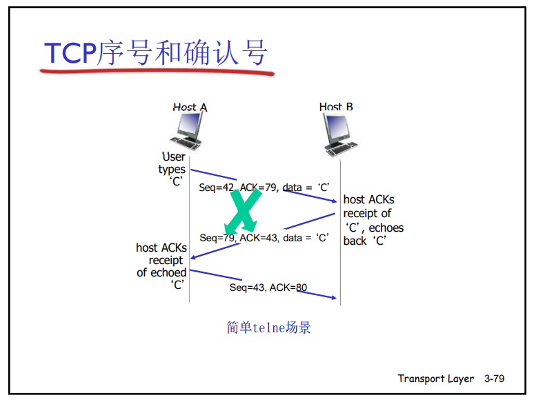
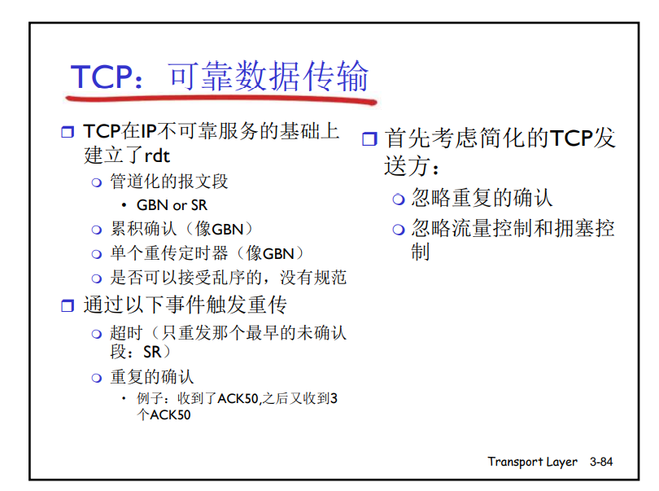
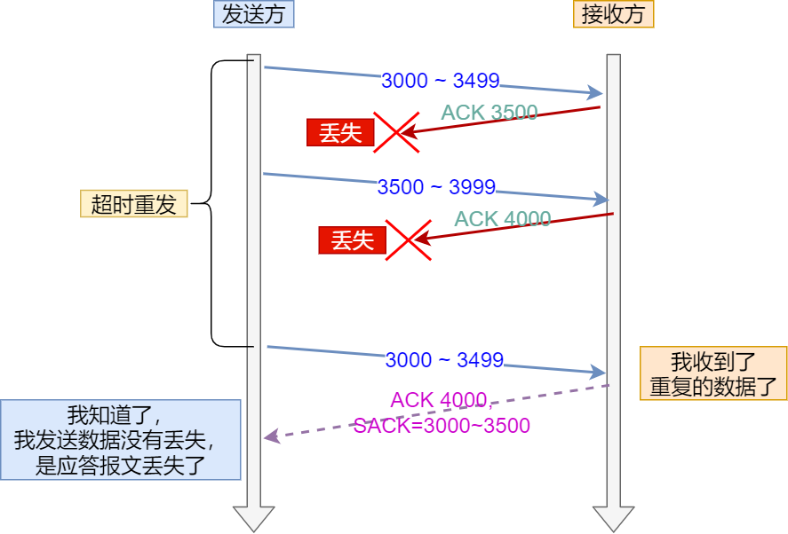
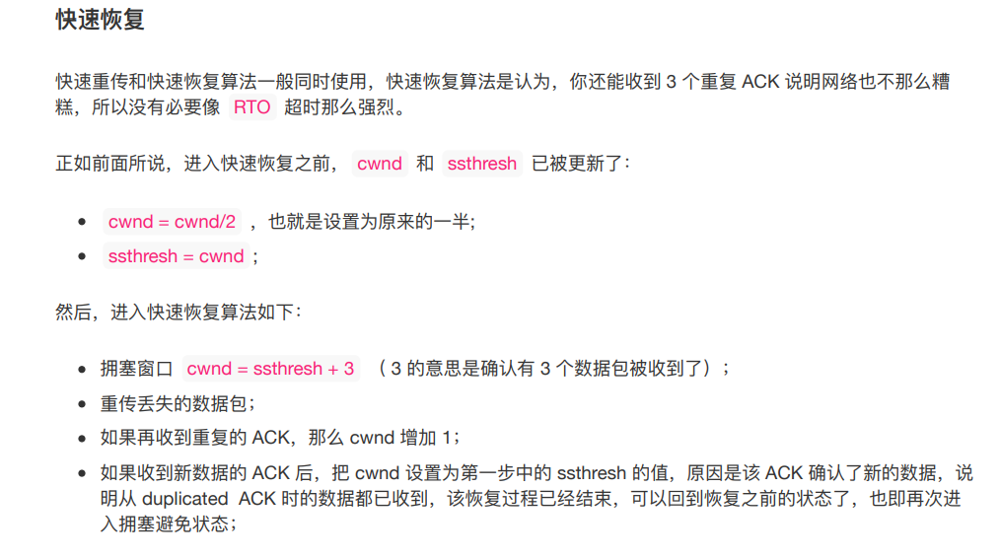

计算机网络笔记

## 第一章 基础

### 1. 协议层次及其服务模型

&ensp;&ensp;**服务**：低层实体向上层实体提供它们之间的通信的能力。


- **应用层**：应用层是网络应用程序和他们的应用层协议存留的地方。应用层的信息分组叫**报文**。
- - HTTP,SMTP,FTP,DNS,DHCP。
- **运输层**：运输层在应用程序端点之间传输应用层报文。有两种运输层协议：TCP向他的应用程序提供了面向连接的服务；UDP向他面向的应用程序提供无连接服务；运输层的分组称为**报文段**。
- **网络层**：网络层负责将称为**数据报**的网络层分组从一台主机移动到另一个主机。运输层协议向网络层递交运输层报文段和目的地址。
- - IP协议定义了数据报中的各个字段以及端系统和路由器如何作用与这些字段。
- **链路层**：为了将分组从一个节点移动到路径上的下一个节点。网络层将数据报传给链路层，链路层封装成帧，沿着路径传给下个节点。
- **物理层**：将帧中的一个个比特从一个节点移动到下一个节点。

&ensp;&ensp;**封装**：在发送端主机，应用层报文传给运输层，运输层收取报文并附加信息（运输层首部信息）构成运输层报文段；运输层因此封装了应用层报文，附加信息包括接受端运输层向上适当的应用层交付报文信息；差错检测信息等等；运输层向网络层传送该报文段，网络层添加如源和目的地址等网络层首部信息，生成网络数据报；数据接下来传给链路层，添加首部信息封装成帧；因此，在每一个层，分组具有两种类型的字段，首部字段和有效数据载荷，有效数据载荷来自上一层分组。

### 2. 键入网址到网页显示，期间发生了什么？

### 3. Linux系统是如何收发网络包的？


## 第二章应用层

### 1. 应用层体系原理

&ensp;&ensp;主流的体系结构包括**客户-服务器体系结构**和**对等（P2P）体系结构**。**客户-服务器体系结构**的应用程序有：Web，FTP和电子邮件等；**对等（P2P）体系结构**的应用包括：文件共享，因特网电话，迅雷等等。

&ensp;&ensp;多个端系统进行通信的实际上是**进程**而不是程序，通过跨越计算机网络交换报文进行通信。
&ensp;&ensp;进程通过一个称为**套接字**的软件接口向网络接受和发送报文。它是一台主机内应用层和运输层间的接口；也称为应用程序和网络之间的应用程序编程接口。


&ensp;&ensp;**进程寻址**：为了向服务器发送分组，需要定义两种信息。一个是主机的地址（**IP地址**）；另一个是目的主机指定接受进程的标识符（**端口号**）。

&ensp;&ensp;**可靠数据传输**：保证应用程序一端发送的数据正确地，完全交付给程序的另一端。

&ensp;&ensp;**不可靠数据传输**：发送进程发送的数据可能到达不了接收进程，这可能被**容忍丢失的应用所接受**，如视频和音频。


### 2. 因特网提供的运输服务

- **TCP服务**：是面向连接的服务和可靠数据传输服务。

- **UDP服务**：UDP协议提供一中不可靠数据传输服务，也是无连接的。没有拥塞控制等机制，发送端可以以任意速率向下注入数据。

&ensp;&ensp;**套子安全层（SSL）**：无论TCP或者UDP都没有加密机制，使用SSL加强后的TCP不仅可以做传统TCP所作的一切，还提供了关键的进程到进程的安全性服务，包括加密，数据完整性和鉴别。它在TCP上面实现，提供加密的TCP连接，属于应用层，有自己的套接字API。

- 应用层协议


### 3. Web和HTTP

- **HTML**：HTML 称为超文本标记语言，是一种标识性的语言。它包括一系列标签。通过这些标签可以将网络上的文档格式统一，使分散的 Internet 资源连接为一个逻辑整体。HTML 文本是由 HTML 命令组成的描述性文本，HTML 命令可以说明文字，图形、动画、声音、表格、链接等。 
- **URI**：URI的全称是（Uniform Resource Identifier），中文名称是统一资源标识符，使用它就能够唯一地标记互联网上资源。
- **URL**：URL的全称是（Uniform Resource Locator），中文名称是统一资源定位符，也就是我们俗称的网址，它实际上是 URI 的一个子集。


HTTP：web的应用层协议是**超文本传输协议**，使用**TCP**作为它的运输支持协议，HTTP服务器不保存用户的信息，是无状态协议。


&ensp;&ensp;每个对象需要2个RTT，一个建立连接一个用于请求和接收对象。

### 4. HTTP请求报文
&ensp;&ensp;**HTTP报文**：两种格式，请求和响应报文。
```C++
GET /somedir/page.html HTTP/1.1  //请求行
Host: www.somescool.edu  //后面都叫首部行
Connection: close  
User-Agent: Mozilla/5.0 //浏览器类型
Accept-language:fr  //用户得到法语版本
```

&ensp;&ensp;**请求行**：有三个字段，方法字段，URL字段，HTTP版本字段。方法包括GET、POST、HEAD、PUT、DELETE。 

&ensp;&ensp;**通用格式**：


### 5. HTTP响应报文
&ensp;&ensp;**HTTP响应报文**：
```C++
HTTP/1.1 200 OK  //初始状态行  协议字段  状态码 状态信息
Connection: close  // 6个首部行
Date: Tue, 18 AUG 2015 15:44:04 GMT //服务器产生相应并发送的时间
Server: Apache/2.2.3 (Centos)
Last-Modified: Tue, 18 AUG 2015 15:11:03 GMT//对象创建或者上次修改的时间
Content-Length: 6821  //发送对象的字节数
Content-Type:text/html //实体体中的对象是HTML文本

(data data ..  data)//实体体
```


- 505 代表服务器不支持请求报文所使用的HTTP协议。

### 6. cookies

**用cookie跟踪用户的状态**


**cookie组件**：
- HTTP响应报文中的一个cookie首部行。
- HTTP请求报文中的一个cookie首部行。
- 用户端系统中保留一个cookie文件，并由用户浏览器管理。
- 位于Web站点的后端数据库。
在无状态的HTTP之上建立一个用户会话层，允许服务器在用户与应用程序会话时标识用户。

### 7. Web缓存
&ensp;&ensp;**Web缓存器**：也叫代理服务器，有自己的磁盘存储空间，并在存储空间内保存最近请求过对象的副本。


- 缓存器发送一个条件GET执行最新检查，首部行里If-Modifed-Since的值等于最近一次从服务器获取的值。当服务器收到报文，发现内容没变，发送上面的响应报文，否则会发送如图下面的报文。


### 8. DNS

&ensp;&ensp;**域名**：又称网域，是由一串用点分隔的名字组成的Internet上某一台计算机或计算机组的名称，用于在数据传输时对计算机的定位标识（有时也指地理位置）
&ensp;&ensp;**域名入网结构** ：主机名、机构名、网络名、最高层域名 csu.edu.cn
&ensp;&ensp;**主机标识的方法**：IP地址和主机名（例如www.facebook.com等等）
&ensp;&ensp;**DNS（域名系统）**：提供主机名到IP地址的转换的目录服务。&ensp;&ensp;DNS是：
- 一个由分层DNS服务器实现的分布式数据库；
- 一个使得主机能够查询分数是数据库应用的应用层协议。
- 运行与UDP之上，端口53。

&ensp;&ensp;**DNS的目的**：
- 主要目的：提供主机名到IP地址的转换的目录服务。
- 其他目的：
    - 主机别名
    - 邮件服务器别名
    - 负载均衡，一个IP地址集合和一个规范主机名对应，DNS数据库存储这些IP地址集合，依次循环响应这些地址达到均衡。

&ensp;&ensp;3种类型的DNS服务器：


- 根DNS服务器：400个根名字服务器遍布世界，提供TLD服务器的IP地址
- 顶级域（TLD）DNS服务器：负责顶级域名（如com, org, net, edu和gov）
和所有国家级的顶级域名（如cn, uk, fr, ca, jp ）
- Network solutions公司维护com TLD服务器 
- Educause公司维护edu TLD服务
- 权威DNS服务器：组织机构的DNS服务器，提供组织机构服务器（如
Web和mail）可访问的主机和IP之间的映射组织机构可以选择实现自己维护或由某个服务提供商来维护。

**DNS域名解析过程**
&ensp;&ensp;主机到本地DNS是递归的，其余是迭代的

- 第一步：主机 A 首先向它的**本地 DNS 服务器**发送一个 DNS 查询报文。该查询报文含有被转换的主机名 def.mn.edu。
- 第二步：当本地的域名服务器收到请求后，就先查询本地的缓存，如果有该纪录项，则本地的域名服务器就直接把查询的结果返回。
- 第三步：如果本地的缓存中没有该纪录，本地 DNS 服务器将该报文转发到**根 DNS 服务器**，根 DNS 服务器注意到查询的 IP 地址前缀为 edu 后向本地 DNS 服务器返回负责 edu 的顶级域名服务器的 IP 地址列表。
- 第四步：该本地 DNS 服务器则再次向这些**顶级域名服务器发送查询报文**。该顶级域名服务器注意到 mn.edu 的前缀，并用权威域名服务器的 IP 地址进行响应。
- 第五步：顶级域名服务器并不总是知道每台主机的**权威 DNS 服务器的 IP 地址**，而只知道中间的某个服务器，该中间 DNS 服务器依次能找到用于相应主机的 IP 地址，我们假设中间经历了权威服务器 ① 和 ②，最后找到了负责 def.mn.edu 的权威 DNS 服务器 。
- 第六步：本地 DNS 服务器直接向该服务器发送查询报文从而获得主机 B 的IP 地址。
- 第七步：本地域名服务器把返回的结果保存到缓存，以备下一次使用，同时还将结果返回给客户机。


&ensp;&ensp;**DNS缓存**：某个DNS服务器收到了一个DNS回答，它能将映射到本地存储器里面。

&ensp;&ensp;**D资源记录RR**：RR提供了主机名到IP地址的映射。
- RR是一个四元组：（Name Value Type TTL）
- TTL是决定了记录应当从缓存中删除的时间
- Type决定了Name 和 Value的值

&ensp;&ensp;**DNS报文**:

   

### <u>前面是自己之前做的，后面是小林的</u>

### 9. HTTP基本概念

#### 9.1 HTTP是什么？

- HTTP是一个在计算机世界里面专门在两点之间传输文字、图片、音频、视频等超文本数据的约定和规范。

#### 9.2 HTTP常见的状态码  

|      | 具体含义                                                 | 常见的状态码       |
| ---- | -------------------------------------------------------- | ------------------ |
| 1xx  | 提示信息，表示目前是协议处理的中间状态，还需要后续的操作 |                    |
| 2xx  | 成功，报文已经收到并且被正确处理                         | 200，204，206      |
| 3xx  | 重定向，资源位置发生变动，需要客户端重新发送请求         | 301，302，304      |
| 4xx  | 客户端错误，请求报文有误，服务器无法处理                 | 400，403，404      |
| 5xx  | 服务器错误，服务器在请求处理的时候内部发生了错误         | 500，501，502，503 |

`1xx`类状态码属于提示信息，是协议处理中的一种中间状态，实际用到的比较少

`2xx`类状态码表示服务器成功处理了客户端的请求

- `200 ok`：是最常见的成功状态码，表示一切正常。如果是非head请求，服务器响应会有body数据。
- `204 No content`，常见的成功状态码，与 200 OK 基本相同，但响应没有 body 数据

`3xx` 类状态码表示客户端请求的资源发生了变动，需要客户端用新的 URL 重新发送请求获取资源，也就是**重定向**。

- 「**301 Moved Permanently**」表示永久重定向，说明请求的资源已经不存在了，需改用新的 URL 再次访问。
- 「**302 Found**」表示临时重定向，说明请求的资源还在，但暂时需要用另一个 URL 来访问。

301 和 302 都会在响应头里使用字段 `Location`，指明后续要跳转的 URL，浏览器会自动重定向新的 URL。

- 「**304 Not Modified**」不具有跳转的含义，表示资源未修改，重定向已存在的缓冲文件，也称缓存重定向，也就是告诉客户端可以继续使用缓存资源，用于缓存控制。

4xx类状态码表示客户端发送的报文有误，服务器无法处理。

- 400 Bad Request：表示客户端请求报文有误
- 403 Forbidden：表示服务器禁止访问资源，并不是请求出错
- 404 Not Found：表示请求的资源在服务器没有找到，无法提供

#### 9.3 HTTP常见字段

- Host字段：客户端发送请求的时候，用来指定域名。有了 `Host` 字段，就可以将请求发往「同一台」服务器上的不同网站。
- Content-Length：服务器在返回数据的时候，会有Content-Length字段，表示回应数据的长度。
- Connection 字段：用于客户端要求服务器是用TCP持久连接，以便请求复用。HTTP/1.1 版本的默认连接都是持久连接，但为了兼容老版本的 HTTP，需要指定 `Connection` 首部字段的值为 `Keep-Alive`。
- Content-type 字段：用于服务器回应的时候，告诉客户端本次数据是什么格式。
- Content-Encoding 字段：说明数据压缩的方式，表示服务器返回的数据使用了什么压缩格式。

### 10. GET和POST

#### 10.1 **GET与POST区别**


```C++
GET /books/?sex=man&name=Professional HTTP/1.1
Host: www.wrox.com
User-Agent: Mozilla/5.0 (Windows; U; Windows NT 5.1; en-US; rv:1.7.6)
Gecko/20050225 Firefox/1.0.1
Connection: Keep-Alive
// 空行
// 请求数据为空

```
* 区别
  * **get参数通过url传递，post放在request body中**，GET提交的数据会在地址栏中显示出来，而POST提交，地址栏不会改变
  * **POST的安全性要比GET的安全性高**，一个登录页面，通过GET方式提交数据时，用户名和密码将出现在URL上，如果页面可以被缓存或者其他人可以访问这台机器，就可以从历史记录获得该用户的账号和密码.
  * **get请求在url中传递的参数是有长度限制的，而post没有**
  * **GET产生一个TCP数据包，POST产生两个TCP数据包**。 
    *  对于GET方式的请求，浏览器会把http header和data一并发送出去，服务器响应200（返回数据）；
    *  对于POST，浏览器先发送header，服务器响应100 continue，浏览器再发送data，服务器响应200 ok（返回数据） 

我们可以这样理解：**一个URL地址，它用于描述一个网络上的资源**，而HTTP中的GET，POST，PUT，DELETE就对应着对这个资源的查，改，增，删4个操作。GET一般用于获取/查询资源信息，而POST一般用于更新资源信息。

- GET - 从指定的资源请求数据,把传送的数据放在url中，大多数浏览器url长度在2K个字节，大多数服务器能处理最长64K字节的url，只产生一个TCP包，浏览器会把http header和data一并发送出去，服务器响应200（返回数据）；
- POST - 向指定的资源提交要被处理的数据，把传送的数据放在body中，可以存放的数据多，浏览器先发送header，服务器响应100 continue，浏览器再发送data，服务器响应200 ok（返回数据）但是不同浏览器不一定是产生两个TCP包
- GET请求在URL中传送的参数是有长度限制的，而POST没有。
- GET比POST更不安全，因为参数直接暴露在URL上，所以不能用来传递敏感信息。而POST数据不会显示在URL中。是放在Request body中。
- 对参数的数据类型，GET只接受ASCII字符，而POST没有限制。
- GET请求参数会被完整保留在浏览器历史记录里；相反，POST请求参数也不会被浏览器保留。
- GET请求只能进行url编码（ application/x-www-form-urlencoded），而POST支持多种编码方式。
- GET请求会被浏览器主动缓存，而POST不会，除非手动设置。
- GET在浏览器回退时是无害的，而POST会再次提交请求。


#### 10.2 get和post方法都是安全且幂等的吗？

安全是指不会破坏服务器的资源。幂等是指多次执行相同的操作，所得结果都是相同的

- **GET 方法就是安全且幂等的**，因为它是「只读」操作，无论操作多少次，服务器上的数据都是安全的，且每次的结果都是相同的。所以，**可以对 GET 请求的数据做缓存，这个缓存可以做到浏览器本身上（彻底避免浏览器发请求），也可以做到代理上（如nginx），而且在浏览器中 GET 请求可以保存为书签**。body可以携带数据但没必要。
- **POST** 因为是「新增或提交数据」的操作，会修改服务器上的资源，所以是**不安全**的，且多次提交数据就会创建多个资源，所以**不是幂等**的。所以，**浏览器一般不会缓存 POST 请求，也不能把 POST 请求保存为书签**。

### 11. HTTP缓存技术

对于一些具有重复性的http请求，我们可以把响应-请求的数据缓存到本地，那么下次直接读取本地数据。

HTTP缓存有两种实现方式：强制缓存和协商缓存

#### 11.1 强制缓存

强缓存指的是只要浏览器判断缓存没有过期，则直接使用浏览器的本地缓存，决定是否使用缓存的主动性在于浏览器这边。主要是利用下面两个字段实现：

- Cache-Control：是一个相对时间
- Expires：绝对时间，前者优先级较高。
- 当浏览器第一次请求访问服务器资源时，服务器会在返回这个资源的同时，在 Response 头部加上 Cache-Control，Cache-Control 中设置了过期时间大小
- 浏览器再次请求访问服务器中的该资源时，会先**通过请求资源的时间与 Cache-Control 中设置的过期时间大小，来计算出该资源是否过期**，如果没有，则使用该缓存，否则重新请求服务器；
- 服务器再次收到请求后，会再次更新 Response 头部的 Cache-Control。

#### 11.2 协商缓存

**协商缓存就是与服务端协商之后，通过协商结果来判断是否使用本地缓存**。**协商缓存这两个字段都需要配合强制缓存中 Cache-control 字段来使用，只有在未能命中强制缓存的时候，才能发起带有协商缓存字段的请求**。基于两种头部实现

- 请求头部中的 `If-Modified-Since` 字段与响应头部中的 `Last-Modified` 字段实现，这两个字段的意思是：响应头部中的 `Last-Modified`：标示这个响应资源的最后修改时间；请求头部中的 `If-Modified-Since`：当资源过期了，发现响应头中具有 Last-Modified 声明，则再次发起请求的时候带上 Last-Modified 的时间，服务器收到请求后发现有 If-Modified-Since 则与被请求资源的最后修改时间进行对比（Last-Modified），如果最后修改时间较新（大），说明资源又被改过，则返回最新资源，HTTP 200 OK；如果最后修改时间较旧（小），说明资源无新修改，响应 HTTP 304 走缓存。
- 第二种：请求头部中的 `If-None-Match` 字段与响应头部中的 `ETag` 字段，这两个字段的意思是：响应头部中 `Etag`：唯一标识响应资源；请求头部中的 `If-None-Match`：当资源过期时，浏览器发现响应头里有 Etag，则再次向服务器发起请求时，会将请求头If-None-Match 值设置为 Etag 的值。服务器收到请求后进行比对，如果资源没有变化返回 304，如果资源变化了返回 200。

使用 ETag 字段实现的协商缓存的过程如下；

- 当浏览器第一次请求访问服务器资源时，服务器会在返回这个资源的同时，在 Response 头部加上 ETag 唯一标识，这个唯一标识的值是根据当前请求的资源生成的；

- 当浏览器再次请求访问服务器中的该资源时，首先会先检查强制缓存是否过期，如果没有过期，则直接使用本地缓存；如果缓存过期了，会在 Request 头部加上 If-None-Match 字段，该字段的值就是 ETag 唯一标识；

- 服务器再次收到请求后，

  会根据请求中的 If-None-Match 值与当前请求的资源生成的唯一标识进行比较

  - **如果值相等，则返回 304 Not Modified，不会返回资源**；
  - 如果不相等，则返回 200 状态码和返回资源，并在 Response 头部加上新的 ETag 唯一标识；

- 如果浏览器收到 304 的请求响应状态码，则会从本地缓存中加载资源，否则更新资源。


### 12.  HTTP特性

**HTTP（1.1）优点：**

- 简单， 报文的格式是请求行+header+body或者状态行+header+body
- 灵活和易于扩展
- 广泛应用和跨平台

**HTTP（1.1）缺点：**

- 无状态双刃剑：
  - 好处：服务器不会去记忆HTTP的状态，不需要额外的资源来记录状态信息，减轻负担
  - 坏处：关联操作十分麻烦，利用cookies技术解决
- 明文传输：
  - 通信使用明文（不加密），内容可能会被窃听
  - 不验证通信方的身份，因此有可能遭遇伪装
  - 无法证明报文的完整性，所以有可能已遭篡改

**HTTP（1.1）性能：**HTTP基于TCP/IP，并且使用了**请求-应答模式**通信模式。

- 长连接：早期 HTTP/1.0 性能上的一个很大的问题，那就是每发起一个请求，都要新建一次 TCP 连接（三次握手），而且是串行请求，做了无谓的 TCP 连接建立和断开，增加了通信开销。为了解决上述问题，1.1提出了长连接的通信方式，这种方式的好处在于减少了 TCP 连接的重复建立和断开所造成的额外开销，减轻了服务器端的负载。


- 管道网络传输：即在一个TCP连接里面，客户端可以发起多个请求，只要第一个请求发出去了，不必等待其回来，可以发送第二个请求，可以减少整体的响应时间。但是服务器必需得按照请求的顺序发送对这些管道化请求的响应，**HTTP/1.1 管道解决了请求的队头阻塞，但是没有解决响应的队头阻塞**。***注意：实际上 HTTP/1.1 管道化技术不是默认开启，而且浏览器基本都没有支持，所以后面讨论HTTP/1.1 都是建立在没有使用管道化的前提。***
- 队头阻塞：由上图的请求-响应模式可知，当顺序发送的请求序列中的一个请求因为某种原因被阻塞时，在后面排队的所有请求也一同被阻塞了，会招致客户端一直请求不到数据，这也就是「**队头阻塞**」，好比上班的路上塞车。

### 13. HTTPS

HTTPS和HTTTP的区别：

- HTTP 是超文本传输协议，信息是明文传输，存在安全风险的问题。HTTPS 则解决 HTTP 不安全的缺陷，在 TCP 和 HTTP 网络层之间加入了 SSL/TLS 安全协议，使得报文能够加密传输。
- HTTP 连接建立相对简单， TCP 三次握手之后便可进行 HTTP 的报文传输。而 HTTPS 在 TCP 三次握手之后，还需进行 SSL/TLS 的握手过程，才可进入加密报文传输。
- HTTP 的端口号是 80，HTTPS 的端口号是 443。
- HTTPS 协议需要向 CA（证书权威机构）申请数字证书，来保证服务器的身份是可信的。

HTTP由于是明文传输，安全上存在一下三个风险：

- **窃听风险**
- **篡改风险**
- **冒充风险**

HTTP**S** 在 HTTP 与 TCP 层之间加入了 `SSL/TLS` 协议，可以很好的解决了上述的风险：

- **信息加密**：交互信息无法被窃取，但你的号会因为「自身忘记」账号而没。 **混合加密**
- **校验机制**：无法篡改通信内容，篡改了就不能正常显示，但百度「竞价排名」依然可以搜索垃圾广告。**摘要算法**
- **身份证书**：证明淘宝是真的淘宝网，但你的钱还是会因为「剁手」而没。将服务器公钥放入到**数字证书**中。

HTTPS 采用的是**对称加密**和**非对称加密**结合的「混合加密」方式：

- 在通信建立前采用**非对称加密**的方式交换「会话秘钥」，后续就不再使用非对称加密。
- 在通信过程中全部使用**对称加密**的「会话秘钥」的方式加密明文数据。

在通信建立前，需要交换一些信息生成密钥，这个时候需要非对称加密叫交换这些信息。然后用**对称加密**的会话密钥加密数据。

- **公钥加密，私钥解密**。这个目的是为了**保证内容传输的安全**，因为被公钥加密的内容，其他人是无法解密的，只有持有私钥的人，才能解密出实际的内容；
- **私钥加密，公钥解密**。这个目的是为了**保证消息不会被冒充**，因为私钥是不可泄露的，如果公钥能正常解密出私钥加密的内容，就能证明这个消息是来源于持有私钥身份的人发送的。


准备工作：CA颁发服务器的数字证书，验证服务端的公钥是否可信。

- CA会把服务端的公钥，用途，有效时间等打包，然后对这些信息进行hash计算得到一个哈希值
- CA是用自己的私钥把Hash值加密，生成数字签名。
- 最后将 Certificate Signature 添加在文件证书上，形成数字证书。

HTTPS基本流程：

- 客户端向服务器索要并验证服务器的公钥

- 双方协商产生会话密钥

- 双方采用会话密钥进行加密通信

  

- TLS第一次握手：客户端发起加密通信的请求，发送一下信息：

  - 客户端支持的 SSL/TLS 协议版本
  - 客户端产生的随机数，用于生成会话密钥
  - 客户端支持的密码套件列表，如RSA加密算法

- TLS第二次握手：服务端收到客户端的请求，发出响应：

  - 确认SSL/TLS版本
  - 服务端产生的随机数，用于生成会话密钥
  - 确认的密码套件列表，如RSA算法
  - 服务器的数字证书（包含服务器的公钥+CA生成的签名（一个哈希值，是用CA私钥加密））

  可以看到，服务端选择的密码套件是 “Cipher Suite: TLS_RSA_WITH_AES_128_GCM_SHA256”。基本的形式是「**密钥交换算法 + 签名算法 + 对称加密算法 + 摘要算法**」， 一般 WITH 单词前面有两个单词，第一个单词是约定密钥交换的算法，第二个单词是约定证书的验证算法。比如刚才的密码套件的意思就是：由于 WITH 单词只有一个 RSA，则说明握手时密钥交换算法和签名算法都是使用 RSA；握手后的通信使用 AES 对称算法，密钥长度 128 位，分组模式是 GCM；摘要算法 SHA256 用于消息认证和产生随机数

- TLS第三次握手：客户端回应，首先利用浏览器或者操作系统的CA公钥，确认服务器的数字证书的真实性。

  - 客户端使用同样的哈希算法即RSA（签名算法）获取服务器公钥的Hash值H1，然后使用CA的公钥解密被CA私钥加密的前面，得到另外一个哈希值H2，比较H1和H2；这里是用私钥解密公钥加密的东西，为了验证
  - H1与H2相等，那么客户端从数字证书取出服务器公钥，产生一个新的随机数，pre-master key，使用服务器公钥和RSA加密算法（密钥交换算法）加密改报文。
  - 至此，服务端和客户端共享了三个随机数，用于生成会话密钥
  - 生成完会话密钥后，然后客户端发一个「**Change Cipher Spec**」，告诉服务端开始使用加密方式发送消息。
  - 然后，客户端再发一个「**Encrypted Handshake Message（Finishd）**」消息，把之前所有发送的数据做个摘要（使用协商的摘要算法），再用会话密钥（master secret）加密一下，让服务器做个验证，验证加密通信是否可用和之前握手信息是否有被中途篡改过。可以发现，「Change Cipher Spec」之前传输的 TLS 握手数据都是明文，之后都是对称密钥加密的密文。

- TLS第四次握手：

  - 通过服务器的私钥取出来用客户端的pre-master key，计算出会话密钥
  - 向客户端发送最后的信息，加密通信算法改变通知，表示随后的信息都将用「会话秘钥」加密通信。
  - 服务器握手结束通知，表示服务器的握手阶段已经结束。这一项同时把之前所有内容的发生的数据做个摘要，用来供客户端校验。          

### 14. HTTP/1.1如何优化

- 第一个思路：通过缓存技术来避免发送HTTP请求。客户端收到第一个响应的时候，缓存在本地磁盘，下次请求，如果强制缓存没过去（cache-control）没过期，直接读取缓存；如果过期，客户端发送请求的时候带上原来响应数据的摘要（etag）字段，服务器对比后发现资源没变，直接发出不带body的304响应，告诉其依然有效。
- 第二个思路：减少HTTP请求的次数
  - 将原本由客户端处理的重定向请求交给代理服务器处理 。减少重定向的次数。
  - 将多个小资源合并成一个大资源再传输，减少HTTP请求的次数以及头部的重复传输，再来减少TCP连接的数量（另外由于 HTTP/1.1 是请求响应模型，如果第一个发送的请求，未收到对应的响应，那么后续的请求就不会发送，于是为了防止单个请求的阻塞，所以一般浏览器会同时发起 5-6 个请求，每一个请求都是不同的 TCP 连接，那么如果合并了请求，也就会**减少 TCP 连接的数量，因而省去了 TCP 握手和慢启动过程耗费的时间**。）
- 第三个思路：压缩响应资源，降低传输资源的大小，进而提升传输效率。

### 15. HTTPS如何优化？

- 硬件优化：HTTPS是计算密集型，不是I/O密集型，应该选择可以**支持 AES-NI 特性的 CPU**。
- 协议优化：
  - 密钥交换算法的优化，选用ECDHE密钥交换算法代替RSA，可以在TLS三次握手就可以发送数据，2RTT减少到1RTT。
  - TLS1.2升级到TLS1.3，完成握手仅需要一个RTT
- 证书优化：
  - 证书传输优化，**对于服务器的证书应该选择椭圆曲线（ECDSA）证书，而不是 RSA 证书，因为在相同安全强度下， ECC 密钥长度比 RSA 短的多**
  - 证书验证优化：OSCP，在线证书状态协议，服务器周期性的**向 CA 发送查询请求，让 CA 返回证书的有效状态**，**获得一个带有时间戳和签名的响应结果并缓存它。**

### 16. HTTP2?

#### 16.1 头部压缩

HTTP/1.1协议的报文是由Header+Body组成的，Body可以使用字段content-Encoding指定压缩方式，但是Header没有压缩方式，存在一些问题：

- 含很多固定的字段，所以有必要**压缩**；
- 大量的请求和响应的报文里有很多字段值都是重复的，这样会使得大量带宽被这些冗余的数据占用了，所以有必须要**避免重复性**；
- 字段是 ASCII 编码的，虽然易于人类观察，但效率低，所以有必要改成**二进制编码**；

HTTP2采用了HPACK算法，包含三个组成部门：静态字典；动态字典；Huffman编码。客户端和服务器两端都会建立和维护「**字典**」，用长度较小的索引号表示重复的字符串，再用 Huffman 编码压缩数据，**可达到 50%~90% 的高压缩率**。

- 静态表编码：HTTP/2 为高频出现在头部的字符串和字段建立了一张**静态表**，它是写入到 HTTP/2 框架里的，不会变化的，静态表里共有 `61` 组，


Index代表key，Header value代表value值，Header Name表示字段名字，有些Index没有对应的Header value，这是因为这些 Value 并不是固定的而是变化的，需要经过 huffman编码之后发送出去。在统计大量的 HTTP 头部后，HTTP/2 根据出现频率将 ASCII 码编码为了 Huffman 编码表。

- 动态表编码：静态表只包含了 61 种高频出现在头部的字符串，不在静态表范围内的头部字符串就要自行构建**动态表**，它的 Index 从 `62` 起步，会在编码解码的时候随时更新。比如，第一次发送时头部中的「`user-agent` 」字段数据有上百个字节，经过 Huffman 编码发送出去后，客户端和服务器双方都会更新自己的动态表，添加一个新的 Index 号 62。**那么在下一次发送的时候，就不用重复发这个字段的数据了，只用发 1 个字节的 Index 号就好了，因为双方都可以根据自己的动态表获取到字段的数据**。因此，使得动态表生效有一个前提：**必须同一个连接上，重复传输完全相同的 HTTP 头部**。


#### 16.2 二进制帧

HTTP2将HTTP/1的文本格式改成二进制格式传输数据，极大提高了HTTP传输效率。它把报文响应分成了两类帧，首部和消息体帧，如下：


帧的类型分为控制帧和数据帧，最后面就是**帧数据**了，它存放的是通过 **HPACK 算法**压缩过的 HTTP 头部和body。

#### 16.3 并发传输

HTTP/1实现基于请求响应模型，同一个连接里面，需要完成一个事务，才可以处理下一个事务，存在队头阻塞的问题。HTTP/2通过Stream设计，多个Stream复用一条TCP连接，达到并发效果


- 一条TCP连接包含一个或者多个Stream，在 HTTP/2 中每个请求或相应的所有数据包，称为一个数据流（`Stream`）。每个数据流都标记着一个独一无二的编号（Stream ID），因此并发多个请求和响应，还可以设置Steam的优先级
- Stream里面包含一个或者多个Message，Message是对应HTTP/1的请求或者响应，由 HTTP 头部和包体构成；
- Message 里包含一条或者多个 Frame，Frame 是 HTTP/2 最小单位，以二进制压缩格式存放 HTTP/1 中的内容（头部和包体）；
- HTTP 消息可以由多个 Frame 构成，以及 1 个 Frame 可以由多个 TCP 报文构成。
- 不同Stream的帧可以乱序发送，因此可以并发不同的stream，每个帧头部带有Stream ID信息，可以有序组装成HTTP消息，同一Stream内部的帧必须是严格有序的。
- 客户端和服务器**双方都可以建立 Stream**， Stream ID 也是有区别的，客户端建立的 Stream 必须是奇数号，而服务器建立的 Stream 必须是偶数号。
- HTTP/2 通过 Stream 实现的并发，比 HTTP/1.1 通过 TCP 连接实现并发要牛逼的多，**因为当 HTTP/2 实现 100 个并发 Stream 时，只需要建立一次 TCP 连接，而 HTTP/1.1 需要建立 100 个 TCP 连接，每个 TCP 连接都要经过TCP 握手、慢启动以及 TLS 握手过程，这些都是很耗时的。**

#### 16.4 服务器主动资源推送

#### 16.5 缺点

HTTP2是基于TCP协议来传输数据的，TCP是字节流协议，TCP层必须保证收到字节数据是完整且连续的，这样内核才会将缓冲区里面的数据返回给HTTP应用，那么当前一个数据没有到达的时候，后面收到的数据只能放在内核缓冲区里面，只有等到这一个字节到达的时候，HTTP2应用层才能从内核拿到数据，这是HTTP2的队头阻塞问题。


假设发送丢包，就会触发TCP的重传机制，这样这个TCP连接的所有流也就是HTTP请求都被阻塞了。


## 第三章  运输层

### 1. 概述和运输层服务

- **运输层作用**：**网络层**解决了两个端系统之间的逻辑通信，而**运输层**则拓展到了两个不同端系统上的应用进程之间的交互服务。为运行在不同主机上的应用进程提供了**逻辑通信**功能。
- 因特网有两种运输层协议，**TCP**和**UDP**。
- **UDP**：它为调用它的应用程序提供了一中不可靠、无连接的服务。
- **TCP**：提供了一中可靠的、面向连接的服务。

### 2. 多路复用和多路分解

- **多路复用**：在源主机从不同套接字中收集数据块，并为每个数据块封装上首部信息从而生成报文段，然后将报文段传递到网络层，所有的这些工作称为**多路复用**。
- **多路分解**：将运输层报文段中的数据交付到正确的套接字的工作称为多路分解。
- 多路复用的要求：
  - 套接字有唯一标识符
  - 每个报文段有特殊字段来指示该报文段所要交付的套接字。这些特殊字段是**源端口号字段**和**目的端口号字段**。
  

- **端口号**：端口的作用是定位到主机上的某一个进程，通过这个端口进程就可以接受到对应的网络数据了。端口也是一个整形数 unsigned short ，一个16位整形数，有效端口的取值范围是：0 ~ 65535(0 ~ 2^16-1)。
  - **0-1023**：周知端口号，保留给HTTP（80）和FTP（21）等周知的应用层来使用。
  - **注意**：并不是所有的进程都需要关联一个端口，只有需要继续网络通信的进程才会关联一个端口，并且一个端口只能给一个进程使用，不能多个进程同时使用一个端口。
- **UDP套接字**：由一个二元组（目的IP和目的端口号）标识。
- **TCP套接字**：由一个四元组（源IP,源端口，目的IP，目的端口号）标识；具有两个不同的源IP或者源端口的到达TCP报文段会被定位到不同的套接字，除非TCP报文段写道了初始创建连接的请求。
- 举例：
```Python
TCP服务器有一个**欢迎套接字**，在端口号为12000等待来自TCP客户端的连接请求创立

TCP客户创建套接字并发送连接请求报文段
clientSocket = socket(AF_INET,SOCKET_STREAM)
clientSocket.connect((servername,12000))

服务器进程的计算机主机操作系统收到具有目的12000的入连接请求报文后，定位此服务器进程，该进程正在端口号为12000等待接收连接。该服务器创建一个新的套接字
connectionSocket，addr = serverSocket.accept()

该服务器的运输层还注意到连接请求报文中的下列四个值（源端口，源IP，目的端口，自身IP），新创建的套接字用这四个来标识，后续到达的报文段如果匹配上，就被分解到找这个套接字。
```
- 套接字和进程不是一一对应的关系，当浏览器客户发送报文段时，所有报文段的目的端口都是80，服务器只使用一个进程，但是为每个新用户创建套接字线程，如下


### 3. UDP
- 运输层最低限度必须提供一种复用/分解服务，以便网络层与正确的应用进程传输数据。
- UDP就是如此，从应用进程得到数据，附上用于多路复用/分解的源和目的端口字段，以及其他两个小字段形成报文段交给网络层。


#### UDP报文段结构


- 应用层数据占用UDP报文段的数据字段
- 分组首部进四个字段，每个字段两个字节，源和目的端口字段用于分解复用；长度字段指出了UDP报文段的字节数（首部加数据）；接收方使用校验和检验报文段是否出现了差错。
- UDP校验和提供了差错检测功能，检验报文段中的比特是否出现差错。


- 发送方：原码相加 ，并将高位叠加到低位，取反 ，得到反码求和结果，放入校验和
  接收方：将所有原码 相加，高位叠加， 如全为1，则正确，即这三个16比特相加，若不是全1，则出现了差错。


### 4. 可靠数据传输原理

|  机制   | 用途和说明  |
|  ----  | ----  |
| 检验和  | 用于检测在一个分组中的传输错误 |
| 定时器  | 用于超时和重传一个分组，可能因为分组或者其(ACK)丢了。由于一个分组时延但未丢失（过早超时），或当一个分组已被接收方接受但是接收方发送的ACK丢失，可能产生超时，所以接收方可能会收到多个冗余的副本 |
| 序号  | 用于为从发送方流向接收方的数据分组按顺序编号。所以接收的分组序号间隙可以使得接收方检测出丢失的分组。其相同序号的分组可以使得接收方检测出一个冗余的分组 |
| 确认  | 接收方告诉发送方一个分组或者一组分组已经被正确的接收了，确认报文通常含有被确认的分组序号，可以是逐个或者累计的 |
| 否定确认  | 接收方用于告诉发送方某个分组未被正确的接收，否对确认报文通常携带着未被正确接收的分组序号 |
| 窗口和流水线  | 发送方也许被限制仅发送那些序号落在一个指定的范围内的分组，滑动窗口的长度可根据接受发接收，缓存报文的能力，网络中的拥塞程度来设置 |

- 停止-等待（RTD 3.0）


- 流水线协议


- 退回N步
  - **发送方**窗口尺寸$W_t$的取值范围为 $1<W_T<=2^n-1$,$n$是构成分组序号的比特数量，$W_t=1$就变成停止-等待；$W_t>2^n-1$导致接收方无法区分新旧分组。
  - 发送方可在未接收到确认分组的情况，将落在发送窗口内的多个数据发送出去。
  - 发送方只有收到对已发送的数据的确认时，发送窗口才能向前滑动。
  - 发送方收到多个重复确认时，可以在重传计算器之前开始重传。
  - 发送方窗口内某个以发送的数据分组产生超时重传，其后续在发送窗口内的且已经发送的数据也必须全部重传，即GBN。
  - **接收方**尺寸$W_r=1$,仅能按序接收分组，接收方只接收序号在接收窗口内且无误码的数据分组，并且将接收窗口往前滑动一个位置，与此同时给发送方发送相应的确认分组，为了减少开销，不一定每接收一个分组就发送确认分组，而是可以连续收到好几个按序到达的且无无码的分组之后，才对最后一个数据分组发送确认分组，称为累计确认。
  - 接受方收到未按序到达的分组，除了丢弃之外还要对最近按序到达接收的分组进行确认。

- 选择重传
  - **发送方**窗口尺寸$W_t$的取值范围为 $1<W_T<=2^{(n-1)}$,$n$是构成分组序号的比特数量，$W_t=1$就变成停止-等待；$W_t>2^{(n-1)}$导致接收方无法区分新旧分组。
  - 发送方可在未接收到确认分组的情况，将落在发送窗口内的多个数据发送出去。
  - 发送方只有收到对已发送的数据的确认时，发送窗口才能向前滑动。若收到未按序到达的确认分组时，对其进行记录，以防止相应的数据超时重发，但发送窗口不能向前滑动。
  - **接收方**尺寸$1<W_r<=W_t$
  - 接收方可接收未按序到达但无误码且落在接收窗口内的分组。
  - 为了使得发送方重传出现错误的分组，接收方不再使用累计确认而且要对每个正确接收的分组逐一确认。
  - 接收方只有在按序接收到数据分组后，接收窗口才能向前相应滑动。

### 5. TCP

#### TCP概述
- 点对点：一个发送方，一个接收方。
- 面向连接的，发送数据之前，两个进程必须先握手，发送预备报文，初始化双方的状态参数变量，TCP是全双工的，在同一连接中数据双向流动。
- 发送和接收缓存
- 最大报文段：TCP可从缓存取出并放入报文段的数据量（MSS），根据本地发送主机的最大链路长度（MTU）来设置，以太网和PPP链路都具有1500字节的MTU，因此MSS的典型值为1460字节（TCP/IP的首部长度都为20字节）。

#### TCP报文段


- TCP报文段由首部字段和数据字段构成，TCP首部一般20字节。
- 首部包括源端口和目的端口，用于多路复用和分解。
- 也包括检验和字段
- 32比特的序号字段和32比特的确认号字段，用于实现可靠数据传输服务。
- 16比特接收窗口字段，用于流量控制，指示接收方愿意接收的字节数量。
- 4比特首部长度字段
- 可选和变长的选项字段
- 6比特标志字段；ACK表示一个对自己已成功被接收的报文段的确认。RST,SYN和FIN用于建立连接和拆除；

- **最重要的是序号和确认号字段**：TCP传输的是字节流，一个报文段的序号是该报文段首字节的字节流编号

```python
主机A填充进报文段的确认号是主机A期望从主机B收到的下一字节号
A：Seq=42，ACK=79，data='c'表示主机A发送数据是从编号为42的字节开始，发送一个字节'c'，希望收到主机B序号为79开始的字节流数据
B：Seq=79，ACK=43，data='C'表示主机B已经成功收到了A序号为42之前的所有数据，希望收到序号43开始的数据，然后B传输的数据是从79开始。
```

#### 往返时间的估计与超时
**TCP采用超时-重传**机制来处理报文丢失的问题，因此超时间隔必然大于连接的往返时间RTT。


#### TCP可靠传输
- 数据分块：应用数据被分割成 TCP 认为最适合发送的数据块。
- 序列号和确认应答：TCP 给发送的每一个包进行编号，在传输的过程中，每次接收方收到数据后，都会对传输方进行确认应答，即发送 ACK 报文，这个 ACK 报文当中带有对应的确认序列号，告诉发送方成功接收了哪些数据以及下一次的数据从哪里开始发。除此之外，接收方可以根据序列号对数据包进行排序，把有序数据传送给应用层，并丢弃重复的数据。
- 校验和： TCP 将保持它首部和数据部分的检验和。这是一个端到端的检验和，目的是检测数据在传输过程中的任何变化。如果收到报文段的检验和有差错，TCP 将丢弃这个报文段并且不确认收到此报文段。
- 流量控制： TCP 连接的双方都有一个固定大小的缓冲空间，发送方发送的数据量不能超过接收端缓冲区的大小。当接收方来不及处理发送方的数据，会提示发送方降低发送的速率，防止产生丢包。TCP 通过滑动窗口协议来支持流量控制机制。
- 拥塞控制： 当网络某个节点发生拥塞时，减少数据的发送。
- ARQ协议： 也是为了实现可靠传输的，它的基本原理就是每发完一个分组就停止发送，等待对方确认。在收到确认后再发下一个分组。
超时重传： 当 TCP 发出一个报文段后，它启动一个定时器，等待目的端确认收到这个报文段。如果超过某个时间还没有收到确认，将重发这个报文段。
- TCP的重传是GBN和SR的结合体




 - 快速重传


- 流量控制：TCP为应用程序提供了流量控制服务，消除发送方使得接收方缓存溢出的可能性；TCP提供让发送方维护一个接收窗口的变量来提供流量控制，接收窗口通知发送方它还要多少缓存空间。

- 若将rwnd=0告诉发送方，发送方不知道什么时候缓存有新的空间，为了防止这种死锁局面出现，发送方会继续发送探测报文，带有一个字节数据，这段报文会被接收方确认，如果缓存清空，回退给一个确认报文，rwnd非0。

### 6. TCP连接管理

- TCP 连接是双向连接，客户端和服务器需要分别向对方发送连接请求，并且建立连接，三次握手成功之后，二者之间的双向连接也就成功建立了。如果要保证三次握手顺利完成，必须要满足以下条件：
- 服务器端：已经启动，并且启动了监听（被动接受连接的一端）
- 客户端：基于服务器端监听的 IP 和端口，向服务器端发起连接请求（主动发起连接的一端）


**第一次握手：**（客户端发起连接请求）

- 客户端：客户端向服务器端发起连接请求将报文中的 SYN 字段置为 1，生成随机序号 x，seq=x
- 服务器端：接收客户端发送的请求数据，解析 tcp 协议，校验 SYN 标志位是否为 1，并得到序号 x

**第二次握手：**（服务器收到客户端的连接请求，同时发送连接请求）

- 服务器端：给客户端回复数据
```c++
1、回复 ACK, 将 tcp 协议 ACK 对应的标志位设置为 1，表示同意了客户端建立连接的请求
2、回复了 ack=x+1, 这是确认序号
   x: 客户端生成的随机序号
   1: 客户端给服务器发送的数据的量，SYN 标志位存储到某一个字节中，因此按照一个字节计算，表示客户端给服务器发送的 1 个字节服务器收到了。
3、将 tcp 协议中的 SYN 对应的标志位设置为 1, 服务器向客户端发起了连接请求
4、服务器端生成了一个随机序号 y, 发送给了客户端
```
- 客户端：接收回复的数据，并解析 tcp 协议
```cpp
1、校验 ACK 标志位，为 1 表示服务器接收了客户端的连接请求
2、数据校验，确认发送给服务器的数据服务器收到了没有，计算公式如下：
3、发送的数据的量 = 使用服务器回复的确认序号 - 客户端生成的随机序号 ===> 1=x+1-x
4、校验 SYN 标志位，为 1 表示服务器请求和客户端建立连接
4、得到服务器生成的随机序号: y
```

**三次握手：**（客户端接受服务器的连接）
- 客户端：发送数据给服务器
```cpp
1、将 tcp 协议中 ACK 标志位设置为 1，表示同意了服务器的连接请求
    给服务器回复了一个确认序号ack = y+1
    y：服务器端生成的随机序号
2、服务器给客户端发送的数据量，服务器给客户端发送了 ACK 和 SYN, 都存储在这一个字节中
3、发送给服务器的序号就是上一次从服务器端收的确认序号因此 seq = x+1
```
- 服务器端：接收数据，并解析 tcp 协议
```c++
1、查看 ACK 对应的标志位是否为 1, 如果是 1 代表，客户端同意了服务器的连接请求
2、数据校验，确认发送给客户端的数据客户端收到了没有，计算公式如下：
给客户端发送的数据量 = 确认序号 - 服务器生成的随机序号 ===> 1=y+1-y
3、得到客户端发送的序号：x+1
```

四次挥手是断开连接的过程，需要双向断开，关于由哪一端先断开连接是没有要求的。通信的两端如果想要断开连接就需要调用 close() 函数，当两端都调用了该函数，四次挥手也就完成了。
- 客户端和服务器断开连接 -> 单向断开
- 服务器和客户端断开连接 -> 单向断开


第一次挥手：

- 主动断开连接的一方：发送断开连接的请

  ​	将 tcp 协议中 FIN 标志位设置为 1，表示请求断开连接
  ​	发送序号 x 给对端，seq=x，基于这个序号用于客户端数据校验的计算

- 被动断开连接的一方：接收请求数据，并解析 TCP 协议

  ​	校验 FIN 标志位是否为 1
  ​	收到了序号 x，基于这个数据计算回复的确认序号 ack 的值

第二次挥手：

- 被动断开连接的一方：回复数据

  ​	同意了对方断开连接的请求，将 ACK 标志位设置为 1
  ​	回复 ack=x+1，表示成功接受了客户端发送的一个字节数据
  ​	向客户端发送序号 seq=y，基于这个序号用于服务器端数据校验的计算

- 主动断开连接的一方：接收回复数据，并解析 TCP 协议

  ​	校验 ACK 标志位，如果为 1 表示断开连接的请求对方已经同意了
  ​	校验 ack 确认发送的数据服务器是否收到了，发送的数据 = ack - x = x + 1 -x = 1

第三次挥手：

- 被动断开连接的一方：将 tcp 协议中 FIN 标志位设置为 1，表示请求断开连接
- 主动断开连接的一方：接收请求数据，并解析 TCP 协议，校验 FIN 标志位是否为 1

第四次挥手：

- 主动断开连接的一方：回复数据

  ​	将 tcp 协议中 ACK 对应的标志位设置为 1，表示同意了断开连接的请求
  ​	ack=y+1，表示服务器发送给客户端的一个字节客户端接收到了
  ​	序号 seq=h，此时的 h 应该等于 x+1，也就是第三次挥手时服务器回复的确认序号 ack 的值

- 被动断开连接的一方：收到回复的 ACK, 此时双向连接双向断开，通信的两端没有任何关系了.

**状态转换**


```c++
//CLOSED：
初始状态，表示TCP连接是“关闭着的”或“未打开的”。
//LISTEN ：
表示服务器端的某个SOCKET处于监听状态，可以接受客户端的连接。
//SYN_RCVD(recivied) ：
表示服务器接收到了来自客户端请求连接的SYN报文。在正常情况下，这个状态是服务器端的SOCKET在建立TCP连接时的三次握手会话过程中的一个中间状态，很短暂，基本上用netstat很难看到这种状态，除非故意写一个监测程序，将三次TCP握手过程中最后一个ACK报文不予发送。当TCP连接处于此状态时，再收到客户端的ACK报文，它就会进入到ESTABLISHED 状态。
//SYN_SENT:
这个状态与SYN_RCVD遥想呼应，当客户端SOCKET执行CONNECT连接时，它首先发送SYN报文，因此也随即它会进入到了SYN_SENT状态，并等待服务端的发送三次握手中的第2个报文。SYN_SENT状态表示客户端已发送SYN报文。
//ESTABLISHED：
这个容易理解了，表示连接已经建立了。
//FIN_WAIT_1:
这个状态得好好解释一下，其实FIN_WAIT_1 和FIN_WAIT_2 两种状态的真正含义都是表示等待对方的FIN报文。而这两种状态的区别是：FIN_WAIT_1状态实际上是当SOCKET在ESTABLISHED状态时，它想主动关闭连接，向对方发送了FIN报文，此时该SOCKET进入到FIN_WAIT_1 状态。而当对方回应ACK报文后，则进入到FIN_WAIT_2 状态。当然在实际的正常情况下，无论对方处于任何种情况下，都应该马上回应ACK报文，所以FIN_WAIT_1 状态一般是比较难见到的，而FIN_WAIT_2 状态有时仍可以用netstat看到。
//FIN_WAIT_2：
上面已经解释了这种状态的由来，实际上FIN_WAIT_2状态下的SOCKET表示半连接，即有一方调用close()主动要求关闭连接。注意：FIN_WAIT_2 是没有超时的（不像TIME_WAIT 状态），这种状态下如果对方不关闭（不配合完成4次挥手过程），那这个 FIN_WAIT_2 状态将一直保持到系统重启，越来越多的FIN_WAIT_2 状态会导致内核crash。
//TIME_WAIT:
表示收到了对方的FIN报文，并发送出了ACK报文，就等2MSL后即可回到CLOSED可用状态了。如果FIN_WAIT_1状态下，收到了对方同时带FIN标志和ACK标志的报文时，可以直接进入到TIME_WAIT状态，而无须经过FIN_WAIT_2状态。
//CLOSING:
这种状态在实际情况中应该很少见，属于一种比较罕见的例外状态。正常情况下，当一方发送FIN报文后，按理来说是应该先收到（或同时收到）对方的ACK报文，再收到对方的FIN报文。但是CLOSING 状态表示一方发送FIN报文后，并没有收到对方的ACK报文，反而却也收到了对方的FIN报文。什么情况下会出现此种情况呢？那就是当双方几乎在同时close()一个SOCKET的话，就出现了双方同时发送FIN报文的情况，这是就会出现CLOSING 状态，表示双方都正在关闭SOCKET连接。
//CLOSE_WAIT:
 这种状态的含义其实是表示在等待关闭。怎么理解呢？当对方close一个SOCKET后发送FIN报文给自己，你系统毫无疑问地会回应一个ACK报文给对方，此时则进入到CLOSE_WAIT状态。接下来呢，实际上你真正需要考虑的事情是查看你是否还有数据发送给对方，如果没有的话，那么你也就可以close这个SOCKET，发送FIN报文给对方，也即关闭连接。所以你在CLOSE_WAIT状态下，需要完成的事情是等待你去关闭连接。
//LAST_ACK:
当被动关闭的一方在发送FIN报文后，等待对方的ACK报文的时候，就处于LAST_ACK 状态。当收到对方的ACK报文后，也就可以进入到CLOSED 可用状态了。
```
#### a、三次握手
在第一次握手之前，服务器端必须先启动，并且已经开始了监听

  - 服务器端先调用了 listen() 函数, 开始监听
  - 服务器启动监听前后的状态变化: 没有状态 ---> LISTEN

第一次握手：

- 客户端调用connect() 函数，状态变化：没有状态 -> SYN_SENT.
- 服务器：收到连接请求 SYN，状态变化：LISTEN -> SYN_RCVD（被接受）

第二次握手：

- 服务器：给客户端回复 ACK，并且请求和客户端建立连接，状态无变化，依然是 SYN_RCVD
- 客户端：接收数据，收到了 ACK，状态变化：SYN_SENT -> ESTABLISHED(建立)

第三次握手：

- 客户端：给服务器回复 ACK，同意建立连接，状态没有变化，还是 ESTABLISHED
- 服务器：收到了 ACK，状态变化：SYN_RCVD -> ESTABLISHED

三次握手完成之后，客户端和服务器都变成了同一种状态，这种状态叫：ESTABLISHED，表示双向连接已经建立， 可以通信了。在通过过程中，正常的通信状态就是 ESTABLISHED。

#### b、四次挥手

第一次挥手：

- 客户端：调用 close() 函数，将 tcp 协议中的 FIN 设置为 1，请求和服务器断开连接，状态变化:ESTABLISHED -> FIN_WAIT_1
- 服务器：收到断开连接请求，状态变化: ESTABLISHED -> CLOSE_WAIT

第二次挥手：

- 服务器：回复 ACK，同意断开连接的请求，状态没有变化，还是 CLOSE_WAIT
- 客户端：收到 ACK，状态变化：FIN_WAIT_1 -> FIN_WAIT_2

第三次挥手：

- 服务器端：调用 close () 函数，发送 FIN 给客户端，请求断开连接，状态变化：CLOSE_WAIT -> LAST_ACK
- 客户端：收到 FIN，状态变化：FIN_WAIT_2 -> TIME_WAIT

第四次挥手：

- 客户端：回复 ACK 给服务器，状态是没有变化的，状态变化：TIME_WAIT -> 没有状态
- 服务器端：收到 ACK，双向连接断开，状态变化：LAST_ACK -> 无状态(没有了)


### 7. 三次握手与四次挥手的常见问题

（1）**为什么TCP三次握手，不能两次或者四次吗？**

答：

*  三次握手是为了防止，客户端的请求报文在网络滞留，客户端超时重传了请求报文，服务端建立连接，传输数据，释放连接之后，服务器又收到了客户端滞留的请求报文，建立连接一直等待客户端发送数据。
*  服务器对客户端的请求进行回应(第二次握手)后，就会理所当然的认为连接已建立，而如果客户端并没有收到服务器的回应呢？此时，客户端仍认为连接未建立，服务器会对已建立的连接保存必要的资源，如果大量的这种情况，服务器会崩溃。 
*  服务器端给客户端发送同步及确认报文时可以合并，四次会浪费时间

（2）为什么TIME_WAIT状态需要经过2MSL(最大报文段生存时间)才能返回到CLOSE状态？

注意：四次挥手期间，客户端和服务器端都可主动释放连接，谁主动释放，谁将进入TIME_WAIT状态

在客户端收到第三次挥手的信息时，客户机会进入TIME_WAIT状态，同时发起第四次挥手，给服务器发送确认ACK，但是在发送过程中，这个ACK有可能会丢失，导致服务器不能收到确认消息，因此服务器会会不断的重复发送FIN片段，所以客户端在发出第四次挥手消息时，不能马上关闭，它必须确认服务器收到了确认消息再关闭。 同时可以防止“已失效的连接请求报文段”出现在本连接中。 客户端在发送完最后一个ACK报文段后，再经过2MSL，就可以使本连接持续的时间内所产生的所有报文段都从网络中消失一个新的连接中不会出现这种旧的连接请求报文段。

如果客户端在发送第四次挥手消息的同时，直接释放关闭，一旦这个ACK丢失的话，服务器就无法正常的进入关闭连接状态。为什么是2MSL 的原因：因为第四次挥手的消息发送到服务器需要的时间最长为MSL，如果这个ACK丢失的话，表示服务器没有收到，它就会立即重发FIN片段给客户端，重复第三次握手过程，而发送的信息到客户端最大时间也为MSL，所以至少要等待2MSL的时间后才能释放连接。

（3）如果已经建立了连接，但是客户端突然出现故障了怎么办？

TCP还设有一个保活计时器，显然，客户端如果出现故障，服务器不能一直等下去，白白浪费资源。服务器每收到一次客户端的请求后都会重新复位这个计时器，时间通常是设置为2小时，若两小时还没有收到客户端的任何数据，服务器就会发送一个探测报文段，以后每隔75秒钟发送一次。若一连发送10个**探测报文**仍然没反应，服务器就认为客户端出了故障，接着就关闭连接。

（4）TCP四次挥手及四次缘由

四次报文中服务器端发送给客户端的请求关闭连接报文FIN和ACK也是合并的，相对于三次来说，只是前面多了一次ACK的确认。

**为什么TCP四次挥手，不能三次吗？**

* 当客户端确认发送完数据且知道服务器已经接收完了，想要关闭发送数据口（当然确认信号还是可以发），就会发FIN给服务器。
* 服务器收到客户端发送的FIN，表示收到了，就会发送ACK回复。
* 但这时候服务器可能还在发送数据，没有想要关闭数据口的意思，所以服务器的FIN与ACK不是同时发送的，而是等到服务器数据发送完了，才会发送FIN给客户端。
* 客户端收到服务器发来的FIN，知道服务器的数据也发送完了，回复ACK， 客户端等待2MSL以后，没有收到服务器传来的任何消息，知道服务器已经收到自己的ACK了，客户端就关闭链接，服务器也关闭链接（服务器比客户端早关闭）。 


### 上述是自己很久之前写的  后面是小林

### 9. TCP三次握手和四次挥手面试题

#### 9.1 TCP基本认知


- 序列号：在建立连接的时候由计算机随机生成的随机数作为其初始值，每发送一次，就累加 一次改数据字节数的大小。**用来解决网络包乱序的问题。**

- 确认应答号：只下一次期望收到的数据的序列号，可以认为这个序号以前的数据被正常接受，**用来解决丢包的问题**。
- 控制位 ：
  - ACK：该位为1的时候，确认应答字段变为有效，TCP规定除了最初建立连接时的SYN包之外该位必须设置位1
  - RST：该位为1的时候，表示TCP连接出现异常，必须强制断开连接。
  - SYN：为1，表示希望建立连接，并在其序列号字段进行初始值的设定。
  - FIN：为1，表示今后不再有数据发送，希望断开连接。

**啥是TCP？**

 TCP 是一个工作在**传输层**的**可靠**数据传输的服务，它能确保接收端接收的网络包是**无损坏、无间隔、非冗余和按序的。**它是面面向连接的，可靠的，基于字节流的传输层通信协议。

- 面向连接：是1对1的连接，不能像 UDP 协议可以一个主机同时向多个主机发送消息，也就是一对多是无法做到的；
- 可靠的：能保证报文能够到达接收端
- 字节流：用户消息通过 TCP 协议传输时，消息可能会被操作系统「分组」成多个的 TCP 报文，如果接收方的程序如果不知道「消息的边界」，是无法读出一个有效的用户消息的。并且 TCP 报文是「有序的」，当「前一个」TCP 报文没有收到的时候，即使它先收到了后面的 TCP 报文，那么也不能扔给应用层去处理，同时对「重复」的 TCP 报文会自动丢弃。

**UDP和TCP的区别，以及应用场景**

UDP不提供复杂的控制机制，利用IP提供面向无连接的通信服务。UDP协议非常简单，头部只有8字节，如下：


- 目标和源端口：主要是告诉 UDP 协议应该把报文发给哪个进程。
- 包长度：该字段保存了 UDP 首部的长度跟数据的长度之和。
- 校验和：校验和是为了提供可靠的 UDP 首部和数据而设计，防止收到在网络传输中受损的 UDP包。

区别：

1. 连接，TCP时面向连接的传输层协议，传输数据时要先建立连接；UDP不需要，即可传输数据
2. 服务对象，TCP时一对一的两点服务，UDP支持1对1，1对多，多对多的交互通信。
3. 可靠性，TCP可靠交付数据，DUP不可靠。
4. 流量控制和拥塞控制，TCP 有拥塞控制和流量控制机制，根据网络的状态调节发送数据包的速率。UDP 则没有，即使网络非常拥堵了，也不会影响 UDP 的发送速率。
5. 首部开销：TCP 首部长度较长，会有一定的开销，首部在没有使用「选项」字段时是 `20` 个字节，如果使用了「选项」字段则会变长的，UDP 首部只有 8 个字节，并且是固定不变的，开销较小。
6. 传输发送：TCP是流式传输，没有边界，但是保证顺序和可靠。UDP是一个一个包发送，有边界。
7. 分片不同，如果TCP的数据大于MSS大小，则会在传输层分片，目标主机收到之后，同样在传输层组装。而TUDP数据大小大于MTU，在IP层进行分片。

#### 9.2 TCP连接建立

通过三次握手来建立连接


- 一开始，客户端和服务器都处于close状态，先是服务器主动监听某个端口，处于listen状态


- 客户端随机初始化序列号，置于序列号字段，同时把SYN标志位置为1，表示SYN报文，接着把第一个SYN报文发送给服务端，表示向服务端发起建立连接，不包含数据，之后客户端处于`syn-sent`状态。

  

- 服务端收到客户端的SYN报文以后，服务器也初始化自己的序列号，再把确认应答号填入客户端初始的序列号+1，接着ACK和SYN都置为1，最后把该报文发给客户端，该报文也不包含应用层数据，之后服务端处于 `SYN-RCVD` 状态。


- 客户端收到服务器的报文之后，还要向服务端回应最后一个应答报文，应答报文的ACK标志位为1，其次确认应答号把服务端生成的序列号+1，最后把报文发给服务端，可以携带数据，之后客户端处于`ESTABLISHED`状态。

- 服务器收到客户端的应答报文后，也进入 `ESTABLISHED` 状态。第三次握手可以携带数据而前两次不可以。

**为什么是三次握手？不是两次、四次？**

1. 三次握手才可以阻止重复历史连接的初始化（主要原因）


客户端连续发送多次SYN建立连接的报文，在网络拥堵情况下：

- 旧的SYN报文比新的SYN先到，那么此时服务器就会回一个SYN+ACK报文给客户端，客户端根据自身上下文可以判断这是一个历史连接，因此会发送RST报文给服务端，终止这次连接。
- 如果是两次握手，就无法阻止历史连接，**在两次握手的情况下，「被动发起方」没有中间状态给「主动发起方」来阻止历史连接，导致「被动发起方」可能建立一个历史连接，造成资源浪费**。如果两次连接，被动发起方，收到SYN报文旧进入ESTABLISHED状态，意味就可以发送数据给对方了。但是「主动发」起方此时还没有进入 ESTABLISHED 状态，假设这次是历史连接，主动发起方判断到此次连接为历史连接，那么就会回 RST 报文来断开连接，而「被动发起方」在第一次握手的时候就进入 ESTABLISHED 状态，所以它可以发送数据的，但是它并不知道这个是历史连接，它只有在收到 RST 报文后，才会断开连接。

2. 同步双方的初始序列号？
- 序列号是可靠传输的关键因素，它可以去除重复数据，使得数据按顺序接受。所以当客户端所以当客户端发送携带「初始序列号」的 `SYN` 报文的时候，需要服务端回一个 `ACK` 应答报文，表示客户端的 SYN 报文已被服务端成功接收，那当服务端发送「初始序列号」给客户端的时候，依然也要得到客户端的应答回应，**这样一来一回，才能确保双方的初始序列号能被可靠的同步。**

- 四次握手其实也能够可靠的同步双方的初始化序号，但由于**第二步和第三步可以优化成一步**，所以就成了「三次握手」。而两次握手只保证了一方的初始序列号能被对方成功接收，没办法保证双方的初始序列号都能被确认接收。

3. 避免资源的浪费？
- 如果只有两次握手，如果客户端的 `SYN` 阻塞了，重复发送多次 `SYN` 报文，由于没有第三次握手，服务器不清楚客户端是否收到了自己发送的建立连接的 `ACK` 确认信号，所以每收到一个 `SYN` 就只能先主动建立一个连接，那么服务器在收到请求后就会**建立多个冗余的无效链接，造成不必要的资源浪费。**

**为什么每次建立 TCP 连接时，初始化的序列号都要求不一样呢？**

- 为了防止历史报文被下一个相同四元组的连接接收（主要原因）；
- 为了安全性，防止黑客伪造的相同序列号的TCP报文被对方接收；

如果每次连接的序列号都是从0开始，


可以看到，**如果每次建立连接，客户端和服务端的初始化序列号都是一样的话，很容易出现历史报文被下一个相同四元组的连接接收的问题**。

**既然 IP 层会分片，为什么 TCP 层还需要 MSS 呢？**

- MTU：一个网络包的最大长度，以太网中一般为 `1500` 字节

- MSS：除去 IP 和 TCP 头部之后，一个网络包所能容纳的 TCP 数据的最大长度；

- 如果当一个IP分片丢失，整个IP报文都得重传，因为IP层没有超时重传的机制，它由传输层的TCP负责。需要重复发送整个TCP报文。

- 所以，为了达到最佳的传输效能 TCP 协议在**建立连接的时候通常要协商双方的 MSS 值**，当 TCP 层发现数据超过 MSS 时，则就先会进行分片，当然由它形成的 IP 包的长度也就不会大于 MTU ，自然也就不用 IP 分片了。经过 TCP 层分片后，如果一个 TCP 分片丢失后，**进行重发时也是以 MSS 为单位**，而不用重传所有的分片，大大增加了重传的效率。

- 发送窗口和 MSS 有什么关系？发送窗口决定了一口气能发多少字节，而 MSS 决定了这些字节要分多少包才能发完。

  举个例子，如果发送窗口为 16000 字节的情况下，如果 MSS 是 1000 字节，那就 需要发送 1600/1000 = 16 个包。

**第一次握手丢了，会发生什么？**

如果客户端迟迟收不到服务端发送的SYN-ACK即第二次握手的报文，客户端会触发超时重传，重传次数由`tcp_syn_retries`内核参数控制，一般是五次。通常，第一次超时重传是在 1 秒后，第二次超时重传是在 2 秒，第三次超时重传是在 4 秒后，第四次超时重传是在 8 秒后，第五次是在超时重传 16 秒后。没错，**每次超时的时间是上一次的 2 倍**。第五次重传之后，会等待32s，然后还没有收到ack的话会断开连接。

**第二次握手丢失了，会发生什么？**

- 客户端会重传 SYN 报文，也就是第一次握手，最大重传次数由 `tcp_syn_retries`内核参数决定；
- 服务端会重传 SYN-ACK 报文，也就是第二次握手，最大重传次数由 `tcp_synack_retries` 内核参数决定。

**第三次握手丢失了，会发生什么？**

- **ACK 报文是不会有重传的，当 ACK 丢失了，就由对方重传对应的报文**。如果第三次的ACK报文丢失了，那么 服务端会触发超时重传机制，重传SYN-ACK报文。

**SYN攻击**

假设攻击者短时间伪造不同 IP 地址的 `SYN` 报文，服务端每接收到一个 `SYN` 报文，就进入`SYN_RCVD` 状态，但服务端发送出去的 `ACK + SYN` 报文，无法得到未知 IP 主机的 `ACK` 应答，久而久之就会**占满服务端的半连接队列**，使得服务器不能为正常用户服务。

- 避免SYN攻击的方式1：

  - SYN_RCVD 状态连接的最大个数：
  - 超出处理能时，对新的 SYN 直接回报 RST，丢弃连接：

- 避免SYN攻击的方式2：

  Linux内核的SYN队列（半连接队列）与Accept队列是如何工作的？

  

  - 当服务端接收到客户端的SYN报文的时候，会将其加入到内核的SYN队列
  - 接着发送SYN+ACK给客户端，等待客户端的ACK报文
  - 服务端接受到ACK报文，从SYN队列移除放入到Accept队列
  - 应用通过accept（）socket接口，取出连接。

  

  

应用程序过慢，会导致accept队列被占满

收到SYN攻击，导致SYN队列被沾满，无法建立新连接。`tcp_syncookies` 的方式可以应对 SYN 攻击的方法：


    - 当 「 SYN 队列」满之后，后续服务器收到 SYN 包，不进入「 SYN 队列」；
    - 计算出一个 `cookie` 值，再以 SYN + ACK 中的「序列号」返回客户端，
    - 服务端接收到客户端的应答报文时，服务器会检查这个 ACK 包的合法性。如果合法，直接放入到「 Accept 队列」。
    - 最后应用通过调用 `accpet()` socket 接口，从「 Accept 队列」取出的连接。

方法3：


- **增大半连接队列**，**要想增大半连接队列，我们得知不能只单纯增大 tcp_max_syn_backlog 的值，还需一同增大 somaxconn 和 backlog，也就是增大全连接队列** = max( somaxconn,backlog)。

方法四：

- 当服务端受到 SYN 攻击时，就会有大量处于 SYN_REVC 状态的 TCP 连接，处于这个状态的 TCP 会重传 SYN+ACK ，当重传超过次数达到上限后，就会断开连接。那么针对 SYN 攻击的场景，我们可以减少 SYN+ACK 的重传次数，以加快处于 SYN_REVC 状态的 TCP 连接断开。


#### 9.3 TCP断开连接

TCP 断开连接是通过**四次挥手**方式


- 客户端打算断开连接，此时发送一个TCP首部FIN标志位为1的报文， 也就是FIN报文，进入FIN_WAIT_1状态；
- 服务端收到该报文的后，就向客户端发送ACK应答报文，接着服务器进入CLOSED_WAIT状态；
- 客户端收到服务端的ACK报文之后，进入FIN_WAIT_2状态；
- 等待服务端处理完数据之后，也向客户端发送FIN报文，进入LAST_ACK状态；
- 客户端收到FIN报文，回一个ACK报文，之后进入TIME_WAIT状态’
- 服务端收到ACK应答报文，进入了CLOSED状态，服务器已经完成连接的关闭；
- 客户端在经过2MSL后，自动进入CLOSED状态，客户端的连接关闭

你可以看到，每个方向都需要**一个 FIN 和一个 ACK**，因此通常被称为**四次挥手**。这里一点需要注意是：**主动关闭连接的，才有 TIME_WAIT 状态。**

**为什么需要四次挥手？**

- 关闭连接时，客户端向服务端发送FIN，仅仅表示客户端不能再发送数据了但是还可以接受数据。
- 服务器收到客户端的FIN报文的时候，先回一个ACK报文，而服务端可能还有数据要发送，等服务器不在发送数据，才发生FIN报文来表示同意关闭连接。服务端的ACK和FIN报文一般都会分开发送，因此比三次握手多了一次

**第一次挥手丢了会发生什么？**

如果第一次挥手丢失了，那么客户端迟迟收不到被动方的 ACK 的话，也就会触发超时重传机制，重传 FIN 报文，重发次数由 `tcp_orphan_retries` 参数控制。当客户端重传 FIN 报文的次数超过 `tcp_orphan_retries` 后，就不再发送 FIN 报文，直接进入到 `close` 状态。

**第二次挥手丢了会发送什么？**

当服务端收到客户端的第一次挥手后，就会先回一个 ACK 确认报文，此时服务端的连接进入到 `CLOSE_WAIT` 状态。ACK 报文是不会重传的，所以如果服务端的第二次挥手丢失了，客户端就会触发超时重传机制，重传 FIN 报文，直到收到服务端的第二次挥手，或者达到最大的重传次数。

对于close函数关闭的连接，由于无法再发送和接受数据，所以FIN_WAIT_2的状态不可以持续太久，而 `tcp_fin_timeout` 控制了这个状态下连接的持续时长，默认值是 60 秒。如果在 60 秒后还没有收到 FIN 报文，客户端（主动关闭方）的连接就会直接关闭。果主动关闭方使用 shutdown 函数关闭连接且指定只关闭发送方向，而接收方向并没有关闭，那么意味着主动关闭方还是可以接收数据的。如果主动关闭方一直没收到第三次挥手，那么主动关闭方的连接将会一直处于 `FIN_WAIT2` 状态（`tcp_fin_timeout` 无法控制 shutdown 关闭的连接）。

**第三次挥手丢了会发送什么**？

如果迟迟收不到这个 ACK，服务端就会重发 FIN 报文，重发次数仍然由 `tcp_orphan_retrie`s 参数控制，这与客户端重发 FIN 报文的重传次数控制方式是一样的。

**第四次挥手丢了会发生什么？**

当客户端收到服务端的第三次挥手的 FIN 报文后，就会回 ACK 报文，也就是第四次挥手，此时客户端连接进入 `TIME_WAIT` 状态。TIME_WAIT 状态会持续 2MSL 后才会进入关闭状态。如果第四次挥手的 ACK 报文没有到达服务端，服务端就会重发 FIN 报文，重发次数仍然由前面介绍过的 `tcp_orphan_retries` 参数控制。

**为什么TIME_WAIT等待时间是2MSL？**

TIME_WAIT 等待 2 倍的 MSL，比较合理的解释是： 网络中可能存在来自发送方的数据包，当这些发送方的数据包被接收方处理后又会向对方发送响应，所以**一来一回需要等待 2 倍的时间**。

比如，如果被动关闭方没有收到断开连接的最后的 ACK 报文，就会触发超时重发 `FIN` 报文，另一方接收到 FIN 后，会重发 ACK 给被动关闭方， 一来一去正好 2 个 MSL。可以看到 **2MSL时长** 这其实是相当于**至少允许报文丢失一次**。比如，若 ACK 在一个 MSL 内丢失，这样被动方重发的 FIN 会在第 2 个 MSL 内到达，TIME_WAIT 状态的连接可以应对。`2MSL` 的时间是从**客户端接收到 FIN 后发送 ACK 开始计时的**。如果在 TIME-WAIT 时间内，因为客户端的 ACK 没有传输到服务端，客户端又接收到了服务端重发的 FIN 报文，那么 **2MSL 时间将重新计时**。

**为什么需要TIME_WAIT?**

- 为了防止历史连接中的数据，被后面相同四元组的连接错误的接收，因此 TCP 设计了 TIME_WAIT 状态，状态会持续 `2MSL` 时长，这个时间**足以让两个方向上的数据包都被丢弃，使得原来连接的数据包在网络中都自然消失，再出现的数据包一定都是新建立连接所产生的。**
- *保证「被动关闭连接」的一方，能被正确的关闭*, TIME-WAIT 作用是**等待足够的时间以确保最后的 ACK 能让被动关闭方接收，从而帮助其正常关闭。**

**TIME_WAIT过大有什么危害？**

- 第一是对内存资源的占用
- 第二是对端口的占用，一个TCP连接至少发送方的一个本地端口；如果发起连接方的TIME_WAIT过大，占满了所有端口，导致无法创建新连接。
- 服务端受限于资源的限制，由于一个四元组表示一个TCP连接 ，理论上服务端可以建立很多连接，因为服务端仅仅监听一个端口，不会因为TCP连接过多而导致端口资源受限。但是TCP连接过多会占用系统资源，比如文件描述符，内存资源等。

**如果已经建立了连接，但是客户端突然出现故障了怎么办？**

TCP存在保活机制，定义一个时间段，在这个时间段内，如果没有任何连接相关的活动，TCP 保活机制会开始作用，每隔一个时间间隔，发送一个探测报文，该探测报文包含的数据非常少，如果连续几个探测报文都没有得到响应，则认为当前的 TCP 连接已经死亡，系统内核将错误信息通知给上层应用程序

```C++
net.ipv4.tcp_keepalive_time=7200 //7200s没有任何连接相关的活动，则会启动保活
net.ipv4.tcp_keepalive_intvl=75  //每次检测间隔为75s  
net.ipv4.tcp_keepalive_probes=9  // 检测9次无响应，认为对方不可到达，中断
```

#### 9.4 socket编程


- 服务端和客户端初始化socket，得到文件描述符；
- 服务端调用bind，绑定IP和端口
- 服务端调用listen，监听；
- 服务端调用accept，等待客户端连接
-  客户端调用connect，向服务端的地址和端口发起连接请求
- 服务端accept返回输出用的socket文件描述符  
- 客户端调用write写数据；服务端调用read读取数据

- 客户端断开连接时，会调用 `close`，那么服务端 `read` 读取数据的时候，就会读取到了 `EOF`，待处理完数据后，服务端调用 `close`，表示连接关闭。

进程通过一个称为**套接字**的软件接口向网络接受和发送报文。它是一台主机内应用层和运输层间的接口；也称为应用程序和网络之间的应用程序编程接口。服务端调用 `accept` 时，连接成功了会返回一个已完成连接的 socket，后续用来传输数据。所以，监听的 socket 和真正用来传送数据的 socket，是「两个」 socket，一个叫作**监听 socket**，一个叫作**已完成连接 socket**。成功连接建立之后，双方开始通过 read 和 write 函数来读写数据，就像往一个文件流里面写东西一样。

```C++
int listen(int socket, int backlog)
参数一 socketfd 为 socketfd 文件描述符
参数二 backlog，这参数在历史版本有一定的变化，现在通常认为 backlog 是 accept 队列的大小，但是上限值是内核参数 somaxconn 的大小，也就说 accpet 队列长度 = min(backlog, somaxconn)
```

**accept发生在三次握手的哪一次**

**客户端 connect 成功返回是在第二次握手，服务端 accept 成功返回是在三次握手成功之后。**

**客户端调用了close，连接断开的流程是什么？**

- 客户端调用close，意味着客户端没有数据要发送了，则此时向服务器发送FIN报文，进入FIN_WIAT_1状态
- 服务端收到了FIN报文,TCP协议栈会为FIN包插入一个文件结束符EOF到接受缓冲区中，应用程序程序通过调用read来感知这个FIN包，这个 `EOF` 会被**放在已排队等候的其他已接收的数据之后**，这就意味着服务端需要处理这种异常情况，因为 EOF 表示在该连接上再无额外数据到达。此时，服务端进入 CLOSE_WAIT 状态；
- 接着，当处理完数据后，自然就会读到 `EOF`，于是也调用 `close` 关闭它的套接字，这会使得服务端发出一个 FIN 包，之后处于 LAST_ACK 状态；

- 客户端接收到服务端的 FIN 包，并发送 ACK 确认包给服务端，此时客户端将进入 TIME_WAIT 状态；
- 服务端收到 ACK 确认包后，就进入了最后的 CLOSE 状态；
- 客户端经过 `2MSL` 时间之后，也进入 CLOSE 状态；


### 10. TCP重传、滑动窗口、流量控制、拥塞控制

#### 10.1 重传机制

TCP 实现可靠传输的方式之一，是通过序列号与确认应答。

重传的方式：

- 超时重传：发送数据的时候，设定一个定时器，当超过指定的时间之后，没有收到对方的ACK应答报文，就会重发该数据
  - RTT：指的是数据发送时刻到接收到ack的时间的差值
  - RTO：超时重传时间，略大于RTT，为了计算TRO，TCP需要采样RTT时间，然后加权平均，除了采样RTT，还要采样RTT的波动范围，**每当遇到一次超时重传的时候，都会将下一次超时时间间隔设为先前值的两倍。两次超时，就说明网络环境差，不宜频繁反复发送。**
- 快速重传：它**不以时间为驱动，而是以数据驱动重传**。发送端收到了三个重复的ACK报文，就会在定时器过期之前，重发相应的报文。
- SACK（选择性确认）：这种方式需要在 TCP 头部「选项」字段里加一个 `SACK` 的东西，它**可以将缓存的地图发送给发送方**，这样发送方就可以知道哪些数据收到了，哪些数据没收到，知道了这些信息，就可以**只重传丢失的数据**。


如图，发送方只需要重传200-299这段报文。

- Duplicate SACK：其主要**使用了 SACK 来告诉「发送方」有哪些数据被重复接收了。**




**「接收方」发现数据是重复收到的，于是回了一个 SACK = 3000~3500**，告诉「发送方」 3000~3500 的数据早已被接收了，因为 ACK 都到了 4000 了，已经意味着 4000 之前的所有数据都已收到，所以这个 SACK 就代表着 `D-SACK`

#### 10.2 滑动窗口

TCP引入了窗口的概念，**窗口大小就是指无需等待确认，而可以继续发生数据的最大值**。窗口的实现实际上是操作系统开辟的一个缓存空间，发送方主机在等到确认应答返回之前，必须在缓冲区中保留已发送的数据。如果按期收到确认应答，此时数据就可以从缓存区清除。

有了窗口，进而可以采用累计确认模式。

窗口大小由接收方决定，TCP首部里面有个Window字段，告诉发送端，自己还有多少缓冲区可以接受数据，于是发送端就可以根据这个接收端的处理能力来发送数据。

**发送方的滑动窗口：**


- 1#表示已发送且受到ack的数据，2#表示已发送但是未收到ack的数据；3#表示未发生但是可以发送的数据；4#表示未发生且不可以发送的数据。
- TCP滑动窗口采用三个指针来跟踪这四个类别的每一个字节：
  - `SND.WND`：表示发送窗口的大小（大小是由接收方指定的）；
  - SND. UNA：是一个绝对指针，指向已发送但是未收到确认的第一个字节；
  - SND. NXT：也是一个绝对指针，它指向未发送但可以发送范围的第一个字节序列号，也就是3#；
  - 4#的第一个字节可以用SND.UNA+SND.WND来确定
  - **可用窗口大 = SND.WND -（SND.NXT - SND.UNA）**

**接受发的滑动窗口：**


- 1#和2#是已经成功接受比起二收到确认的数据；#3是未收到的数据但可以接受的数据；4#是未收到且不可以接受的数
- `RCV.WND`：表示接收窗口的大小，它会通告给发送方。
- `RCV.NXT`：是一个指针，它指向期望从发送方发送来的下一个数据字节的序列号，也就是 #3 的第一个字节。
- 指向 #4 的第一个字节是个相对指针，它需要 `RCV.NXT` 指针加上 `RCV.WND` 大小的偏移量，就可以指向 #4 的第一个字节了。

#### 10.3 流量控制

**TCP 提供一种机制可以让「发送方」根据「接收方」的实际接收能力控制发送的数据量，这就是所谓的流量控制。**

**窗口关闭问题**
**如果窗口大小为 0 时，就会阻止发送方给接收方传递数据，直到窗口变为非 0 为止，这就是窗口关闭。**
危险：接收方向发送方通告窗口大小时，是通过 `ACK` 报文来通告的。
那么，当发生窗口关闭时，接收方处理完数据后，会向发送方通告一个窗口非 0 的 ACK 报文，如果这个通告窗口的 ACK 报文在网络中丢失了，那麻烦就大了。就会产生死锁
为了解决这个问题，TCP 为每个连接设有一个持续定时器，**只要 TCP 连接一方收到对方的零窗口通知，就启动持续计时器。**
如果持续计时器超时，就会发送**窗口探测 ( Window probe ) 报文**，而对方在确认这个探测报文时，给出自己现在的接收窗口大小。

TCP保活机制  2小时+75(S)*9

**糊涂窗口综合症**

如果接收方太忙了，来不及取走窗口里面的数据，那么就会导致发送方的发送窗口越来越小，到最后，**如果接收方腾出几个字节并告诉发送方现在有几个字节的窗口，而发送方会义无反顾地发送这几个字节，这就是糊涂窗口综合症**。

所以，糊涂窗口综合症的现象是可以发生在发送方和接收方：

- 接收方可以通告一个小的窗口
- 而发送方可以发送小数据

于是，要解决糊涂窗口综合症，就解决上面两个问题就可以了

- 让接收方不通告小窗口给发送方，接收方通常的策略如下: 当「窗口大小」小于 min( MSS，缓存空间/2 ) ，也就是小于 MSS 与 1/2 缓存大小中的最小值时，就会向发送方通告窗口为 `0`，也就阻止了发送方再发数据过来。等到接收方处理了一些数据后，窗口大小 >= MSS，或者接收方缓存空间有一半可以使用，就可以把窗口打开让发送方发送数据过来。
- 让发送方避免发送小数据
  - Nagle算法：没有已发送未确认报文时，立刻发送数据；存在未确认报文时，直到「没有已发送未确认报文」或「数据长度达到 MSS 大小」时，再发送数据。只要没满足上面条件中的一条，发送方一直在囤积数据，直到满足上面的发送条件。
  - 延迟确认，为了解决 ACK 传输效率低问题，所以就衍生出了 **TCP 延迟确认**。当有响应数据要发送时，ACK 会随着响应数据一起立刻发送给对方；当没有响应数据要发送时，ACK 将会延迟一段时间，以等待是否有响应数据可以一起发；如果在延迟等待发送 ACK 期间，对方的第二个数据报文又到达了，这时就会立刻发送 

#### 10.4 拥塞控制

- **原因**：丢包一般是因为网络拥塞导致路由器缓存溢出形成的，而分组重传作为网络拥塞的征兆；当分组的发送速率接近链路容量时。分组经历巨大的排队时延。
- **拥塞窗口**：cwnd，表示对一个TCP发送方能向网络发送流量的速率进行了限制。因此发送方的发送速率时$min（rwnd,cwnd）$

 

- **慢开始算法**

  - 假定$cwdn=rwnd$，初始化$cwnd=MSS$
  - 每次收到一个ACK,$cwnd$翻倍
  - 慢启动算法发包个数指数增长
  - 慢启动门限(ssthresh)
当$cwnd>=ssthresh$时，拥塞避免算法
当$cwnd< ssthresh$时，慢启动算法

- **拥塞避免**
  
  - cwnd线性增长，一次增加一个MSS

当拥塞发送有两种机制，**超时重传**和**快速重传**

**超时重传拥塞控制**


- 当发生超时重传，$ssthresh = cwnd/2$,$cwnd=MSS$
- 重新开始执行慢启动和要塞避免

**快速重传拥塞控制**



- 当出现三个冗余ACK时，因为网络能继续从发送方向接收方交付报文段，因此TCP对这种丢包事件的行为，相比于超时应该更“宽容”：**此时TCP将cwnd的值减半**，**将ssthresh的值记录为cwnd值的一半**，接下来进入快速恢复状态。


- 快重传算法要求接收方每收到一个**失序的报文就立即发送重复确认**,而不必继续等待设置的重传计时器时间到期。例如窗口内有1，2，3，4四个数据，若数据没有发生失序，则可以采用累计确认的方式，当产生数据失序时，如数据2丢失，接收方会立即向发送方发送数据1的确认消息，由于采用的是窗口发送机制，接收方会继续发送窗口内的其它数据3，4，但是每次发送方每次接收到得到的都是数据1的确认消息，这样，发送方就收到了 3 次数据1 的重复确认，**于是立即重传对方未收到的 数据报文**。**由于发送方尽早重传未被确认的报文段，因此，快重传算法可以提高网络的吞吐量发送方一旦收到3个重复确认，就知道现在只是丢失了个别的报文段，于是不启动慢开始算法，而执行快速恢复算法。**

- 快速恢复有两种实现方式，**第一种是发送方将ssthresh值和拥塞窗口cwnd调整为当前窗口的一半**，并开始执行拥塞避免算法；**第二种实现方式是把快速恢复开始时的拥塞窗口cwnd的值再增大一些，即等于新的ssthresh+3，这是因为既然发送方收到三个重复的确认，就表明有三个数据报文已经离开了网络；**这三个报文段不再消耗网络资源而是停留在接收方的接收缓存中；可见现在网络中不是堆积了报文段而是减少了三个报文段，因此可以适当把拥塞窗口扩大一些。

  https://www.zhihu.com/question/53168634/answer/154822905

### 11. 如何优化TCP?

#### 11.1 优化三次握手的策略？


- 客户端的优化，当客户端发起SYN包的时候，可以通过tcp_syn_retries控制其重传次数
- 服务端的优化：
  - 当服务端的SYN半连接队列溢出后，会导致后续的练级被丢弃，可以通过`netstat -s`观察队列的情况。如果SYN半连接队列队列溢出的情况比较严重，可以通过tcp_max_syn_backlog，somaxconn，backlog参数来调整SYN队列的大小。（SYN队列的大小不仅仅受到SYN队列大小这一参数的影响，还和accpet队列大小有关系）
  - 服务端的SYN+ACK的重传次数由tcp_synack_retries参数控制。当网络繁忙、不稳定时，报文丢失就会变严重，此时应该调大重发次数。反之则可以调小重发次数。如果遭受SYN攻击，应把tcp_syncookies参数设置为1，表示仅仅在SYN队列满开启syncookie功能，可以保证正常的连接成功建立。**开启 syncookies 功能就可以在不使用 SYN 半连接队列的情况下成功建立连接**。syncookies 的工作原理：服务器根据当前状态计算出一个值，放在己方发出的 SYN+ACK 报文中发出，当客户端返回 ACK 报文时，取出该值验证，如果合法，就认为连接建立成功
  - 服务端收到客户端返回的 ACK，会把连接移入 accpet 队列，等待进行调用 accpet() 函数取出连接。可以通过 `ss -lnt` 查看服务端进程的 accept 队列长度，如果 accept 队列溢出，系统默认丢弃 ACK，如果可以把 `tcp_abort_on_overflow` 设置为 1 ，表示用 RST 通知客户端连接建立失败。如果 accpet 队列溢出严重，可以通过 listen 函数的 `backlog` 参数和 `somaxconn` 系统参数提高队列大小，accept 队列长度取决于 min(backlog, somaxconn)。
- 绕过三次握手：TCP FAST OPEN（TCP首部option字段含有）功能可以绕过三次握手，Linux 下可以通过 `tcp_fastopen` 开启该功能，同时必须保证服务端和客户端同时支持。
  - 首次建立连接的时候，SYN报文含有FAST OPEN选项，该选项的COOKIE为空，表明客户端请求FAST OPEN COOKIE；支持TCP FAST OPEN 的服务器生成cookie，客户端收到SYN+ACK报文，缓存cookie；
  - 之后客户端发起SYN报文，携带数据和cookie，如果cookie校验有效，则服务器的SYN+ACK报文会对SYN和数据进行确认，把数据发送给用户，如果 Cookie 无效，服务器将丢弃 SYN 报文中包含的「数据」，且其随后发出的 SYN-ACK 报文将只确认 SYN 的对应序列号，然后进行正常的TCP握手。这样可以减少握手带来的一个RTT消耗。

#### 11.2 四次挥手的优化


主动方的优化：

- 主动方发送FIN报文断开连接，如果迟迟没有收到ACK回复，那么则会重传FIN报文，次数由`tcp_orphan_retries` 参数决定。
- 当主动方收到 ACK 报文后，连接就进入 FIN_WAIT2 状态，根据关闭的方式不同，优化的方式也不同：
  - 如果这是 close 函数关闭的连接，那么它就是孤儿连接。如果 `tcp_fin_timeout` 秒内没有收到对方的 FIN 报文，连接就直接关闭。同时，为了应对孤儿连接占用太多的资源，`tcp_max_orphans` 定义了最大孤儿连接的数量，超过时连接就会直接释放。
  - 而shutdown函数关闭的连接 则可以一直处于此状态，因为它还可以发送或者接受数据。
  - SHUT_RD(0)：**关闭连接的「读」这个方向**，如果接收缓冲区有已接收的数据，则将会被丢弃，并且后续再收到新的数据，会对数据进行 ACK，然后悄悄地丢弃。也就是说，对端还是会接收到 ACK，在这种情况下根本不知道数据已经被丢弃了。
  - SHUT_WR(1)：**关闭连接的「写」这个方向**，这就是常被称为「半关闭」的连接。如果发送缓冲区还有未发送的数据，将被立即发送出去，并发送一个 FIN 报文给对端。
  - SHUT_RDWR(2)：相当于 SHUT_RD 和 SHUT_WR 操作各一次，**关闭套接字的读和写两个方向**。
  - 当主动方接收到 FIN 报文，并返回 ACK 后，主动方的连接进入 TIME_WAIT 状态。这一状态会持续 1 分钟，为了防止 TIME_WAIT 状态占用太多的资源，`tcp_max_tw_buckets` 定义了最大数量，超过时连接也会直接释放。
  - 当 TIME_WAIT 状态过多时，还可以通过设置 `tcp_tw_reuse` 和 `tcp_timestamps` 为 1 ，将 TIME_WAIT 状态的端口复用于作为客户端的新连接，注意该参数只适用于客户端。

被动方的优化：

- 当被对方发送FIN报文的时候，连接进入LAST_ACK状态，在未等到ACK时，会重传，次数由`tcp_orphan_retries`决定。

#### 11.3 TCP传输数据性能的提升


- TCP 可靠性是通过 ACK 确认报文实现的，又依赖滑动窗口提升了发送速度也兼顾了接收方的处理能力。默认的滑动窗口最大值只有 64 KB，不满足当今的高速网络的要求，要想提升发送速度必须提升滑动窗口的上限，在 Linux 下是通过设置`tcp_window_scaling` 为 1 做到的，此时最大值可高达 1GB。滑动窗口的设置，必须参考带宽时延积。它超过带宽时延积时，网络过载，就会发生丢包。而当它小于带宽时延积时，就无法充分利用网络带宽。
- 内核缓冲区决定了滑动窗口的上限，缓冲区可分为：发送缓冲区 tcp_wmem 和接收缓冲区 tcp_rmem。Linux 会对缓冲区动态调节，我们应该把缓冲区的上限设置为带宽时延积。发送缓冲区的调节功能是自动打开的，而接收缓冲区需要把 tcp_moderate_rcvbuf 设置为 1 来开启。其中，调节的依据是 TCP 内存范围 tcp_mem。
- 但需要注意的是，如果程序中的 socket 设置 SO_SNDBUF 和 SO_RCVBUF，则会关闭缓冲区的动态整功能，所以不建议在程序设置它俩，而是交给内核自动调整比较好。
- 在高并发服务器中，为了兼顾网速与大量的并发连接，**我们应当保证缓冲区的动态调整的最大值达到带宽时延积，而最小值保持默认的 4K 不变即可。而对于内存紧张的服务而言，调低默认值是提高并发的有效手段。**
- 同时，如果这是网络 IO 型服务器，那么，**调大 tcp_mem 的上限可以让 TCP 连接使用更多的系统内存，这有利于提升并发能力**。需要注意的是，tcp_wmem 和 tcp_rmem 的单位是字节，而 tcp_mem 的单位是页面大小。而且，**千万不要在 socket 上直接设置 SO_SNDBUF 或者 SO_RCVBUF，这样会关闭缓冲区的动态调整功能**。


### 12. 如何理解TCP是面向字节流的协议？

先来说说为什么 UDP 是面向报文的协议？

- 当用户消息通过UDP协议传输的时候，操作系统不会对消息进行拆分，在组装好的UDP头部后就交给网络层来处理，所以发出的UDP报文中的数据部分就是完整的用户消息，也就是每个UDP报文就是一个用户消息边界。

为什么 TCP 是面向字节流的协议？

- 当用户消息通过 TCP 协议传输时，**消息可能会被操作系统分组成多个的 TCP 报文**，也就是一个完整的用户消息被拆分成多个 TCP 报文进行传输。

- 这时，接收方的程序如果不知道发送方发送的消息的长度，也就是不知道消息的边界时，是无法读出一个有效的用户消息的，因为用户消息被拆分成多个 TCP 报文后，并不能像 UDP 那样，一个 UDP 报文就能代表一个完整的用户消息。
- 发送方准备发送 「Hi.」和「I am Xiaolin」这两个消息。可能会出现很多种情况，第一种情况，这两个消息被分到同一个 TCP 报文；第二种情况，「I am Xiaolin」的部分随 「Hi」 在一个 TCP 报文中发送出去，像这样；第三种情况，「Hi.」 的一部分随 TCP 报文被发送出去，另一部分和 「I am Xiaolin」 一起随另一个 TCP 报文发送出去，像这样。因此，**我们不能认为一个用户消息对应一个 TCP 报文，正因为这样，所以 TCP 是面向字节流的协议**。当两个消息的某个部分内容被分到同一个 TCP 报文时，就是我们常说的 TCP 粘包问题，这时接收方不知道消息的边界的话，是无法读出有效的消息。要解决这个问题，要交给**应用程序**。

如何解决粘包？粘包的问题出现是因为不知道一个用户消息的边界在哪，如果知道了边界在哪，接收方就可以通过边界来划分出有效的用户消息。

- 固定长度的消息：每个用户消息都是固定长度的，比如规定一个消息的长度是 64 个字节，当接收方接满 64 个字节，就认为这个内容是一个完整且有效的消息。
- 特殊字符作为边界：比如HTTP 通过设置回车符、换行符作为 HTTP 报文协议的边界。有一点要注意，这个作为边界点的特殊字符，如果刚好消息内容里有这个特殊字符，我们要对这个字符转义，避免被接收方当作消息的边界点而解析到无效的数据。
- 自定义消息结构体：我们可以自定义一个消息结构，由包头和数据组成，其中包头包是固定大小的，而且包头里有一个字段来说明紧随其后的数据有多大。接收方接收到包头的大小（比如 4 个字节）后，就解析包头的内容，于是就可以知道数据的长度，然后接下来就继续读取数据，直到读满数据的长度，就可以组装成一个完整到用户消息来处理了


### 13. SYN包什么时候会被丢弃？

两种场景：

- 开启 tcp_tw_recycle 参数，并且在 NAT 环境下，造成 SYN 报文被丢弃

- TCP 两个队列满了（半连接队列和全连接队列），造成 SYN 报文被丢弃

**第一种场景：**

Linux操作系统提供了两个系统参数来快速回收TIME WAIT状态的连接，这两个参数为：

- net.ipv4.tcp_tw_reuse：客户端（连接发起方） 在调用 connect() 函数时，**内核会随机找一个 time_wait 状态超过 1 秒的连接给新的连接复用**，所以该选项只适用于连接发起方。
- net.ipv4.tcp_tw_recycle，如果开启该选项的话，允许处于 TIME_WAIT 状态的连接被快速回收；
- 要使得这两个选项生效，有一个前提条件，就是要打开 TCP 时间戳，即 net.ipv4.tcp_timestamps=1（默认即为 1)）。

tcp_tw_recycle 在使用了 NAT 的网络下是不安全的！对于服务器来说，如果同时开启了recycle 和 timestamps 选项，则会开启一种称之为「 per-host 的 PAWS 机制」。

PAWS 机制？  tcp_timestamps 选项开启之后， PAWS 机制会自动开启，它的作用是防止 TCP 包中的序列号发生绕回。PAWS 要求连接双方维护最近一次收到的数据包的时间戳（Recent TSval），每收到一个新数据包都会读取数据包中的时间戳值跟 Recent TSval 值做比较，**如果发现收到的数据包中时间戳不是递增的，则表示该数据包是过期的，就会直接丢弃这个数据包**。

**per-host 是对「对端 IP 做 PAWS 检查」**，而非对「IP + 端口」四元组做 PAWS 检查。当客户端 A 通过 NAT 网关和服务器建立 TCP 连接，然后服务器主动关闭并且快速回收 TIME-WAIT 状态的连接后，**客户端 B 也通过 NAT 网关和服务器建立 TCP 连接，注意客户端 A 和 客户端 B 因为经过相同的 NAT 网关，所以是用相同的 IP 地址与服务端建立 TCP 连接，如果客户端 B 的 timestamp 比 客户端 A 的 timestamp 小，那么由于服务端的 per-host 的 PAWS 机制的作用，服务端就会丢弃客户端主机 B 发来的 SYN 包**。


### 14. 字节序

字节序，顾名思义字节的顺序，就是大于一个字节类型的数据在内存中的存放顺序，也就是说对于单字符来说是没有字节序问题的，字符串是单字符的集合，因此字符串也没有字节序问题。目前在各种体系的计算机中通常采用的字节存储机制主要有两种：Big-Endian 和 Little-Endian，下面先从字节序说起。

- 小端（主机字节序）
  - 数据的低位字节存储到内存的低地址位 , 数据的高位字节存储到内存的高地址位
  - 我们使用的 PC 机，数据的存储默认使用的是小端
- 大端（网络字节序）
  - 据的低位字节存储到内存的高地址位 , 数据的高位字节存储到内存的低地址位
  - 套接字通信过程中操作的数据都是大端存储的，包括：接收/发送的数据、IP地址、端口。
- 函数

```c++
#include <arpa/inet.h>
// u:unsigned// 16: 16位, 32:32位// h: host, 主机字节序// n: net, 网络字节序// s: short// l: int
// 这套api主要用于 网络通信过程中 IP 和 端口 的 转换
// 将一个短整形从主机字节序 -> 网络字节序
uint16_t htons(uint16_t hostshort);	
// 将一个整形从主机字节序 -> 网络字节序
uint32_t htonl(uint32_t hostlong);	
// 将一个短整形从网络字节序 -> 主机字节序
uint16_t ntohs(uint16_t netshort)
// 将一个整形从网络字节序 -> 主机字节序
uint32_t ntohl(uint32_t netlong);
```

- IP地址转换：IP地址本质是一个整型数，但是使用的过程都是通过一个字符串来描述

```c++
//主机字节序的IP地址转换为网络字节序，主机字节序的IP地址是字符串，网络字节序的IP地址是整型数
int inet_pton(int af,const char* src, void* dst);
af: 地址族协议
AF_INET: ipv4 格式的 ip 地址
AF_INET6: ipv6 格式的 ip 地址
src: 传入参数，这个指针指向的内存中存储了大端的整形 IP 地址
dst: 传出参数，存储转换得到的小端的点分十进制的 IP 地址
size: 修饰 dst 参数的，标记 dst 指向的内存中最多可以存储多少个字节
返回值:
成功：指针指向第三个参数对应的内存地址，通过返回值也可以直接取出转换得到的 IP 字符串
失败: NULL
 //将大端的整型数转为小端的点分十进制数IP地址
const char* inet_ntop(int af,const void* src,char* dst,socklen_t size);  
af: 地址族协议
AF_INET: ipv4 格式的 ip 地址
AF_INET6: ipv6 格式的 ip 地址
src: 传入参数，这个指针指向的内存中存储了大端的整形 IP 地址
dst: 传出参数，存储转换得到的小端的点分十进制的 IP 地址
size: 修饰 dst 参数的，标记 dst 指向的内存中最多可以存储多少个字节
返回值:
成功：指针指向第三个参数对应的内存地址，通过返回值也可以直接取出转换得到的 IP 字符串
失败: NULL

```

### 15. TCP通信的一些接口函数

```c++
// 创建一个套接字
int socket(int domain, int type, int protocol);
参数:
domain: 使用的地址族协议
AF_INET: 使用 IPv4 格式的 ip 地址
AF_INET6: 使用 IPv4 格式的 ip 地址
type:
SOCK_STREAM: 使用流式的传输协议
SOCK_DGRAM: 使用报式 (报文) 的传输协议
protocol: 一般写 0 即可，使用默认的协议
SOCK_STREAM: 流式传输默认使用的是 tcp
SOCK_DGRAM: 报式传输默认使用的 udp
返回值:
成功：可用于套接字通信的文件描述符
失败: -1
函数的返回值是一个文件描述符，通过这个文件描述符可以操作内核中的某一块内存，网络通信是基于这个文件描述符来完成的。
```

```c++
// 将文件描述符和本地的IP与端口进行绑定   
int bind(int sockfd, const struct sockaddr *addr, socklen_t addrlen);
参数:
sockfd: 监听的文件描述符，通过 socket () 调用得到的返回值
addr: 传入参数，要绑定的 IP 和端口信息需要初始化到这个结构体中，IP和端口要转换为网络字节序
addrlen: 参数 addr 指向的内存大小，sizeof (struct sockaddr)
返回值：成功返回 0，失败返回 - 1
```

```C++
// 给监听的套接字设置监听
int listen(int sockfd, int backlog);
参数:
sockfd: 文件描述符，可以通过调用 socket () 得到，在监听之前必须要绑定 bind ()
backlog: 同时能处理的最大连接要求，最大值为 128
返回值：函数调用成功返回 0，调用失败返回 -1
```

```c++
// 等待并接受客户端的连接请求, 建立新的连接, 会得到一个新的文件描述符(通信的)		
int accept(int sockfd, struct sockaddr *addr, socklen_t *addrlen);
参数:
sockfd: 监听的文件描述符
addr: 传出参数，里边存储了建立连接的客户端的地址信息
addrlen: 传入传出参数，用于存储 addr 指向的内存大小
返回值：函数调用成功，得到一个文件描述符，用于和建立连接的这个客户端通信，调用失败返回 -1
这个函数是一个阻塞函数，当没有新的客户端连接请求的时候，该函数阻塞；当检测到有新的客户端连接请求时，阻塞解除，新连接就建立了，得到的返回值也是一个文件描述符，基于这个文件描述符就可以和客户端通信了。
```

```C++
// 接收数据
ssize_t read(int sockfd, void *buf, size_t size);
ssize_t recv(int sockfd, void *buf, size_t size, int flags);
参数:
sockfd: 用于通信的文件描述符，accept () 函数的返回值
buf: 指向一块有效内存，用于存储接收是数据
size: 参数 buf 指向的内存的容量
flags: 特殊的属性，一般不使用，指定为 0
返回值:
大于 0：实际接收的字节数
等于 0：对方断开了连接
-1：接收数据失败了
如果连接没有断开，接收端接收不到数据，接收数据的函数会阻塞等待数据到达，数据到达后函数解除阻塞，开始接收数据，当发送端断开连接，接收端无法接收到任何数据，但是这时候就不会阻塞了，函数直接返回0。
```

```C++
// 发送数据的函数
ssize_t write(int fd, const void *buf, size_t len);
ssize_t send(int fd, const void *buf, size_t len, int flags);
参数:
fd: 通信的文件描述符，accept () 函数的返回值
buf: 传入参数，要发送的字符串
len: 要发送的字符串的长度
flags: 特殊的属性，一般不使用，指定为 0
返回值：
大于 0：实际发送的字节数，和参数 len 是相等的
-1：发送数据失败了
```

```c++
// 成功连接服务器之后, 客户端会自动随机绑定一个端口
// 服务器端调用accept()的函数, 第二个参数存储的就是客户端的IP和端口信息
int connect(int sockfd, const struct sockaddr *addr, socklen_t addrlen);
参数:
sockfd: 通信的文件描述符，通过调用 socket () 函数就得到了
addr: 存储了要连接的服务器端的地址信息: iP 和 端口，这个 IP 和端口也需要转换为大端然后再赋值
addrlen: addr 指针指向的内存的大小 sizeof (struct sockaddr)
返回值：连接成功返回 0，连接失败返回 - 1
```

- 文件描述符：在tcp的服务端，有两类文件描述符：

  - 监听的文件描述符：只需要一个，不负责和客户端通信，负责检测客户端的连接请求，检测到之后调用accept就可以建立新的连接。

  - 通信的文件描述符：负责和建立连接的客户端通信，如果有N个客户端和服务器建立了连接，通信的文件描述符就有N个，每个客户端和服务端都对应一个通信的文件描述符。

  - 文件描述符对应的内存结构：一个文件文件描述符对应两块内存, 一块内存是读缓冲区, 一块内存是写缓冲区。读数据: 通过文件描述符将内存中的数据读出, 这块内存称之为读缓冲区；写数据: 通过文件描述符将数据写入到某块内存中, 这块内存称之为写缓冲区。

  - 监听的文件描述符: 客户端的连接请求会发送到服务器端监听的文件描述符的读缓冲区中。读缓冲区中有数据，说明有新的客户端连接调用 accept () 函数，这个函数会检测监听文件描述符的读缓冲区，检测不到数据，该函数阻塞，如果检测到数据，解除阻塞，新的连接建立。

  - 通信的文件描述符: 客户端和服务器端都有通信的文件描述符；发送数据：调用函数 write () /send ()，数据进入到内核中
    数据并没有被发送出去，而是将数据写入到了通信的文件描述符对应的写缓冲区中，内核检测到通信的文件描述符写缓冲区中有数据，内核会将数据发送到网络中。接收数据：调用的函数 read () /recv (), 从内核读数据数据，如何进入到内核程序猿不需要处理，数据进入到通信的文件描述符的读缓冲区中，数据进入到内核，必须使用通信的文件描述符，将数据从读缓冲区中读出即可

    


    